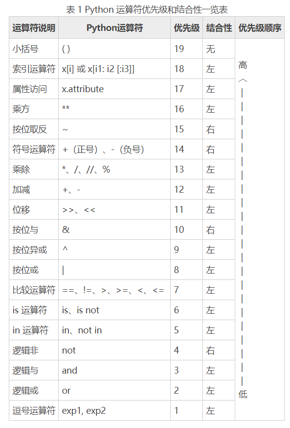

#Python30天学习
##概念
编译型语言：一次性将所有程序编译成二进制文件
- 缺点:开发效率低，不能跨平台
- 优点：运行速度快
- 语言：C，C++，Go等

解释型语言:当程序执行时，一行一行的解释
- 优点:开发效率高，开源跨平台
- 缺点：运行速度慢
- 语言：python，php,Perl等等

强类型定义语言：就是说一旦一个变量被指定了某个数据类型，如果不经过强制转换，那么就是这个数据类型了
弱类型定义语言: 数据类型可以被忽略的语言

python是一门动态解释型的强类型定义语言。

在计算机中执行python程序，是通过Python解释器将python语言翻译成计算机CPU能够听懂的机器指令语言。

目前Python的主要应用领域：
- 云计算，典型应用openstack
- web开发：典型WEB框架Django
- 系统运维
- 科学运算，人工智能
- 金融

Python的优点:
- 开发效率高：python有非常强大的第三方库，可以实现任何功能
- 高级语言：
- 可移植性
- 可扩展性
- 可嵌入性

Python的缺点：
- 速度慢：python的运行速度较C语言和java来说比较慢
- 代码不能加密：源码都是以明文形式存放
- 线程不能利用多CPU问题


Python的几种解释器:
- CPython:默认的python实现.。CPython是用C语言写的，当执行代码的时候Pythond代码会被转化成字节码（bytecode）。所以CPython是个字节码解释器。
- PyPy:很多地方都和CPython很像的实现，但是这个解释器本身就是由Python写成.PyPy被认为要比CPython性能更好。因为CPython会把代码转化成字节码，PyPy会把代码转化成机器码。
- Jython:是用java实现的一个解释器。Jython允许程序员写Python代码，还可以把java的模块加载在python的模块中使用。Jython使用了JIT技术，也就是说运行时Python代码会先转化成Java 字节码（不是java源代码），然后使用JRE执行。程序员还可以用Jython把Python代码打成jar包，这些jar和java程序打包成的jar一样可以直接使用。这样就允许Python程序员写Java程序了。
- Cython:允许把Python代码转化成C/C++代码或者使用各种各样的C/C++模块/文件的实现。换句话说，Cython是C/C++ 和Python的一个桥梁。Cython也是Python的一种方言。开发者也可以使用Cython来执行Python脚本，并且执行效率比CPython更快。另外，开发者可以写一个Python脚本，使用Cython来编译成（linux上.so 或者是Windows上的.dll）类库，然后当作一个Python模块来使用。

GIL是在实现Python解释器(CPython)时所引入的一个概念。GIL不是Python的特性，Python完全可以不依赖于GIL.为什么会有GIL?Python最初的设计理念在于，为了解决多线程之间数据完整性和状态同步的问题，设计为在任意时刻只有一个线程在解释器中运行。而当执行多线程程序时，由GIL来控制同一时刻只有一个线程能够运行。即Python中的多线程是表面多线程，也可以理解为fake多线程，不是真正的多线程(并发：不同的代码块交替执行;并行：不同的代码块同时执行)。为什么要保证同一时刻只有一个线程在解释器中运行呢？答案是为了Python解释器中原子操作的线程安全。

由于GIL锁存在，python里一个进程永远只能同时执行一个线程(拿到GIL的线程才能执行)，这就是为什么在多核CPU上，python的多线程效率并不高。分类别讨论一下：
1. CPU密集型代码(各种循环处理、计数等等)，在这种情况下，ticks计数很快就会达到阈值，然后触发GIL的释放与再竞争（多个线程来回切换当然是需要消耗资源的），所以python下的多线程对CPU密集型代码并不友好。
2. IO密集型代码(文件处理、网络爬虫等)，多线程能够有效提升效率(单线程下有IO操作会进行IO等待，造成不必要的时间浪费，而开启多线程能在线程A等待时，自动切换到线程B，可以不浪费CPU的资源，从而能提升程序执行效率)。所以python的多线程对IO密集型代码比较友好。

在Python3.x中，GIL不适用ticks计数，改为使用计时器(执行时间达到阈值后，当前线程释放GIL)，这样对CPU密集型程序更加友好,但依然没有解决GIL导致的同一时间只能执行一个线程的问题，所以效率依然不尽如人意。

老手经常说的一句话:"python下想要充分利用多核CPU，就用多进程"，因为每个进程有各自独立的GIL，互不干扰，这样就可以真正意义上的并行执行，所以在python中，多进程的执行效率优于多线程(仅仅针对多核CPU而言)。

如何避免GIL影响：
1. CPU密集型下的任务尽量采用多进程处理
2. 如果你不想使用Cython解释器，就没有这个限制，同样很多Cython的特性你也放弃了。
3. 利用 ctypes 绕过 GIL.ctypes会在调用C函数前释放GIL,可以通过ctypes和C动态库来让 python充分利用物理内核的计算能力。


GIL参考文献：https://blog.csdn.net/zshluckydogs/article/details/81986649?utm_medium=distribute.pc_relevant.none-task-blog-BlogCommendFromMachineLearnPai2-1.channel_param&depth_1-utm_source=distribute.pc_relevant.none-task-blog-BlogCommendFromMachineLearnPai2-1.channel_param

## 数据类型
python五大标准数据类型:
1. Numbers(数字)
2. String(字符串)
3. List(列表)
4. Tuple(元组)
5. Dictionary(字典)

###Numbers(数字)
四种不同的数字类型:
1. int(有符号整型)
- 在32位机器上，整数的位数为32位，取值范围为-2**31～2**31-1
- 在64位系统上，整数的位数为64位，取值范围为-2**63～2**63-1
2. long(长整形[也可以代表八进制和十六进制])
- 跟C语言不同，Python的长整数没有指定位宽，即：Python没有限制长整数数值的大小，但实际上由于机器内存有限，长整数数值不可能无限大。
3. float(浮点型)
- 浮点数用来处理实数，即带有小数的数字。类似于C语言中的double类型，占8个字节（64位），其中52位表示底，11位表示指数，剩下的一位表示符号。
4. complex(复数)
- 浮点数用来处理实数，即带有小数的数字。类似于C语言中的double类型，占8个字节（64位），其中52位表示底，11位表示指数，剩下的一位表示符号。


Python中存在小整形对象池:-5~257

在实际编程中,数值比较小的整数,比如1,2,29等,可能会频繁的出现。而在python中，所有的对象都存在于系统堆上。想想？如果某个小整数出现的次数非常多，那么Python将会出现大量的malloc/free操作，这样大大降低了运行效率，而且会造成大量的内存碎片，严重影响Python的整体性能。

数字不仅支持十进制，还支持二进制、八进制、十六进制
```
print(bin(20)) #转换二进制
print(oct(20)) #转换八进制
print(hex(20)) #转换十六进制
```


###字符串
字符串或串(String)是由数字、字母、下划线组成的一串字符。

Python的字串列表有2种取值顺序:
- 从左到右索引默认0开始的，最大范围是字符串长度少1
- 从右到左索引默认-1开始的，最大范围是字符串开头


字符串常用函数:
1. str.strip():消除字符串s左右两边的空白字符(包括'\t','\n','\r')
2. len(str):获取字符串长度
3. str.upper()转换为大写
4. str.lower()转换为小写
5. str.title()每个单词首字母大写
6. str.capitalize()首字母大写
7. str[::-1]:字符串翻转
8. str.split(','):用','分割字符串
9. l.join(','):对列表用','进行拼接

Python的编码:
1. ASCII编码出现最早,只有大小写英文字母、数字和一些符号等127个字符,为了实现多语言表示,如中文的GB2312编码,日文的Shift_JIS编码等,Unicode孕育而生,它将所有语言都统一到一套编码中;
2. 在Python3中所有字符串在内存中均是Unicode保存
3. 当需要将文件保存到外设或进行网络传输时,就要进行编码转换,将字符转换为字节,以提高效率


在 Python3 中，内存中的 Unicode 字符用 str 对象表示，对应于的，Python3 使用了一种全新的数据类型来表示字节，就是 bytes，所以 encode 转换后的字节流就不是 str 对象，而是 bytes 字节对象，它当然支持分片、索引、基本数值运算等操作，但 str 与 bytes 类型的数据不能进行+操作。


```
>>> byt = b'优雅的Python'
  File "<stdin>", line 1
SyntaxError: bytes can only contain ASCII literal characters.
>>> byt = b'Python'
>>> type(byt)
<class 'bytes'>
```

从上述例子中可以看出 bytes 对象不能由超出 ASCII 码范围的字符组成，只接受 ASCII 码这个范围的字符。

```
>>> u'a'
'a'
>>> '\u0061'
'a'
>>> '中'.encode('unicode-escape')
b'\\u4e2d'
>>> b'@Aa'
b'@Aa'
>>> b'\x40\x41\x61'
b'@Aa'
>>> #-*- coding：utf-8 -*-
...
>>>
```

同样，从上面的例子我们还可以总结出一些坑爹的东西：
1. Unicode 码在 Python3 中有两种表示方式，u'字符串'和\u四位十六进制数；区分r'字符串' ，是表示不转义的原始字符串
2. 将字符直接以 Unicode 码保存使用unicode-escape
3. 在 Python 的交互式环境中，输出 bytes 对象时，可按 ASCII 码表示，或按十六进制\x表示
4. 在 Python 头声明#-*- coding：utf-8 -*-，是告诉 Python 编译器按utf-8的方式读取，这个声明并不能将 Python 文件本身保存成utf-8，这时候需要借助文本编辑器保存文件编码。


###列表(List)
List（列表） 是 Python 中使用最频繁的数据类型。

列表可以完成大多数集合类的数据结构实现。它支持字符，数字，字符串甚至可以包含列表（所谓嵌套）。

###元组(tuple)
元组是另一个数据类型，类似于List（列表）。

元组用"()"标识。内部元素用逗号隔开。但是元组不能二次赋值，相当于只读列表。

操作实例与列表相似

###字典(Dictionary)
字典(dictionary)是除列表以外Python之中最灵活的内置数据结构类型。列表是有序的对象结合，字典是无序的对象集合。

两者之间的区别在于：字典当中的元素是通过键来存取的，而不是通过偏移存取。

字典用"{ }"标识。字典由索引(key)和它对应的值value组成。


###自定义容器
常见的容器类型有: dict, tuple, list, string。容器可分为:可变容器和不可变容器两个概念。其中 tuple, string 是不可变容器，dict, list 是可变容器。其中 tuple, string 是不可变容器，dict, list 是可变容器。

如果想自定义容器,我们具体需要做什么?


实现一个自定义的类来模拟内置的容器类功能，比如列表和字典。可以使用collections模块，定义了很多抽象基类，当你想自定义容器类的时候它们会非常有用。


```
```


Python魔法方法:魔法方法在面向对象的Python处处皆是,他们是一些可以让你对类添加"魔法"的特殊方法.他们经常是两个下划线包围来命名的(比如__init__,__it__)。

1. 构造方法:
- __new__(cls,[...):__new__ 是对象实例化时第一个调用的方法，它只取下 cls 参数，并把其他参数传给 __init__ 。
- __init__(self,[...]):类的初始化方法。它获取任何传给构造器的参数
- __del__(self):__new__ 和 __init__ 是对象的构造器， __del__ 是对象的销毁器。它并非实现了语句 del x (因此该语句不等同于 x.__del__())。而是定义了当对象被垃圾回收时的行为。

2. 比较操作符
- __cmp__(self, other):__cmp__ 是所有比较魔法方法中最基础的一个，它实际上定义了所有比较操作符的行为（<,==,!=,等等），但是它可能不能按照你需要的方式工作（例如，判断一个实例和另一个实例是否相等采用一套标准，而与判断一个实例是否大于另一实例采用另一套）。 __cmp__ 应该在 self &lt; other 时返回一个负整数，在 self == other 时返回0，在 self &gt; other 时返回正整数。最好只定义你所需要的比较形式，而不是一次定义全部。 如果你需要实现所有的比较形式，而且它们的判断标准类似，那么 __cmp__ 是一个很好的方法，可以减少代码重复，让代码更简洁。
- __eq__(self, other):定义等于操作符(==)的行为。
- __ne__(self, other):定义不等于操作符(!=)的行为。
- __lt__(self, other):定义小于操作符(<)的行为。
- __gt__(self, other):定义大于操作符(>)的行为。
- __le__(self, other):定义小于等于操作符(<)的行为。
- __ge__(self, other):定义大于等于操作符(>)的行为。

3. 数值操作符
- __pos__(self):实现取正操作，例如 +some_object。
- __neg__(self):实现取负操作，例如 -some_object。
- __abs__(self):实现内建绝对值函数 abs() 操作。
- __invert__(self):实现取反操作符 ~。
- __round__(self， n):实现内建函数 round() ，n 是近似小数点的位数。
- __floor__(self):实现 math.floor() 函数，即向下取整。
- __ceil__(self):实现 math.ceil() 函数，即向上取整。
- __trunc__(self):实现 math.trunc() 函数，即距离零最近的整数。
- __pos__(self):实现取正操作，例如 +some_object。
- __neg__(self):实现取负操作，例如 -some_object。
- __abs__(self):实现内建绝对值函数 abs() 操作。
- __invert__(self):实现取反操作符 ~。
- __round__(self， n):实现内建函数 round() ，n 是近似小数点的位数。
- __floor__(self):实现 math.floor() 函数，即向下取整。
- __ceil__(self):实现 math.ceil() 函数，即向上取整。
- __trunc__(self):实现 math.trunc() 函数，即距离零最近的整数。

还有一种运算符叫反射运算符,之前的运算符实现的是如下所示的例子:
```
some_object + other
```
不过交换一下位置(如下所示)就无法实现了，为了解决该问题需要定义反射运算符
```
other + some_object
```
常见的反射运算符有:
- __radd__(self, other):实现反射加法操作。
- __rsub__(self, other):实现反射减法操作。
- __rmul__(self, other):实现反射乘法操作。
- __rfloordiv__(self, other):实现使用 // 操作符的整数反射除法。
- __rdiv__(self, other):实现使用 / 操作符的反射除法。
- __rtruediv__(self, other):实现 _true_ 反射除法，这个函数只有使用 from __future__ import division 时才有作用。
- __rmod__(self, other):实现 % 反射取余操作符。
- __rdivmod__(self, other):实现调用 divmod(other, self) 时 divmod 内建函数的操作。
- __rpow__:实现 ** 反射操作符。
- __rlshift__(self, other):实现反射左移位运算符 &lt;&lt; 的作用。
- __rshift__(self, other):实现反射右移位运算符 &gt;&gt; 的作用。
- __rand__(self, other):实现反射按位与运算符 & 。
- __ror__(self, other):实现反射按位或运算符 | 。
- __rxor__(self, other):实现反射按位异或运算符 ^ 。


增强赋值运算符:例如x+=1等
- __iadd__(self, other):实现加法赋值操作。
- __isub__(self, other):实现减法赋值操作。
- __imul__(self, other):实现乘法赋值操作。
- __ifloordiv__(self, other):实现使用 //= 操作符的整数除法赋值操作。
- __idiv__(self, other):实现使用 /= 操作符的除法赋值操作。
- __itruediv__(self, other):实现 _true_ 除法赋值操作，这个函数只有使用 from __future__ import division 时才有作用。
- __imod__(self, other):实现 %= 取余赋值操作。
- __ipow__:实现 ** = 操作。
- __ilshift__(self, other):实现左移位赋值运算符 &lt;&lt;= 。
- __irshift__(self, other):实现右移位赋值运算符 &gt;&gt;= 。
- __iand__(self, other):实现按位与运算符 &= 。
- __ior__(self, other):实现按位或赋值运算符 | 。
- __ixor__(self, other):实现按位异或赋值运算符 ^= 。


类型转换操作符:Python也有一系列的魔法方法用于实现类似 float() 的内建类型转换函数的操作。它们是这些：
- __int__(self):实现到int的类型转换。
- __long__(self):实现到long的类型转换。
- __float__(self):实现到float的类型转换。
- __complex__(self):实现到complex的类型转换。
- __oct__(self):实现到八进制数的类型转换。
- __hex__(self):实现到十六进制数的类型转换。
- __index__(self):实现当对象用于切片表达式时到一个整数的类型转换。如果你定义了一个可能会用于切片操作的数值类型，你应该定义 __index__。
- __trunc__(self):当调用 math.trunc(self) 时调用该方法， __trunc__ 应该返回 self 截取到一个整数类型（通常是long类型）的值。
- __coerce__(self):该方法用于实现混合模式算数运算，如果不能进行类型转换， __coerce__ 应该返回 None 。反之，它应该返回一个二元组 self 和 other ，这两者均已被转换成相同的类型。


类的表示:使用字符串来表示类是一个相当有用的特性。在Python中有一些内建方法可以返回类的表示，相对应的，也有一系列魔法方法可以用来自定义在使用这些内建函数时类的行为。

- __str__(self):定义对类的实例调用 str() 时的行为。
- __repr__(self):定义对类的实例调用 repr() 时的行为。 str() 和 repr() 最主要的差别在于“目标用户”。 repr() 的作用是产生机器可读的输出（大部分情况下，其输出可以作为有效的Python代码），而 str() 则产生人类可读的输出。
- __unicode__(self):定义对类的实例调用 unicode() 时的行为。 unicode() 和 str() 很像，只是它返回unicode字符串。注意，如果调用者试图调用 str() 而你的类只实现了 __unicode__() ，那么类将不能正常工作。所有你应该总是定义 __str__() ，以防有些人没有闲情雅致来使用unicode。
- __format__(self):定义当类的实例用于新式字符串格式化时的行为，例如， "Hello, 0:abc!".format(a) 会导致调用 a.__format__("abc") 。当定义你自己的数值类型或字符串类型时，你可能想提供某些特殊的格式化选项，这种情况下这个魔法方法会非常有用。
- __hash__(self):定义对类的实例调用 hash() 时的行为。它必须返回一个整数，其结果会被用于字典中键的快速比较。同时注意一点，实现这个魔法方法通常也需要实现 __eq__ ，并且遵守如下的规则： a == b 意味着 hash(a) == hash(b)。
- __nonzero__(self):定义对类的实例调用 bool() 时的行为，根据你自己对类的设计，针对不同的实例，这个魔法方法应该相应地返回True或False。
- __dir__(self):定义对类的实例调用 dir() 时的行为，这个方法应该向调用者返回一个属性列表。一般来说，没必要自己实现 __dir__ 。但是如果你重定义了 __getattr__ 或者 __getattribute__ （下个部分会介绍），乃至使用动态生成的属性，以实现类的交互式使用，那么这个魔法方法是必不可少的。


访问控制:很多从其他语言转向Python的人都抱怨Python的类缺少真正意义上的封装（即没办法定义私有属性然后使用公有的getter和setter）。然而事实并非如此。实际上Python不是通过显式定义的字段和方法修改器，而是通过魔法方法实现了一系列的封装。

- __getattr__(self, name):当用户试图访问一个根本不存在（或者暂时不存在）的属性时，你可以通过这个魔法方法来定义类的行为。这个可以用于捕捉错误的拼写并且给出指引，使用废弃属性时给出警告（如果你愿意，仍然可以计算并且返回该属性），以及灵活地处理AttributeError。只有当试图访问不存在的属性时它才会被调用，所以这不能算是一个真正的封装的办法。
- __setattr__(self, name, value):和 __getattr__ 不同， __setattr__ 可以用于真正意义上的封装。它允许你自定义某个属性的赋值行为，不管这个属性存在与否，也就是说你可以对任意属性的任何变化都定义自己的规则。然后，一定要小心使用 __setattr__ ，这个列表最后的例子中会有所展示。
- __delattr__(self, name):这个魔法方法和 __setattr__ 几乎相同，只不过它是用于处理删除属性时的行为。和 _setattr__ 一样，使用它时也需要多加小心，防止产生无限递归（在 __delattr__ 的实现中调用 del self.name 会导致无限递归）。
- __getattribute__(self, name):__getattribute__ 看起来和上面那些方法很合得来，但是最好不要使用它。 __getattribute__ 只能用于新式类。在最新版的Python中所有的类都是新式类，在老版Python中你可以通过继承 object 来创建新式类。 __getattribute__ 允许你自定义属性被访问时的行为，它也同样可能遇到无限递归问题（通过调用基类的 __getattribute__ 来避免）。 __getattribute__ 基本上可以替代 __getattr__ 。只有当它被实现，并且显式地被调用，或者产生 AttributeError 时它才被使用。 这个魔法方法可以被使用（毕竟，选择权在你自己），我不推荐你使用它，因为它的使用范围相对有限（通常我们想要在赋值时进行特殊操作，而不是取值时），而且实现这个方法很容易出现Bug。


反射:你可以通过定义魔法方法来控制用于反射的内建函数 isinstance 和 issubclass 的行为。下面是对应的魔法方法：
- __instancecheck__(self, instance):检查一个实例是否是你定义的类的一个实例（例如 isinstance(instance, class) ）。
- __subclasscheck__(self, subclass):检查一个类是否是你定义的类的子类（例如 issubclass(subclass, class) ）。

## 运算符
1. 逻辑运算符(not and or):


2. 算术运算符:


3. 比较运算符:


4. 赋值运算符:


5. 成员运算符:


6. 位运算符:


7. 身份运算符:


###运算符优先级


###运算符重写
Python施加的一些限制：
- 不能重载内置类型的运算符
- 不能新建运算符，只能重载现有的
- 某些运算符不能重载——is、and、or 和 not（不过位运算符 &、| 和 ~ 可以）

####重载一元运算符
- -（__neg__）：一元取负算术运算符。如果 x 是 -2，那么 -x == 2。
- +（__pos__）：一元取正算术运算符。通常，x == +x，但也有一些例外。(Decimal 中精度不一致时.)
- ~（__invert__）：对整数按位取反，定义为 ~x == -(x+1)。如果 x 是 2，那么 ~x == -3。


Data Model，还把内置的 abs(...) 函数列为一元运算符。它对应的特殊方法是 __abs__.

支持他们，只需实现对应的特殊方法，并且这些特殊方法只有一个参数，就是 self 自身. 实现特殊方法时要遵循原则：始终返回一个新对象。（不能修改 self，要创建并返回合适类型的新实例。）

```
def __abs__(self):
        return math.sqrt(sum(x * x for x in self))

def __neg__(self):
        return Vector(-x for x in self)  # 构建一个新 Vector 实例，把 self 的每个分量都取反。

def __pos__(self):
        return Vector(self)  # 构建一个新 Vector 实例，传入 self 的各个分量。
```
####重载二元运算符
- + (__add__)：用于拼接
- * (*)：用于重复复制

```
# 在Vector类中定义， 支持所有可迭代对象.
def __add__(self, other):
        try:
             pairs = itertools.zip_longest(self, other, fillvalue=0.0) # 使用 0.0 填充不足的值.
             return Vector(a + b for a, b in pairs)  # 使用生成器重新生成对象.
         except TypeError:
             return NotImplemented  # 类型不支持时，让python解释器尝试其他方法， __radd__ 或 抛出类型错误.

#用于支持 方向运算， 如: a + b - >  b.__radd__(a)
def __radd__(self, other):
        return self + other  # 委托给 __add__

def __mul__(self, scalar):
        if isinstance(scalar, numbers.Real):  # 检查数值类型， 记得引入 numbers
            return Vector(n * scalar for n in self)
        else:  # 让 Python 尝试在 scalar 操作数上调用 __rmul__ 方法。
            return NotImplemented

def __rmul__(self, scalar):
        return self * scalar  # 委托给 __mul__ 方法。
```

实现一元运算符和中缀运算符的特殊方法一定不能修改操作数。使用这些运算符的表达式期待结果是新对象。只有增量赋值表达式可能会修改第一个操作数（self）.

为了支持涉及不同类型的运算，Python 为中缀运算符特殊方法提供了特殊的分派机制。对表达式 a + b 来说，解释器会执行以下几步操作：
- 如果 a 有 __add__ 方法，而且返回值不是 NotImplemented，调用 a.__add__(b)，然后返回结果。
- 如果 a 没有 __add__ 方法，或者调用 __add__ 方法返回 NotImplemented，检查 b 有没有 __radd__ 方法，如果有，而且没有返回 NotImplemented，调用 b.__radd__(a)，然后返回结果。
- 如果 b 没有 __radd__ 方法，或者调用 __radd__ 方法返回 NotImplemented，抛出 TypeError，并在错误消息中指明操作数类型不支持。

更多二元运算符:

#### 重载比较运算符
Python 解释器对众多比较运算符（==、!=、>、<、>=、<=）的处理与前文类似，不过在两个方面有重大区别。
- 正向和反向调用使用的是同一系列方法。例如:
对 == 来说，正向和反向调用都是 __eq__ 方法，只是把参数对调了；
而正向的 __gt__ 方法调用的是反向的 __lt__ 方法，并把参数对调。
- 对 == 和 != 来说，如果反向调用失败，Python 会比较对象的 ID，而不抛出 TypeError 。


#### 重载增量运算符
- += (__iadd__):就地修改左边的对象. 加
- *= (__imul__):就地修改左边的对象. 乘

如果一个类没有实现地运算符，增量赋值运算符只是语法糖：a += b 的作用与 a = a + b 完全一样。对不可变类型来说，这是预期的行为，而且，如果定义了 __add__ 方法的话，不用编写额外的代码，+= 就能使用。

然而，如果实现了就地运算符方法，例如 __iadd__，计算 a += b 的结果时会调用就地运算符方法。这种运算符的名称表明，它们会就地修改左操作数，而不会创建新对象作为结果。

```
>>> v1 = Vector([1, 2, 3])
>>> v1_alias = v1
>>> id(v1)
4302860128
>>> v1 += Vector([4, 5, 6])
>>> v1
Vector([5.0, 7.0, 9.0])
>>> id(v1)
4302859904
>>> v1_alias
Vector([1.0, 2.0, 3.0])
>>> v1 *= 11
>>> v1
Vector([55.0, 77.0, 99.0])
>>> id(v1)
4302858336
```


```
import itertools  # 把导入标准库的语句放在导入自己编写的模块之前。

from tombola import Tombola
from bingo import BingoCage


class AddableBingoCage(BingoCage):  # 扩展 BingoCage

    def __add__(self, other):
        if isinstance(other, Tombola):  # 判断类型
            return AddableBingoCage(self.inspect() + other.inspect())  # 返回新对象.
        else:
            return NotImplemented

    def __iadd__(self, other):
        if isinstance(other, Tombola):
            other_iterable = other.inspect()  # 尝试使用 other 创建迭代器。
        else:
            try:
                other_iterable = iter(other)
            except TypeError:  # 抛出类型错误
                self_cls = type(self).__name__
                msg = "right operand in += must be {!r} or an iterable"
                raise TypeError(msg.format(self_cls))
        self.load(other_iterable)  # 载入自身实例中.
        return self  # 增量赋值特殊方法必须返回 self
```

## 函数
定义函数的规则:
1. 函数代码块以def关键词开头，后接函数标识符名和圆括号()。
2. 任何传入实参和形参必须放在圆括号中。圆括号中写的是形参。
3. 函数的第一行语句可以选择性地使用文档字符串—-用于存放函数说明。
4. 函数内容以冒号起始，并且函数体要有缩进。
5. return[expression]结束函数，选择性地返回一个值给调用者。不带表达式的return相当于返回None。

###内置函数


1. abs(x)：返回一个数的绝对值。 参数可以是一个整数或浮点数。 如果参数是一个复数，则返回它的模。 如果 x 定义了 __abs__()，则 abs(x) 将返回 x.__abs__()。
2. all(iterable)：如果 iterable 的所有元素均为真值（或可迭代对象为空）则返回 True 。 等价于:
```
def all(iterable):
    for element in iterable:
        if not element:
            return False
    return True
```
3. any(iterable):如果 iterable 的任一元素为真值则返回 True。 如果可迭代对象为空，返回 False。 等价于:
```
def any(iterable):
    for element in iterable:
        if element:
            return True
    return False
```
4. ascii(object):就像函数 repr()，返回一个对象可打印的字符串，但是 repr() 返回的字符串中非 ASCII 编码的字符，会使用 \x、\u 和 \U 来转义。生成的字符串和 Python 2 的 repr() 返回的结果相似。
5. bin(x):将一个整数转变为一个前缀为“0b”的二进制字符串。结果是一个合法的 Python 表达式。如果 x 不是 Python 的 int 对象，那它需要定义 __index__() 方法返回一个整数。一些例子：
```
>>>bin(3)
'0b11'
>>>bin(-10)
'-0b1010'
```
如果不一定需要前缀“0b”，还可以使用如下的方法。
```
>>>format(14, '#b'), format(14, 'b')
('0b1110', '1110')
>>>f'{14:#b}', f'{14:b}'
('0b1110', '1110')
```
6. class bool([x]):返回一个布尔值，True 或者 False。 x 使用标准的 真值测试过程 来转换。如果 x 是假的或者被省略，返回 False；其他情况返回 True。bool 类是 int 的子类（参见 数字类型 --- int, float, complex）。其他类不能继承自它。它只有 False 和 True 两个实例（参见 布尔值）。
7. breakpoint(*args, **kws):此函数会在调用时将你陷入调试器中。具体来说，它调用 sys.breakpointhook() ，直接传递 args 和 kws 。默认情况下， sys.breakpointhook() 调用 pdb.set_trace() 且没有参数。在这种情况下，它纯粹是一个便利函数，因此您不必显式导入 pdb 且键入尽可能少的代码即可进入调试器。但是， sys.breakpointhook() 可以设置为其他一些函数并被 breakpoint() 自动调用，以允许进入你想用的调试器。
8. class bytearray([source[, encoding[, errors]]]):返回一个新的 bytes 数组。 bytearray 类是一个可变序列，包含范围为 0 <= x < 256 的整数。它有可变序列大部分常见的方法，见 可变序列类型 的描述；同时有 bytes 类型的大部分方法，参见 bytes 和 bytearray 操作。
9. class bytes([source[, encoding[, errors]]]):返回一个新的“bytes”对象， 是一个不可变序列，包含范围为 0 <= x < 256 的整数。bytes 是 bytearray 的不可变版本 - 它有其中不改变序列的方法和相同的索引、切片操作。
10. callable(object):如果参数 object 是可调用的就返回 True，否则返回 False。 如果返回 True，调用仍可能失败，但如果返回 False，则调用 object 将肯定不会成功。 请注意类是可调用的（调用类将返回一个新的实例）；如果实例所属的类有 __call__() 则它就是可调用的。
11. chr(i):返回 Unicode 码位为整数 i 的字符的字符串格式。例如，chr(97) 返回字符串 'a'，chr(8364) 返回字符串 '€'。这是 ord() 的逆函数。
12. @classmethod:把一个方法封装成类方法。一个类方法把类自己作为第一个实参，就像一个实例方法把实例自己作为第一个实参。请用以下习惯来声明类方法:
```
class C:
    @classmethod
    def f(cls, arg1, arg2, ...): ...
```
- 类方法的调用可以在类上进行 (例如 C.f()) 也可以在实例上进行 (例如 C().f())。 其所属类以外的类实例会被忽略。 如果类方法在其所属类的派生类上调用，则该派生类对象会被作为隐含的第一个参数被传入。
13. compile(source, filename, mode, flags=0, dont_inherit=False, optimize=-1):将 source 编译成代码或 AST 对象。代码对象可以被 exec() 或 eval() 执行。source 可以是常规的字符串、字节字符串，或者 AST 对象。参见 ast 模块的文档了解如何使用 AST 对象。
14. class complex([real[, imag]]):返回值为 real + imag*1j 的复数，或将字符串或数字转换为复数。如果第一个形参是字符串，则它被解释为一个复数，并且函数调用时必须没有第二个形参。第二个形参不能是字符串。每个实参都可以是任意的数值类型（包括复数）。如果省略了 imag，则默认值为零，构造函数会像 int 和 float 一样进行数值转换。如果两个实参都省略，则返回 0j。
15. delattr(object, name):setattr() 相关的函数。实参是一个对象和一个字符串。该字符串必须是对象的某个属性。如果对象允许，该函数将删除指定的属性。例如 delattr(x, 'foobar') 等价于 del x.foobar 。

###lambda匿名函数
匿名函数就是没有定义函数的名称，用来实现简单的功能。

语法结构:
```
lambda param_list: expression
```
- param_list是参数列表，相当于函数的参数
- expression是表达式,相当于函数体，用一行进行表示


###map函数
map会根据提供的函数对指定序列做映射。
语法结构：map(function,iterable,..)
```
>>> func2=lambda x: x**x
>>> L=[1,2,3]
>>> map(func2, L)
<map object at 0x00000218C07F0080>
>>> list(map(func2, L)) # 注意要显示内容需要转为list类型，因为py3中返回的是迭代器对象
[1, 4, 27]
>>>
```
其中function可以使用lambda函数对象

###reduce函数
reduce 函数会对参数序列中元素进行累积。

语法结构:reduce(function, iterable[, initializer])
```
>>> reduce(lambda x, y: x+y, [1,2,3,4,5])  # 使用 lambda 匿名函数
15
```
注意python3使用前要加上：from functools import reduce , reduce函数在python3中被移除，放入了functools模块。

###filter函数
filter内置函数用于过滤序列，过滤掉不符合条件的元素，返回由符合条件元素组成的新列表。
语法结构: filter(function, iterable)
```
>>> filter(lambda x: x % 2 == 0, [1,2,3,4,5,6,7,8,9,10])
<filter object at 0x00000218C07F0080>
>>> list(filter(lambda x: x % 2 == 0, [1,2,3,4,5,6,7,8,9,10]))
[2, 4, 6, 8, 10]
>>>
```
这里function智能返回true or false, 将满足true的放入最终列表。

###sorted函数
sorted函数对所有可迭代的对象进行排序操作。
语法结构:sorted(iterable, key=None, reverse=False)

```
>>> sorted([[3,4],[2,1],[5,3],[7,4],[9,0]], key=lambda x:x[0])
[[2, 1], [3, 4], [5, 3], [7, 4], [9, 0]]
```

key参数的作用是我们自定义一个函数，然后通过将序列中的元素作用于函数之后再进行排序


###闭包
闭包概念：在一个内部函数中，对外部作用域的变量进行引用，(并且一般外部函数的返回值为内部函数)，那么内部函数就被认为是闭包。
举个例子:

在函数startAt中定义了一个incrementBy函数，incrementBy访问了外部函数startAt的变量，并且函数返回值为incrementBy函数（注意python是可以返回一个函数的，这也是python的特性之一）


上面代码中a其实就是一个函数，上面代码执行的结果：

从结果我们不难看出，a是函数incrementBy而不是startAt这个有点绕，但是并不难理解，因为return回来的是incrementBy函数。

输出是：

如果调用函数a的话，得到的结果是传入参数的整数值加。


常见错误:
1. 闭包无法修改外部函数的局部变量。
2. python循环中不包含域的概念。

闭包的作用:闭包可以保存当前的运行环境，以一个类似棋盘游戏的例子来说明。假设棋盘大小为50*50，左上角为坐标系原点(0,0)，我需要一个函数，接收2个参数，分别为方向(direction)，步长(step)，该函数控制棋子的运动。 这里需要说明的是，每次运动的起点都是上次运动结束的终点。

###装饰器
装饰器本质是一个python函数，如果学过flask就知道，里边装饰器是必须的，经常用到。

装饰器的作用：抽离大量和函数功能本身无关的代码进行重用

一个简单的装饰器，用于计数，由于对不同的函数运行时间进行计数的需要，所以要对时间计数这部分进行处理。
```
def get_time(func):
	def wrapper():
        startTime = time.time()
        func()
        endTime = time.time()
        print("spend %f" % (endTime-startTime))
    return wrapper
myFunction = get_time(myFunction)
```
精简一下，使用@语法来进行精简：
```
import time
def get_time(func):
    startTime = time.time()
    func()
    endTime = time.time()
    processTime = (endTime - startTime) * 1000
    print ("The function timing is %f ms" %processTime)

@get_time
def myfunc():
	print("start")
	time.sleep(0.8)
	print("end")

if __name__ == "__main__":
    myfunc
```
理解为：get_time(myfun()) ,将myfunc()函数包裹

装饰器可以叠加使用，若多个装饰器同时装饰一个函数，那么装饰器的调用顺序和@语法糖的声明顺序相反，也就是：

```
@decorator1
@decorator2
def func():
    pass
```
等效于
```
func = decorator1(decorator2(func()))
```
####内置装饰器
Python中，常见的类装饰器包括：@staticmathod、@classmethod和@property

1. @staticmethod：类的静态方法，跟成员方法的区别是没有self参数，并且可以在类不进行实例化的情况下调用。
2. @classmethod：跟成员方法的区别是接收的第一个参数不是self，而是cls（当前类的具体类型）
3. @property：表示可以直接通过类实例直接访问的信息。

####带有参数的装饰器
```
def func(*args,**kwags):
	def function(func): #定义了一个闭包
		def func_in(*args,**kwargs): #闭包内的函数，因为装饰器运行的实则是闭包内的函数，所以这里将需要有形参用来接收原函数的参数。
			print('这里是需要装饰的内容，就是需要添加的内容')
			num = func(*args,**kwargs) #调用实参函数，并传入一致的实参，并且用变量来接收原函数的返回值，
			return num #将接受到的返回值再次返回到新的test()函数中。
		return func_in
	return function

@func(50)  #这里会先运行函数func，并切传入参数，之后会再次运行闭包函数进行装饰, @func(50)>>@function，然后将由@function继续进行装饰修改。
def test(a,b):
	print('这是一个函数')
	return a+b
```
```
class Test(object): #定义一个类
	def __init__(self，func):
		self.__func = func
	def __call__(self):  #定义call方法，当直接调用类的时候，运行这里。
		print('这里是装饰的功能')
		self.__func()
t = Test() #实例化对象
t() #调用类，将会调用call方法。

@Test  #类装饰器等于test = Test(test),将函数test当作参数传入类中的init方法，并将函数名赋值给私有属性__func，当函数test被调用的时候，其实是运行Test类中的call方法.
def test():
	print('被装饰的函数')
test() #这里调用的不在是函数test，而是实例对象test的call方法，会先进行装饰，然后再调用私有属性__func(),__func 其实就是被装饰的函数test。
```
##参考文献
1. https://blog.csdn.net/qq_41853758/article/details/82853811
