#Go语言学习
##GO语言开发环境
下载地址：Windows平台和Mac平台推荐下载可执行文件版，Linux平台下载压缩文件版。
- Go官网下载地址：https://golang.org/dl/
- Go官方镜像站（推荐）：https://golang.google.cn/dl/

###Windows下安装
此安装实例以 64位Win10系统安装 Go1.14.1可执行文件版本为例。

将上一步选好的安装包下载到本地。

双击下载好的文件，然后按照下图的步骤安装即可。

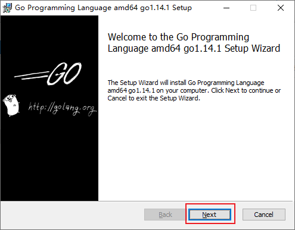

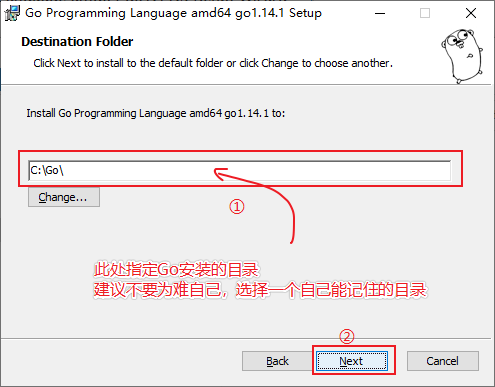

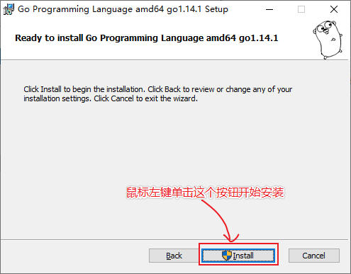

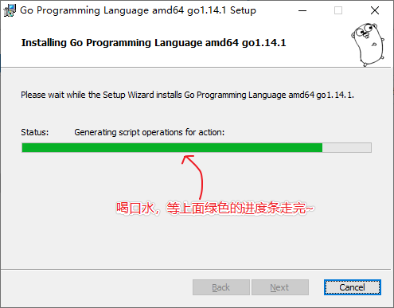

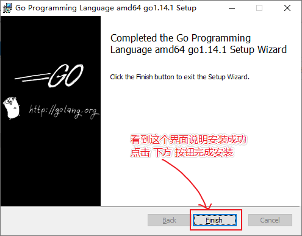

### Linux下安装
如果不是要在Linux平台敲go代码就不需要在Linux平台安装Go，我们开发机上写好的go代码只需要跨平台编译（详见文章末尾的跨平台编译）好之后就可以拷贝到Linux服务器上运行了，这也是go程序跨平台易部署的优势。

我们在版本选择页面选择并下载好go1.14.1.linux-amd64.tar.gz文件：

```
wget https://dl.google.com/go/go1.14.1.linux-amd64.tar.gz
```
将下载好的文件解压到/usr/local目录下：

```
tar -zxvf go1.14.1.linux-amd64.tar.gz -C /usr/local  # 解压
```
如果提示没有权限，加上sudo以root用户的身份再运行。执行完就可以在/usr/local/下看到go目录了。

配置环境变量： Linux下有两个文件可以配置环境变量，其中/etc/profile是对所有用户生效的；$HOME/.profile是对当前用户生效的，根据自己的情况自行选择一个文件打开，添加如下两行代码，保存退出。

```
export GOROOT=/usr/local/go
export PATH=$PATH:$GOROOT/bin
```
修改/etc/profile后要重启生效，修改$HOME/.profile后使用source命令加载$HOME/.profile文件即可生效。 检查：

```
~ go version
go version go1.14.1 linux/amd64
```

###Mac下安装
下载可执行文件版，直接点击下一步安装即可，默认会将go安装到/usr/local/go目录下。
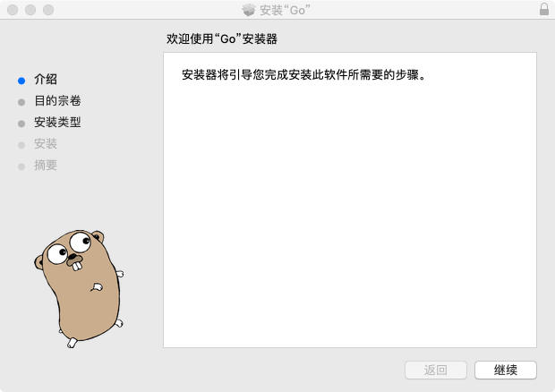

###检查
上一步安装过程执行完毕后，可以打开终端窗口，输入go version命令，查看安装的Go版本。

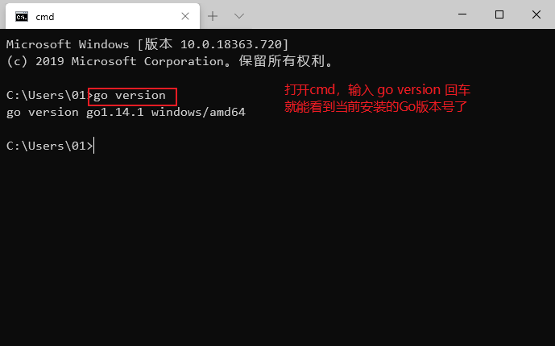

###GOROOT和GOPATH
GOROOT和GOPATH都是环境变量，其中GOROOT是我们安装go开发包的路径，而从Go 1.8版本开始，Go开发包在安装完成后会为GOPATH设置一个默认目录，参见下表。

GOPATH在不同操作系统平台上的默认值

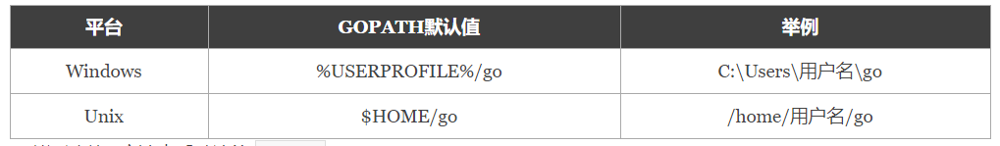

可以通过以下方法查看默认的GOPATH目录：

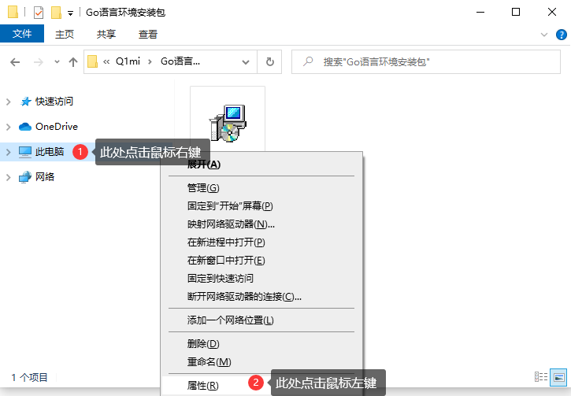


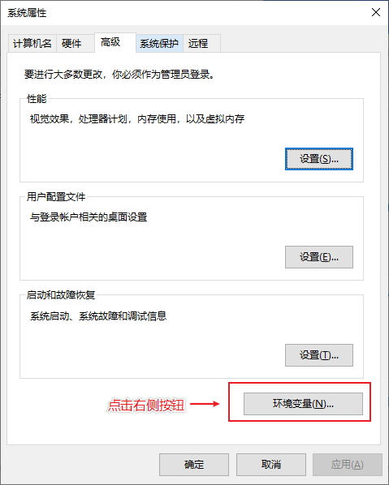

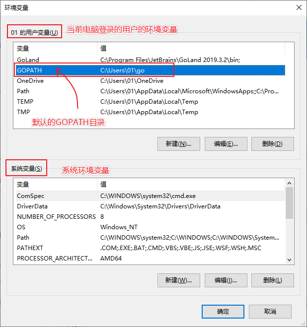

我们只需要记住默认的GOPATH路径在哪里就可以了，并且默认情况下 GOROOT下的bin目录及GOPATH下的bin目录都已经添加到环境变量中了，我们也不需要额外配置了。

###GOPROXY
Go1.14版本之后，都推荐使用go mod模式来管理依赖环境了，也不再强制我们把代码必须写在GOPATH下面的src目录了，你可以在你电脑的任意位置编写go代码。（网上有些教程适用于1.11版本之前。）

默认GoPROXY配置是：GOPROXY=https://proxy.golang.org,direct，由于国内访问不到https://proxy.golang.org，所以我们需要换一个PROXY，这里推荐使用https://goproxy.io或https://goproxy.cn。

可以执行下面的命令修改GOPROXY：
```
go env -w GOPROXY=https://goproxy.cn,direct
```
## 将VSCODE 打造成GO开发利器
##程序架构
https://cloud.tencent.com/developer/article/1615925
###helloworld
著名程序helloworld
```
package main

func main() {
    print("hello, world\n")
}
```
1. 程序编译
```
C:\Go\test>go build helloworld.go
```

2. 程序执行
```
C:\Go\test>go run helloworld.go
```
####Package
Java和NodeJS语言中都有package概念，这里也不例外。
包只是一个包含一些代码文件的目录，它可以从同一个入口引入并可以使用其中的代码或变量（ features ）。

包可以定义在很深的目录中，包名的定义是不包括目录路径的，但是包在引用时一般使用全路径引用。比如在GOPATH/src/a/b/ 下定义一个包 c。在包 c 的源码中只需声明为package c，而不是声明为package a/b/c，但是在导入 c 包时，需要带上路径，例如import "a/b/c"。

包的导入:
1. 单行导入:
```
import "包 1 的路径"
import "包 2 的路径"
```
2. 多行导入
```
import (
    "包 1 的路径"
    "包 2 的路径"
)
```
3. 全路径导入
```
import "lab/test"
import "database/sql/driver"
import "database/sql"
```
4. 相对路径导入
```
import "../a"
```


包的引用:
1. 标准引用格式:例如fmt.作为前缀来使用 fmt 包中的方法，这是常用的一种方式。
```
package main
import "fmt"
func main() {
    fmt.Println("C语言中文网")
}
```
2. 自定义别名引用格式:
```
package main
import F "fmt"
func main() {
    F.Println("C语言中文网")
}
```
3. 省略引用格式
```
package main
import . "fmt"
func main() {
    //不需要加前缀 fmt.
    Println("C语言中文网")
}
```
4. 匿名引用格式:使用标准格式引用包，但是代码中却没有使用包，编译器会报错。如果包中有 init 初始化函数，则通过import _ "包的路径" 这种方式引用包，仅执行包的初始化函数，即使包没有 init 初始化函数，也不会引发编译器报错。
```
package main
import (
    _ "database/sql"
    "fmt"
)
func main() {
    fmt.Println("C语言中文网")
}
```


包加载:
在执行 main 包的 mian 函数之前， Go 引导程序会先对整个程序的包进行初始化。整个执行的流程如下图所示。
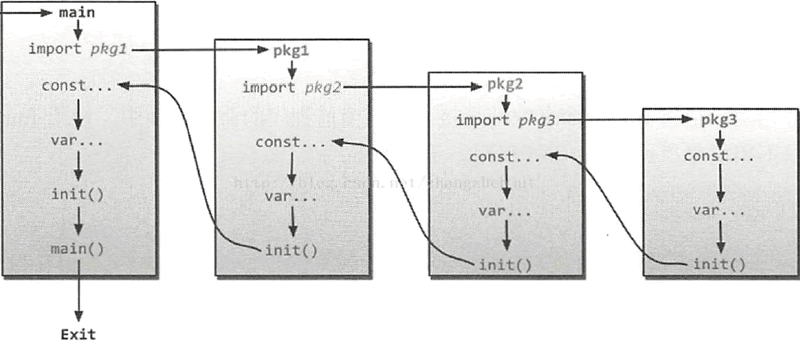

Go语言包的初始化有如下特点：
- 包初始化程序从 main 函数引用的包开始，逐级查找包的引用，直到找到没有引用其他包的包，最终生成一个包引用的有向无环图。
- Go 编译器会将有向无环图转换为一棵树，然后从树的叶子节点开始逐层向上对包进行初始化。
- 单个包的初始化过程如上图所示，先初始化常量，然后是全局变量，最后执行包的 init 函数。


###GO语言常用内置包
1. fmt:fmt 包实现了格式化的标准输入输出，这与C语言中的 printf 和 scanf 类似。其中的 fmt.Printf() 和 fmt.Println() 是开发者使用最为频繁的函数。

2. io:这个包提供了原始的 I/O 操作界面。它主要的任务是对 os 包这样的原始的 I/O 进行封装，增加一些其他相关，使其具有抽象功能用在公共的接口上。

3. bufio:bufio 包通过对 io 包的封装，提供了数据缓冲功能，能够一定程度减少大块数据读写带来的开销。在 bufio 各个组件内部都维护了一个缓冲区，数据读写操作都直接通过缓存区进行。当发起一次读写操作时，会首先尝试从缓冲区获取数据，只有当缓冲区没有数据时，才会从数据源获取数据更新缓冲。

4. sort:sort 包提供了用于对切片和用户定义的集合进行排序的功能。

5. strconv:strconv 包提供了将字符串转换成基本数据类型，或者从基本数据类型转换为字符串的功能。

6. os:os 包提供了不依赖平台的操作系统函数接口，设计像 Unix 风格，但错误处理是 go 风格，当 os 包使用时，如果失败后返回错误类型而不是错误数量。

7. sync:sync 包实现多线程中锁机制以及其他同步互斥机制。

8. flag:flag 包提供命令行参数的规则定义和传入参数解析的功能。绝大部分的命令行程序都需要用到这个包。

9. encoding/json:JSON 目前广泛用做网络程序中的通信格式。encoding/json 包提供了对 JSON 的基本支持，比如从一个对象序列化为 JSON 字符串，或者从 JSON 字符串反序列化出一个具体的对象等。

10. reflect:reflect 包实现了运行时反射，允许程序通过抽象类型操作对象。通常用于处理静态类型 interface{} 的值，并且通过 Typeof 解析出其动态类型信息，通常会返回一个有接口类型 Type 的对象。

11. strings:strings 包主要是处理字符串的一些函数集合，包括合并、查找、分割、比较、后缀检查、索引、大小写处理等等。

12. bytes:bytes 包提供了对字节切片进行读写操作的一系列函数。字节切片处理的函数比较多，分为基本处理函数、比较函数、后缀检查函数、索引函数、分割函数、大小写处理函数和子切片处理函数等。strings 包与 bytes 包的函数接口功能基本一致。

13.  log:log 包主要用于在程序中输出日志。log 包中提供了三类日志输出接口，Print、Fatal 和 Panic。
- Print 是普通输出；
- Fatal 是在执行完 Print 后，执行 os.Exit(1)；
- Panic 是在执行完 Print 后调用 panic() 方法。


##顺序编程——类C语言
###GOlang 单引号、双引号和反引号
Golang限定字符或者字符串一共三种引号，单引号（’’)，双引号("") 以及反引号(\`\`)。
1. 单引号，表示byte类型或rune类型，对应 uint8和int32类型，默认是 rune 类型。byte用来强调数据是raw data，而不是数字；而rune用来表示Unicode的code point。

2. 双引号，才是字符串，实际上是字符数组。可以用索引号访问某字节，也可以用len()函数来获取字符串所占的字节长度。

3. 反引号，表示字符串字面量，但不支持任何转义序列。字面量 raw literal string 的意思是，你定义时写的啥样，它就啥样，你有换行，它就换行。你写转义字符，它也就展示转义字符。


```
package main

import (
    "fmt"
    "reflect"
    "unsafe"
)

func main() {
    //String in double quotes
    x := "tit\nfor\ttat"
    fmt.Println("Priting String in Double Quotes:")
    fmt.Printf("x is: %s\n", x)

   //String in back quotes
    y := `tit\nfor\ttat`
    fmt.Println("\nPriting String in Back Quotes:")
    fmt.Printf("y is: %s\n", y)

    //Declaring a byte with single quotes
    var b byte = 'a'
    fmt.Println("\nPriting Byte:")
    //Print Size, Type and Character
    fmt.Printf("Size: %d\nType: %s\nCharacter: %c\n", unsafe.Sizeof(b), reflect.TypeOf(b), b)

    //Declaring a rune with single quotes
    r := '£'
    fmt.Println("\nPriting Rune:")
    //Print Size, Type, CodePoint and Character
    fmt.Printf("Size: %d\nType: %s\nUnicode CodePoint: %U\nCharacter: %c\n", unsafe.Sizeof(r), reflect.TypeOf(r), r, r)
    //Below will raise a compiler error - invalid character literal (more than one character)
    //r = 'ab'
}
```

输出:
```
Priting String in Double Quotes:
x is: tit
for	tat

Priting String in Back Quotes:
y is: tit\nfor\ttat

Priting Byte:
Size: 1
Type: uint8
Character: a

Priting Rune:
Size: 4
Type: int32
Unicode CodePoint: U+00A3
Character: £
```

反引号的应用场景，为了展示字面量
```
package main

import (
	"log"
)

const (
	doubleQuote string = "\nmain {\nconsole.log(event)\nreturn ret\n};\n"
	backQuote string = `
	main {
		console.log(event)
	};
	`
)

func main() {
	log.Printf("doubleQuote:%v\n", doubleQuote[1])
	log.Printf("backQuote:%s\n", backQuote)
}
```
输出
```
doubleQuote:109
backQuote:
main {
		console.log(event)
};
```
反引号在某些需要展示字符串字面量的场合还是很有用，比如我们要展示一个多行的函数。

单引号则通常用来表示rune类型，展示 unicode。

###GO语言关键字
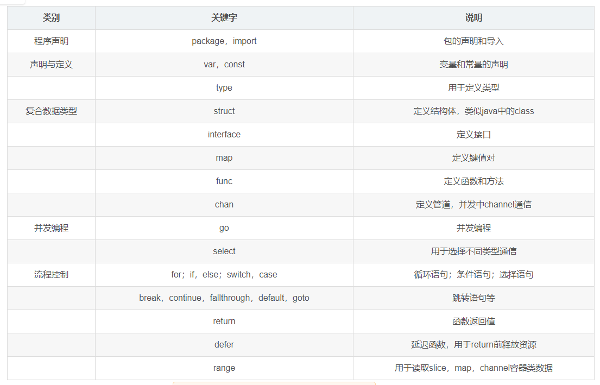
###GO语言命令
Usage：go command [arguments]

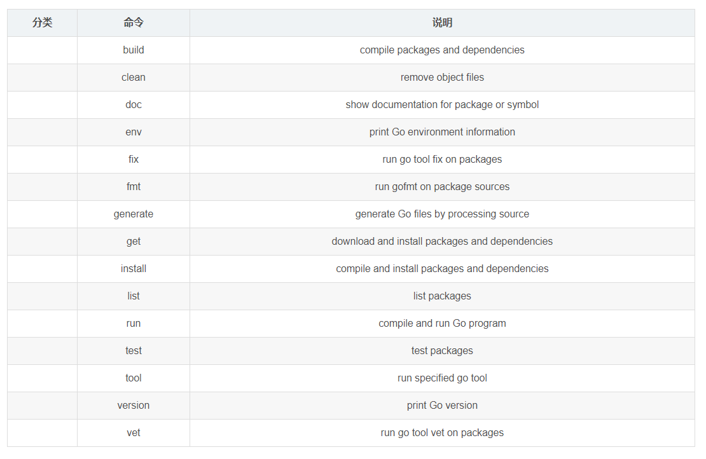

###顺序编程
####变量
1. 变量声明:
```
//1、单变量声明,类型放在变量名之后，可以为任意类型
var 变量名 类型
var v1,v2,v3 string //多变量同类型声明
//2、多变量声明
var {
    v1 int
    v2 []int
}
```

2. 变量初始化：
```
//1、使用关键字var，声明变量类型并赋值
var v1 int=10
//2、使用关键字var，直接对变量赋值，go可以自动推导出变量类型
var v2=10
//3、直接使用“：=”对变量赋值，不使用var，两者同时使用会语法冲突，推荐使用
v3:=10
```

3. 变量赋值:
```
//1、声明后再变量赋值
var v int
v=10
//2、多重赋值，经常使用在函数的多返回值中，err,v=func(arg)
i，j=j,i  //两者互换，并不需要引入中间变量
```
4. 匿名变量:
```
//1、声明后再变量赋值
var v int
v=10
//2、多重赋值，经常使用在函数的多返回值中，err,v=func(arg)
i，j=j,i  //两者互换，并不需要引入中间变量
```


####常量
​ Go语言中，常量是编译时期就已知且不可变的值，常量可以是数值类型（整型、浮点型、复数类型）、布尔类型、字符串类型。

1. 字面常量:
```
//字面常量(literal)指程序中硬编码的常量
3.14
“foo”
true
```
2. 常量定义:
```
//1、可以限定常量类型，但非必需
const Pi float64 = 3.14
//2、无类型常量和字面常量一样
const zero=0.0
//3、多常量赋值
const(
  size int64=1024
  eof=-1
)
//4、常量的多重赋值，类似变量的多重赋值
const u,v float32=0,3
const a,b,c=3,4,"foo"    //无类型常量的多重赋值
//5、常量赋值是编译期行为，可以赋值为一个编译期运算的常量表达式
const mask=1<<3
```
3. 预定义常量
```
//预定义常量：true、false、iota
//iota：可修改常量，在每次const出现时被重置为0，在下一个const出现前，每出现一次iota，其代表的值自动增1。
const(          //iota重置为0
  c0=iota       //c0==0
  c1=iota       //c1==1
  c2=iota       //c2==2
)
//两个const赋值语句一样可以省略后一个
const(          //iota重置为0
  c0=iota       //c0==0
  c1            //c1==1
  c2            //c2==2
)
```
4. 枚举
```
const(
  Sunday=iota    //Sunday==0,以此类推
  Monday
  Tuesday
  Wednesday
  Thursday
  Friday
  Saturday       //大写字母开头表示包外可见
  numberOfDays   //小写字母开头表示包内私有
)
```

####基础类型
1. 布尔类型
```
//布尔类型的关键字为bool,值为true或false，不可写为0或1
var v1 bool
v1=true
//接受表达式判断赋值，不支持自动或强制类型转换
v2:=(1==2)
```

2. 整型
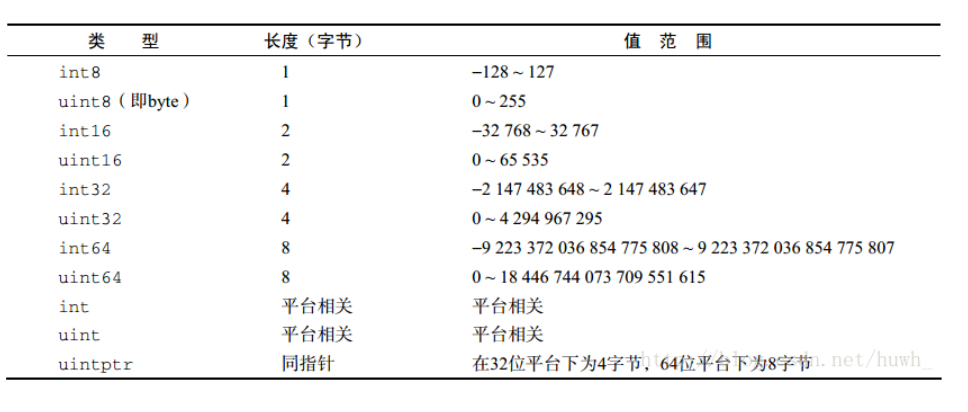
```
//1、类型表示
//int和int32为不同类型，不会自动类型转换需要强制类型转换
//强制类型转换需注意精度损失（浮点数→整数），值溢出（大范围→小范围）
var v2 int32
v1:=64
v2=int32(v1)

//2、数值运算,支持“+,-,*,/和%”
5%3 //求余

//3、比较运算,“<,>,==,>=,<=,!=”
//不同类型不能进行比较例如int和int8，但可以与字面常量（literal）进行比较
var i int32
var j int64
i,j=1,2
if i==j  //编译错误，不同类型不能进行比较
if i==1 || j==2  //编译通过，可以与字面常量（literal）进行比较

//4、位运算
//Go(^x)取反与C语言(~x)不同，其他类似，具体见下表
```
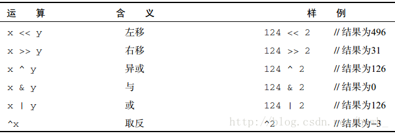

3. 浮点型
```
//1、浮点型分为float32(类似C中的float)，float64(类似C中的double)
var f1 float32
f1=12     //不加小数点，被推导为整型
f2:=12.0  //加小数点，被推导为float64
f1=float32(f2)  //需要执行强制转换
//2、浮点数的比较
//浮点数不是精确的表达方式，不能直接使用“==”来判断是否相等，可以借用math的包math.Fdim
```

4. 复数类型:
```
//1、复数的表示
var v1 complex64
v1=3.2+12i
//v1 v2 v3 表示为同一个数
v2:=3.2+12i
v3:=complex(3.2,12)
//2、实部与虚部
//z=complex(x,y),通过内置函数实部x=real(z),虚部y=imag(z)
```

5. 字符串:
```
//声明与赋值
var str string
str="hello world"
```
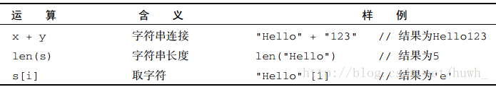

6. 字符类型
```
//1、byte，即uint8的别名
//2、rune，即Unicode
```

7. 错误类型(error)
####复合类型
1. 数组:数组表示同一类型数据，数组长度定义后就不可更改，长度是数组内的一个内置常量，可通过len()来获取。
```
//1、创建数组
var array1 [5]int    //声明：var 变量名 类型
var array2 [5]int=[5]int{1,2,3,4,5}   //初始化
array3：=[5]int{1,2,3,4,5}    //直接用“：=”赋值
[3][5]int  //二维数组
[3]*float  //指针数组

//2、元素访问
for i,v:=range array{
  //第一个返回值为数组下标，第二个为元素的值
}

//3、值类型
//数组在Go中作为一个值类型，值类型在赋值和函数参数传递时，只复制副本，因此在函数体中并不能改变数组的内容，需用指针来改变数组的值。
```

2. 切片(slice):​ 数组在定义了长度后无法改变，且作为值类型在传递时产生副本，并不能改变数组元素的值。因此切片的功能弥补了这个不足，切片类似指向数组的一个指针。可以抽象为三个变量：指向数组的指针；切片中元素的个数(len函数)；已分配的存储空间(cap函数)。

```
//1、创建切片
//a)基于数组创建
var myArray [5]int=[5]{1,2,3,4,5}
var mySlice []int=myArray[first:last]
slice1=myArray[:]   //基于数组所有元素创建
slice2=myArray[:3]  //基于前三个元素创建
slice3=myArray[3:]  //基于第3个元素开始后的所有元素创建
//b)直接创建
slice1:=make([]int,5)       //元素初始值为0，初始个数为5
slice2:=make([]int,5,10)    //元素初始值为0，初始个数为5，预留个数为10
slice3:=[]int{1,2,3,4,5}    //初始化赋值
//c)基于切片创建
oldSlice:=[]int{1,2,3,4,5}
newSlice:=oldSlice[:3]   //基于切片创建，不能超过原切片的存储空间(cap函数的值)

//2、元素遍历
for i,v:=range slice{
  //与数组的方式一致，使用range来遍历
  //第一个返回值(i)为索引，第二个为元素的值(v)
}

//3、动态增减元素
//切片分存储空间(cap)和元素个数(len)，当存储空间小于实际的元素个数，会重新分配一块原空间2倍的内存块，并将原数据复制到该内存块中，合理的分配存储空间可以以空间换时间，降低系统开销。
//添加元素
newSlice:=append(oldSlice,1,2,3)   //直接将元素加进去，若存储空间不够会按上述方式扩容。
newSlice1:=append(oldSlice1,oldSlice2...)  //将oldSlice2的元素打散后加到oldSlice1中，三个点不可省略。

//4、内容复制
//copy()函数可以复制切片，如果切片大小不一样，按较小的切片元素个数进行复制
slice1:=[]int{1,2,3,4,5}
slice2:=[]int{6,7,8}
copy(slice2,slice1)   //只会复制slice1的前三个元素到slice2中
copy(slice1,slice1)   //只会复制slice2的三个元素到slice1中的前三个位置
```

3. 键值对(map):map是一堆键值对的未排序集合。
```
//1、先声明后创建再赋值
var map1 map[键类型] 值类型
//创建
map1=make(map[键类型] 值类型)
map1=make(map[键类型] 值类型 存储空间)
//赋值
map1[key]=value

// 直接创建
m2 := make(map[string]string)
// 然后赋值
m2["a"] = "aa"
m2["b"] = "bb"

// 初始化 + 赋值一体化
m3 := map[string]string{
    "a": "aa",
    "b": "bb",
}

//2、元素删除
//delete()函数删除对应key的键值对，如果key不存在，不会报错；如果value为nil，则会抛出异常(panic)。
delete(map1,key)  

//3、元素查找
value,ok:=myMap[key]
if ok{//如果找到
  //处理找到的value值
}

//遍历
for key,value:=range myMap{
    //处理key或value
}
```
map可以用来判断一个值是否在切片或数组中。
```
// 判断某个类型（假如为myType）的值是否在切片或数组（假如为myList）中
// 构造一个map,key的类型为myType,value为bool型
myMap := make(map[myType]bool)
myList := []myType{value1, value2}
// 将切片中的值存为map中的key（因为key不能重复）,map的value都为true
for _, value := range myList {
    myMap[value] = true
}
// 判断valueX是否在myList中，即判断其是否在myMap的key中
if _, ok := myMap[valueX]; ok {
    // 如果valueX 在myList中，执行后续操作
}
```

####流程语句
1. 条件语句

```
//在if之后条件语句之前可以添加变量初始化语句，用;号隔离
if <条件语句> {    //条件语句不需要用括号括起来，花括号必须存在
  //语句体
}else{
  //语句体
}

//在有返回值的函数中，不允许将最后的return语句放在if...else...的结构中，否则会编译失败
//例如以下为错误范例
func example(x int) int{
  if x==0{
    return 5
  }else{
    return x  //最后的return语句放在if-else结构中，所以编译失败
  }
}
```
2. 选择语句:
```
//1、根据条件不同，对应不同的执行体
switch i{
  case 0:
    fmt.Printf("0")
  case 1:                //满足条件就会退出，只有添加fallthrough才会继续执行下一个case语句
    fmt.Prinntf("1")
  case 2,3,4:            //单个case可以出现多个选项
    fmt.Printf("2,3,4")
  default:               //当都不满足以上条件时，执行default语句
    fmt.Printf("Default")
}

//2、该模式等价于多个if-else的功能
switch {
  case <条件表达式1>:
    语句体1
  case <条件表达式2>:
    语句体2
}
```
3. 循环语句:
```
//1、Go只支持for关键字，不支持while，do-while结构
for i,j:=0,1;i<10;i++{    //支持多个赋值
  //语句体
}

//2、无限循环
sum:=1
for{  //不接条件表达式表示无限循环
  sum++
  if sum > 100{
    break   //满足条件跳出循环
  }
}

//3、支持continue和break，break可以指定中断哪个循环，break JLoop(标签)
for j:=0;j<5;j++{
  for i:=0;i<10;i++{
    if i>5{
      break JLoop   //终止JLoop标签处的外层循环
  }
  fmt.Println(i)
}
JLoop:    //标签处
...
```
4. 跳转语句:
```
//关键字goto支持跳转
func myfunc(){
  i:=0
  HERE:           //定义标签处
  fmt.Println(i)
  i++
  if i<10{
    goto HERE     //跳转到标签处
  }
}
```

####函数
1. 函数定义与调用:
```
//1、函数组成：关键字func ,函数名，参数列表，返回值，函数体，返回语句
//先名称后类型
func 函数名(参数列表)(返回值列表){  //参数列表和返回值列表以变量声明的形式，如果单返回值可以直接加类型
  函数体
  return    //返回语句
}
//例子
func Add(a,b int)(ret int,err error){
  //函数体
  return   //return语句
}

//2、函数调用
//先导入函数所在的包，直接调用函数
import "mymath"
sum,err:=mymath.Add(1,2)   //多返回值和错误处理机制
//可见性，包括函数、类型、变量
//本包内可见(private)：小写字母开头
//包外可见(public)：大写字母开头
```

2. 不定参数:
```
//1、不定参数的类型
func myfunc(args ...int){   //...type不定参数的类型，必须是最后一个参数，本质是切片
  for _,arg:=range args{
    fmt.Println(arg)
  }
}
//函数调用,传参可以选择多个，个数不定
myfunc(1,2,3)
myfunc(1,2,3,4,5)

//2、不定参数的传递，假如有个变参函数myfunc2(args ...int)
func myfunc1(args ...int){
  //按原样传递
  myfunc2(args...)
  //传递切片
  myfunc2(args[1:]...)
}

//3、任意类型的不定参数，使用interface{}作为指定类型
func Printf(format string,args ...interface{}){   //此为标准库中fmt.Printf()函数的原型
  //函数体
}
```

3. 多返回值:
```
//多返回值
func (file *File) Read(b []byte) (n int,err error)
//使用下划线"_"来丢弃返回值
n,_:=f.Read(buf)
```

4. 匿名函数与闭包:
```
//1、匿名函数：不带函数名的函数，可以像变量一样被传递
func(a,b int,z float32) bool{  //没有函数名
  return a*b<int(z)
}
f:=func(x,y int) int{
  return x+y
}

//2、闭包
```

####错误处理
1. error接口:
```
//定义error接口
type error interface{
  Error() string
}
//调用error接口
func Foo(param int) (n int,err error){
  //...
}
n,err:=Foo(0)
if err!=nil{
  //错误处理
}else{
  //使用返回值
}
```

2. defer[延迟函数]
语法：defer function_name()
- defer在声明时不会执行，而是推迟执行，在return执行前，倒序执行defer[先进后出]，一般用于释放资源，清理数据，记录日志，异常处理等。
- defer有一个特性：即使函数抛出异常，defer仍会被执行，这样不会出现程序错误导致资源不被释放，或者因为第三方包的异常导致程序崩溃。
- 一般用于打开文件后释放资源的操作，比如打开一个文件，最后总是要关闭的。而在打开和关闭之间，会有诸多的处理，可能会有诸多的if-else、根据不同的情况需要提前返回
```
f, = os.open(filename)
defer f.close()
do_something()
if (condition_a) {return}
do_something_again()
if (condition_b) {return}
do_further_things()
```
defer示例:
```
package main
import "fmt"

func deferTest(number int) int {
    defer func() {
        number++
        fmt.Println("three:", number)
    }()

    defer func() {
        number++
        fmt.Println("two:", number)
    }()

    defer func() {
        number++
        fmt.Println("one:", number)
    }()

    return number
}

func main() {
    fmt.Println("函数返回值：", deferTest(0))
}

/*
one: 1
two: 2
three: 3
函数返回值： 0
*/
```
这里涉及闭包的概念，闭包是由函数及相关的引用环境组合而成的实体(即：闭包=函数+引用环境)。

- 在函数式语言中，当内嵌函数体内引用到体外的变量时，将会把定义时涉及到的引用环境和函数体打包成一个整体（闭包）返回。现在给出引用环境的定义就容易理解了：引用环境是指在程序执行中的某个点所有处于活跃状态的约束（一个变量的名字和其所代表的对象之间的联系）所组成的集合。闭包的使用和正常的函数调用没有区别。
- 由于闭包把函数和运行时的引用环境打包成为一个新的整体，所以就解决了函数编程中的嵌套所引发的问题。当每次调用包含闭包的函数时都将返回一个新的闭包实例，这些实例之间是隔离的，分别包含调用时不同的引用环境现场。不同于函数，闭包在运行时可以有多个实例，不同的引用环境和相同的函数组合可以产生不同的实例。

闭包的价值:闭包的价值在于可以作为函数对象或者匿名函数，对于类型系统而言，这意味着不仅要表示数据还要表示代码。支持闭包的多数语言都将函数作为第一级对象，就是说这些函数可以存储到变量中作为参数传递给其他函数，最重要的是能够被函数动态创建和返回。


利用闭包实现斐波那契数列
```
package main

import (
	"fmt"
)

func fibonacci() func() int {
	b0 := 0
	b1 := 1
	return func() int {
		tmp := b0 + b1
		b0 = b1
		b1 = tmp
		return b1
	}

}

func main() {
	myFibonacci := fibonacci()
	for i := 1; i <= 5; i++ {
		fmt.Println(myFibonacci())
	}
}
```
###GO面向对象
面向对象的三个基本特性:
1. 封装
2. 继承
3. 多态


golang中没有class关键字，却引入了type，二者不是简单的替换那么简单，type表达的涵义远比class要广。


类声明：
```
type Poem struct {
  Title string
  Author string
  intro string
}
```
这样就声明了一个类，其中没有public、protected、private的声明。golang用另外一种做法来实现属性的访问权限：属性的开头字母是大写的则在其他包种可以被访问，否则只能在本包中访问。类的声明和方法也是如此。

注意:struct中是没有方法（行为）的，少了这个不是等于封装特征缺了只脚吗？当然不是了，Go语言里对应面向对象里的成员方法不是定义在struct里面，而是直接定义在struct外面，和struct平级，这里定义一个类似Java中的toString方法：

```
type Employee struct {
    Name string
    Sex  string
    Age  int
}

func (e *Employee) ToString() string {
    return "name=" + e.Name + ";sex=" + e.Sex + ";age=" + strconv.Itoa(e.Age)
}
```
这里(e *Employee)叫做方法的接收者，有点怪异，我们可以这样理解：
1. Go里没有this，要自己加个类似this的东西，用于指代方法对应的实例，括号里前面的e相当于this，当然名字可以随便取。
2. 方法定义和struct平级，如果不加个接收者定义，哪里知道这个方法属于谁的呢，括号里后面的类型表示这个方法属性于谁的，这里可以用（e Employee）或（e *Employee），区别是传值还是传指针，一般统一用后者。


####继承
同样，Go里面也没有像Java中类似extend继承的语法，Go是用了类似Java里组合的东西来让语法看起来像继承：

```
type TechEmployee struct {
    Employee
    SalaryPerMonth float32
}

type SaleEmployee struct {
    Employee
    BaseSalary float32
    ExtraRate  float32
}

//实例化时，是传了个employee
tech := object.TechEmployee{
    Employee:       object.Employee{Name: "lee"},
    SalaryPerMonth: 10000,
}
//这里看起来像拥有了Employee的name属性，可以设置和访问
tech.Name = "bruce lee"
fmt.Println(tech.Name)
```

####多态
关于多态，必须要提接口，终于Go里也是有接口的了：
```
type TechEmployee struct {
    Employee
    SalaryPerMonth float32
}

func (e *TechEmployee) CalcSalary() float32 {
    return e.SalaryPerMonth
}

type Machine struct {

}

func (e *Machine) CalcSalary() float32 {
    return 0
}
```
相比于Java而言，GO语言的接口并没有那么直观，但更灵活。它没有指定实现哪个接口，而是如果定义了一个相同名字和返回值的方法，就认为是实现了对应拥有这个方法的接口，这里假如接口有两个方法，对应也必须要两个方法都有定义了，才认为是实现了接口。

####构造函数(自己构造)
```
func NewPoem(author string) (poem *Poem) {
  poem = &Poem{}
  poem.Author = author
  return
}

poem6 := NewPoem("Heine")
```
