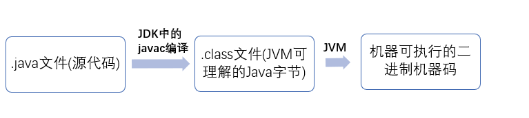

# JAVA基本功
## JAVA基础概念

1. JVM是什么？
- Java 虚拟机（JVM）是运行 Java 字节码的虚拟机。JVM 有针对不同系统的特定实现（Windows，Linux，macOS），目的是使用相同的字节码，它们都会给出相同的结果。

2. 什么是字节码？
- 在 Java 中，JVM 可以理解的代码就叫做字节码（即扩展名为 .class 的文件），它不面向任何特定的处理器，只面向虚拟机。
- Java 语言通过字节码的方式，在一定程度上解决了传统解释型语言执行效率低的问题，同时又保留了解释型语言可移植的特点。

3. JAVA程序从源代码到运行分为三步：

- 需要格外注意的是 .class->机器码这一步，在这一步 JVM 类加载器首先加载字节码文件，然后通过解释器逐行解释执行，这种方式的执行速度会相对比较慢。有些方法和代码块是经常需要被调用的(也就是所谓的热点代码)，所以后面引进了 JIT 编译器，而 JIT 属于运行时编译。当 JIT 编译器完成第一次编译后，其会将字节码对应的机器码保存下来，下次可以直接使用。而我们知道，机器码的运行效率肯定是高于 Java 解释器的。这也解释了我们为什么经常会说 Java 是编译与解释共存的语言。

4. JDK,JRE和JVM的区别
- JDK 是 java开发工具包(Java Development Kit 缩写)，是JAVA环境的核心组件，并提供编译调试和运行一个JAVA程序所需的所有工具，它是功能齐全的 Java SDK。JDK是一个平台特定的软件，有针对windows,Mac和Unix系统的不同安装包。可以说JDK是JRE的超集，它拥有 JRE 所拥有的一切，还有编译器（javac）和工具（如 javadoc 和 jdb）。它能够创建和编译程序。
- JRE 是 Java 运行时环境。它是运行已编译 Java 程序所需的所有内容的集合，包括 Java 虚拟机（JVM），Java 类库，java 命令和其他的一些基础构件。但是，它不能用于创建新程序。
- JVM(Java虚拟机)是Java 编程语言的核心。当我们运行一个程序时，JVM 负责将字节码转换为特定机器代码。JVM 也是平台特定的，并提供核心的 Java 方法，例如内存管理、垃圾回收和安全机制等。JVM 是可定制化的，我们可以通过 Java 选项(java options)定制它，比如配置 JVM 内存的上下界。JVM 之所以被称为虚拟的是因为它提供了一个不依赖于底层操作系统和机器硬件的接口。这种独立于硬件和操作系统的特性正是 Java 程序可以一次编写多处执行的原因。

5. JAVA和C++的异同
- 都是面向对象的语言，都支持封装、继承和多态
- Java 不提供指针来直接访问内存，程序内存更加安全
- Java 的类是单继承的，C++ 支持多重继承；虽然 Java 的类不可以多继承，但是接口可以多继承。
- Java 有自动内存管理垃圾回收机制(GC)，不需要程序员手动释放无用内存
- 在 C 语言中，字符串或字符数组最后都会有一个额外的字符'\0'来表示结束。但是，Java 语言中没有结束符这一概念。

6. JAVA编译与解释共存
- 编译型语言是指编译器针对特定的操作系统将源代码一次性翻译成可被该平台执行的机器码。（类似全文翻译）
- 解释型语言是指解释器对源程序逐行解释成特定平台的机器码并立即执行。（类似逐段翻译）
- Java 编写的程序需要先经过编译步骤，生成字节码（* .class 文件），这种字节码必须由 Java 解释器来解释执行。

7. 什么是JIT(即时编译器)
- JIT是JVM的一部分
- 它可以在同一时间编译类似的字节码来优化将字节码转换为机器特定语言的过程相似的字节码，从而将优化字节码转换为机器特定语言的过程，这样减少转换过程所需要花费的时间。

## 面向对象编程
面向对象编程是一种使用类和对象来设计程序的方法或模式。
###面向对象的基本概念
它涉及其中的几个概念：
1. 对象：任何具有状态和行为的实体都称为对象。例如：椅子，钢笔，桌子，键盘，自行车等。它可以是物理和逻辑的。
2. 类：对象的集合称为类，它是一个逻辑实体。
3. 继承：当一个对象获取父对象的所有属性和行为时，称为继承。它提供代码可重用性，它用于实现运行时多态性。继承是面向对象的编程概念，一个对象基于另一个对象构建。继承是代码重用的机制， 被继承的类称为超类，继承超类的类称为子类。在java中使用extends关键字来实现继承。
4. 多态性：当一个任务通过不同的方式执行时，称为多态性。
5. 抽象：隐藏内部细节和显示功能称为抽象。例如：电话，但我们不知道内部是如何处理通话/通信的。
抽象是隐藏内部细节和用简单的术语描述事物的概念。
6. 封装：将代码和数据绑定(或包装)在一起成为单个单元称为封装。例如：胶囊，它包裹着不同的药物。
一个java类是封装的例子。Java bean是完全封装的类，因为所有的数据成员在这里是私有的。
封装是用于在面向对象编程中实现抽象的技术。封装用于对类成员和方法的访问限制。
访问修饰符关键字用于面向对象编程中的封装。例如，java中的封装是使用private，protected和public关键字实现的。
7. 组合：组合是聚合的特例。组合是一种更具限制性的聚合形式。
-------------------------------------------------------

1. JAVA中的方法覆盖Overriding和方法重载Overloading：Java 中的方法重载发生在同一个类里面两个或者是多个方法的方法名相同但是参数不同的情况。与此相对，方法覆盖是说子类重新定义了父类的方法。方法覆盖必须有相同的方法名，参数列表和返回类型。覆盖者可能不会限制它所覆盖的方法的访问。Overload 是重载的意思，Override 是覆盖的意思，也就是重写。
- 覆盖的方法的标志必须要和被覆盖的方法的标志完全匹配，才能达到覆盖的效果；
- 覆盖的方法的返回值必须和被覆盖的方法的返回一致；
- 覆盖的方法所抛出的异常必须和被覆盖方法的所抛出的异常一致，或者是其子类；
- 被覆盖的方法不能为 private，否则在其子类中只是新定义了一个方法，并没有对其进行覆盖。
- 在使用重载时只能通过不同的参数样式。
- 方法的异常类型和数目不会对重载造成影响；
- 对于继承来说，如果某一方法在父类中是访问权限是 priavte，那么就不能在子类对其进行重载，如果定义的话，也只是定义了一个新方法，而不会达到重载的效果。

2. JAVA中的构造函数，构造函数重载，复制构造函数：
- 当新对象被创建的时候，构造函数会被调用。每一个类都有构造函数。
- Java 中构造函数重载和方法重载很相似。可以为一个类创建多个构造函数。每一个构造函数必须有它自己唯一的参数列表。
- Java 不支持像 C++ 中那样的复制构造函数，这个不同点是因为如果你不自己写构造函数的情况下，Java不会创建默认的复制构造函数。

3. JAVA不支持多继承，每个类只能继承一个类，但是可以实现多个接口
4. 接口和抽象类的区别是什么？
- 接口中所有的方法隐含的都是抽象的。而抽象类则可以同时包含抽象和非抽象的方法。
- 类可以实现很多个接口，但是只能继承一个抽象类
- 类如果要实现一个接口，它必须要实现接口声明的所有方法。但是，类可以不实现抽象类声明的所有方法，当然，在这种情况下，类也必须得声明成是抽象的。
- 抽象类可以在不提供接口方法实现的情况下实现接口。
- Java 接口中声明的变量默认都是 final 的。抽象类可以包含非 final 的变量。
- Java 接口中的成员函数默认是 public 的。抽象类的成员函数可以是 private，protected 或者是 public 。
- 接口是绝对抽象的，不可以被实例化。抽象类也不可以被实例化，但是，如果它包含 main 方法的话是可以被调用的。

### 总结
面向对象编程的优点
1. OOP使开发和维护变得更容易，因为在面向过程的编程语言中，如果代码随着项目规模的增长而增长，则不容易管理。
2. OOP提供数据隐藏，而在面向过程的编程语言中，可以从任何地方访问全局数据。
3. OOP提供更有效地模拟真实世界事件的能力。如果使用面向对象的编程语言，我们可以提供真实世界里的问题的解决方案。
