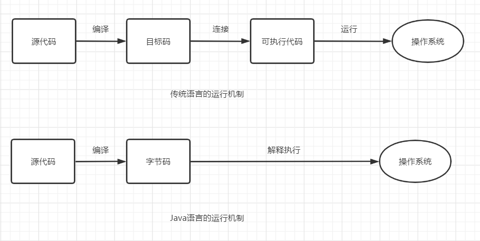

# JAVA基本功
<p align="center">
    <a href="https://mp.weixin.qq.com/s/ePhaYezFblgt0NgbvtWqww" target="_ blank">
        
    </a>
</p>

## JAVA基础概念


1. JVM是什么？
- Java 虚拟机（JVM）是运行 Java 字节码的虚拟机。JVM 有针对不同系统的特定实现（Windows，Linux，macOS），目的是使用相同的字节码，它们都会给出相同的结果。

2. 什么是字节码？
- 在 Java 中，JVM 可以理解的代码就叫做字节码（即扩展名为 .class 的文件），它不面向任何特定的处理器，只面向虚拟机。
- Java 语言通过字节码的方式，在一定程度上解决了传统解释型语言执行效率低的问题，同时又保留了解释型语言可移植的特点。

3. JAVA程序从源代码到运行分为三步：

- 需要格外注意的是 .class->机器码这一步，在这一步 JVM 类加载器首先加载字节码文件，然后通过解释器逐行解释执行，这种方式的执行速度会相对比较慢。有些方法和代码块是经常需要被调用的(也就是所谓的热点代码)，所以后面引进了 JIT 编译器，而 JIT 属于运行时编译。当 JIT 编译器完成第一次编译后，其会将字节码对应的机器码保存下来，下次可以直接使用。而我们知道，机器码的运行效率肯定是高于 Java 解释器的。这也解释了我们为什么经常会说 Java 是编译与解释共存的语言。

4. JDK,JRE和JVM的区别
- JDK 是 java开发工具包(Java Development Kit 缩写)，是JAVA环境的核心组件，并提供编译调试和运行一个JAVA程序所需的所有工具，它是功能齐全的 Java SDK。JDK是一个平台特定的软件，有针对windows,Mac和Unix系统的不同安装包。可以说JDK是JRE的超集，它拥有 JRE 所拥有的一切，还有编译器（javac）和工具（如 javadoc 和 jdb）。它能够创建和编译程序。
- JRE 是 Java 运行时环境。它是运行已编译 Java 程序所需的所有内容的集合，包括 Java 虚拟机（JVM），Java 类库，java 命令和其他的一些基础构件。但是，它不能用于创建新程序。
- JVM(Java虚拟机)是Java 编程语言的核心。当我们运行一个程序时，JVM 负责将字节码转换为特定机器代码。JVM 也是平台特定的，并提供核心的 Java 方法，例如内存管理、垃圾回收和安全机制等。JVM 是可定制化的，我们可以通过 Java 选项(java options)定制它，比如配置 JVM 内存的上下界。JVM 之所以被称为虚拟的是因为它提供了一个不依赖于底层操作系统和机器硬件的接口。这种独立于硬件和操作系统的特性正是 Java 程序可以一次编写多处执行的原因。

5. JAVA和C++的异同
- 都是面向对象的语言，都支持封装、继承和多态
- Java 不提供指针来直接访问内存，程序内存更加安全
- Java 的类是单继承的，C++ 支持多重继承；虽然 Java 的类不可以多继承，但是接口可以多继承。
- Java 有自动内存管理垃圾回收机制(GC)，不需要程序员手动释放无用内存
- 在 C 语言中，字符串或字符数组最后都会有一个额外的字符'\0'来表示结束。但是，Java 语言中没有结束符这一概念。

6. JAVA编译与解释共存
- 编译型语言是指编译器针对特定的操作系统将源代码一次性翻译成可被该平台执行的机器码。（类似全文翻译）
- 解释型语言是指解释器对源程序逐行解释成特定平台的机器码并立即执行。（类似逐段翻译）
- Java 编写的程序需要先经过编译步骤，生成字节码（* .class 文件），这种字节码必须由 Java 解释器来解释执行。

7. 什么是JIT(即时编译器)
- JIT是JVM的一部分
- 它可以在同一时间编译类似的字节码来优化将字节码转换为机器特定语言的过程相似的字节码，从而将优化字节码转换为机器特定语言的过程，这样减少转换过程所需要花费的时间。

8. JAVA的特点:
- 简单:去掉了C和C++中许多复杂功能,如指针、运算符重载等，没有goto语句,没有struct和union等
- 面向对象:JAVA是完全面向对象的编程语言，比C++更彻底，纯度更高
- 健壮性:没有指针，避免对指针的误操作造成程序崩溃。JAVA虚拟机具有垃圾回收机制来统一管理，避免内存泄漏
- 安全性:由于JAVA取消了指针运算，有效地提高了程序的安全性。JAVA运行在JAVA虚拟机上，虚拟机可以有效地过滤掉恶意代码，防止程序员有意编写的病毒程序
- 多线程：JAVA程序使用一个称为"多线程"的进程同时处理多项任务

9. JAVA平台无关性
- JAVA是一种既面向对象又可以跨平台的语言，即编写一次，随处运行
- JAVA不仅适用于单机应用程序和基于网络的程序，也可用于创建消费类设备的附件程序。
- Java语言编写的程序实际是运行在JVM上，而不是在操作系统上


10. 程序运行机制的对比


11. 关键词:
- goto 是 Java 中的保留字，在目前版本的 Java 中没有使用。
- final的作用：1)被final修饰的类不可以被继承;2)被final修饰的方法不可以被重写;3)被final修饰的变量不可以被改变，被final修饰不可变的是变量的引用，而不是引用指向的内容，引用指向的内容是可以改变的
- final finally finalize区别:1)final可以修饰类、变量、方法，修饰类表示该类不能被继承、修饰方法表示该方法不能被重写、修饰变量表示该变量是一个常量不能被重新赋值。2)finally一般作用在try-catch代码块中，在处理异常的时候，通常我们将一定要执行的代码方法finally代码块中，表示不管是否出现异常，该代码块都会执行，一般用来存放一些关闭资源的代码。3)finalize是一个方法，属于Object类的一个方法，而Object类是所有类的父类，该方法一般由垃圾回收器来调用，当我们调用System.gc() 方法的时候，由垃圾回收器调用finalize()，回收垃圾，一个对象是否可回收的最后判断。
- this关键字的用法:1)普通的直接引用，this相当于是指向当前对象本身。2)形参与成员名字重名，用this来区分;3)引用本类的构造函数
- static存在的主要意义:1)static的主要意义是在于创建独立于具体对象的域变量或者方法。以致于即使没有创建对象，也能使用属性和调用方法！2)static关键字还有一个比较关键的作用就是 用来形成静态代码块以优化程序性能。static块可以置于类中的任何地方，类中可以有多个static块。在类初次被加载的时候，会按照static块的顺序来执行每个static块，并且只会执行一次。

- 比较常见的static应用场景有:1)修饰成员变量 2)修饰成员方法 3)静态代码块 4)修饰类【只能修饰内部类也就是静态内部类】 5)静态导包
- static注意事项:1)静态只能访问静态。2)非静态既可以访问非静态的，也可以访问静态的。


## 面向对象编程
面向对象编程是一种使用类和对象来设计程序的方法或模式。


###面向对象的基本概念
它涉及其中的几个概念：
1. 对象：任何具有状态和行为的实体都称为对象。例如：椅子，钢笔，桌子，键盘，自行车等。它可以是物理和逻辑的。
2. 类：对象的集合称为类，它是一个逻辑实体。
3. 继承：当一个对象获取父对象的所有属性和行为时，称为继承。它提供代码可重用性，它用于实现运行时多态性。继承是面向对象的编程概念，一个对象基于另一个对象构建。继承是代码重用的机制， 被继承的类称为超类，继承超类的类称为子类。在java中使用extends关键字来实现继承。
- 父类（超类/基类）：提供继承信息的类
- 子类（派生类）：得到继承信息的类
4. 多态性：当一个任务通过不同的方式执行时，称为多态性。JAVA的多态性体现在两方面：
- 由方法重载实现的静态多态性(编译时多态)
- 由方法重写实现的动态多态性(运行时多态)
5. 抽象：隐藏内部细节和显示功能称为抽象。例如：电话，但我们不知道内部是如何处理通话/通信的。
抽象是隐藏内部细节和用简单的术语描述事物的概念。
6. 封装：将代码和数据绑定(或包装)在一起成为单个单元称为封装。例如：胶囊，它包裹着不同的药物。
一个java类是封装的例子。Java bean是完全封装的类，因为所有的数据成员在这里是私有的。
封装是用于在面向对象编程中实现抽象的技术。封装用于对类成员和方法的访问限制。
访问修饰符关键字用于面向对象编程中的封装。例如，java中的封装是使用private，protected和public,default关键字实现的。


- private : 在同一类内可见。使用对象：变量、方法。注意：不能修饰类（外部类）
- default (即缺省，什么也不写，不使用任何关键字）: 在同一包内可见，不使用任何修饰符。使用对象：类、接口、变量、方法。
- protected : 对同一包内的类和所有子类可见。使用对象：变量、方法。注意：不能修饰类（外部类）。
- public : 对所有类可见。使用对象：类、接口、变量、方法


7. 组合：组合是聚合的特例。组合是一种更具限制性的聚合形式。
-------------------------------------------------------

1. JAVA中的方法覆盖Overriding和方法重载Overloading：Java 中的方法重载发生在同一个类里面两个或者是多个方法的方法名相同但是参数不同的情况。与此相对，方法覆盖是说子类重新定义了父类的方法。方法覆盖必须有相同的方法名，参数列表和返回类型。覆盖者可能不会限制它所覆盖的方法的访问。Overload 是重载的意思，Override 是覆盖的意思，也就是重写。
- 覆盖的方法的标志必须要和被覆盖的方法的标志完全匹配，才能达到覆盖的效果；
- 覆盖的方法的返回值必须和被覆盖的方法的返回一致；
- 覆盖的方法所抛出的异常必须和被覆盖方法的所抛出的异常一致，或者是其子类；
- 被覆盖的方法不能为 private，否则在其子类中只是新定义了一个方法，并没有对其进行覆盖。
- 在使用重载时只能通过不同的参数样式。
- 方法的异常类型和数目不会对重载造成影响；
- 对于继承来说，如果某一方法在父类中是访问权限是 priavte，那么就不能在子类对其进行重载，如果定义的话，也只是定义了一个新方法，而不会达到重载的效果。

2. JAVA中的构造函数，构造函数重载，复制构造函数：
- 当新对象被创建的时候，构造函数会被调用。每一个类都有构造函数。
- Java 中构造函数重载和方法重载很相似。可以为一个类创建多个构造函数。每一个构造函数必须有它自己唯一的参数列表。
- Java 不支持像 C++ 中那样的复制构造函数，这个不同点是因为如果你不自己写构造函数的情况下，Java不会创建默认的复制构造函数。

3. JAVA不支持多继承，每个类只能继承一个类，但是可以实现多个接口
4. 接口和抽象类的区别是什么？
- 接口中所有的方法隐含的都是抽象的。而抽象类则可以同时包含抽象和非抽象的方法。
- 类可以实现很多个接口，但是只能继承一个抽象类
- 类如果要实现一个接口，它必须要实现接口声明的所有方法。但是，类可以不实现抽象类声明的所有方法，当然，在这种情况下，类也必须得声明成是抽象的。
- 抽象类可以在不提供接口方法实现的情况下实现接口。
- Java 接口中声明的变量默认都是 final 的。抽象类可以包含非 final 的变量。
- Java 接口中的成员函数默认是 public 的。抽象类的成员函数可以是 private，protected 或者是 public 。
- 接口是绝对抽象的，不可以被实例化。抽象类也不可以被实例化，但是，如果它包含 main 方法的话是可以被调用的。


5. 构造代码块和构造函数的区别：
- 构造代码块：是给所有的对象进行初始化 ，只要对象一建立就会调用这个代码块。
- 构造函数：是给与之对应的对象进行初始化。


### 面向对象五大基本原则是什么
1. 单一职责原则SRP(Single Responsibility Principle)
类的功能要单一，不能包罗万象，跟杂货铺似的。

2. 开放封闭原则OCP(Open－Close Principle)
一个模块对于拓展是开放的，对于修改是封闭的，想要增加功能热烈欢迎，想要修改，哼，一万个不乐意。

3. 里式替换原则LSP(the Liskov Substitution Principle LSP)
子类可以替换父类出现在父类能够出现的任何地方。比如你能代表你爸去你姥姥家干活。哈哈~~

4. 依赖倒置原则DIP(the Dependency Inversion Principle DIP)
高层次的模块不应该依赖于低层次的模块，他们都应该依赖于抽象。抽象不应该依赖于具体实现，具体实现应该依赖于抽象。就是你出国要说你是中国人，而不能说你是哪个村子的。比如说中国人是抽象的，下面有具体的xx省，xx市，xx县。你要依赖的抽象是中国人，而不是你是xx村的。

5. 接口分离原则ISP(the Interface Segregation Principle ISP)
设计时采用多个与特定客户类有关的接口比采用一个通用的接口要好。就比如一个手机拥有打电话，看视频，玩游戏等功能，把这几个功能拆分成不同的接口，比在一个接口里要好的多。


### 总结
面向对象编程的优点
1. OOP使开发和维护变得更容易，因为在面向过程的编程语言中，如果代码随着项目规模的增长而增长，则不容易管理。
2. OOP提供数据隐藏，而在面向过程的编程语言中，可以从任何地方访问全局数据。
3. OOP提供更有效地模拟真实世界事件的能力。如果使用面向对象的编程语言，我们可以提供真实世界里的问题的解决方案。


面向对象和面向过程的区别：
- 面向过程：事物比较简单，可以用线性的思维去解决。
- 面向对象：事物比较复杂，使用简单的线性思维无法解决。
- 共同点：都是解决实际问题的一种思维方式。解决复杂问题，通过面向对象方式便于我们从宏观上把握事物之间复杂的关系，方便我们分析整个系统；具体到微观操作，仍然使用面向过程方式来处理。


## 数据类型
1. 8大基本类型：
- boolean:1位
- byte:8位
- char:16位
- short:16位
- int:32位
- float:32位
- long:64位
- double:64位


2. 封装器类(wrapper)
- Boolean:基本类型boolean二进制位数:Boolean.SIZE;最小值:Boolean.MIN_VALUE;最大值:Boolean.MAX_VALUE;
- Byte:基本类型byte二进制位数:Byte.SIZE;最小值:Byte.MIN_VALUE;最大值:Byte.MAX_VALUE;
- Character:基本类型char二进制位数:Character.SIZE;最小值:Character.MIN_VALUE;最大值:Character.MAX_VALUE;
- Short:基本类型short二进制位数:Short.SIZE;最小值:Short.MIN_VALUE;最大值:Short.MAX_VALUE;
- Integer:基本类型int二进制位数:Integer.SIZE;最小值:Integer.MIN_VALUE;最大值:Integer.MAX_VALUE;
- Long:基本类型long二进制位数:Long.SIZE;最小值:Long.MIN_VALUE;最大值:Long.MAX_VALUE;
- Float:基本类型float二进制位数:Float.SIZE;最小值:Float.MIN_VALUE;最大值:Float.MAX_VALUE;
- Double:基本类型double二进制位数:Double.SIZE;最小值:Double.MIN_VALUE;最大值:Double.MAX_VALUE;

3. 常量的定义，有两种方法
- 在定义变量的类型前面加final关键字，并进行初始化
- 在定义变量的类型前面加final关键字,不进行初始化。通过另外的语句进行赋值。

4. 值类型和引用类型
- 值类型：变量名指向具体的数值；引用类型：变量名指向存数据对象的内存地址
- 值类型：变量在声明之后，Java 就会立刻分配给他内存空间；引用类型：它以特殊的方式（类似 C 指针）向对象实体（具体的值），这类变量声明时不会分配内存，只是存储了一个内存地址。
- 值类型：使用时需要赋具体值,判断时使用 == 号。引用类型：使用时可以赋 null，判断时使用 equals 方法。
- 值类型分配在栈上，引用类型分配在堆上。


5. 4种引用类型
- 强引用：强引用是使用最普遍的引用。如果一个对象具有强引用，那垃圾回收器绝不会回收它。当内存空间不足，Java虚拟机宁愿抛出OutOfMemoryError错误，使程序异常终止，也不会靠随意回收具有强引用的对象来解决内存不足的问题。  ps：强引用其实也就是我们平时A a = new A()这个意思。
- 软引用：如果一个对象只具有软引用，则内存空间足够，垃圾回收器就不会回收它；如果内存空间不足了，就会回收这些对象的内存。只要垃圾回收器没有回收它，该对象就可以被程序使用。软引用可用来实现内存敏感的高速缓存
- 弱引用：相比于软引用更弱的一种引用类型。只具有弱引用的对象拥有更短暂的生命周期。在垃圾回收器线程扫描它所管辖的内存区域的过程中，一旦发现了只具有弱引用的对象，不管当前内存空间足够与否，都会回收它的内存。
- 虚引用：“虚引用”顾名思义，就是形同虚设，与其他几种引用都不同，虚引用并不会决定对象的生命周期。如果一个对象仅持有虚引用，那么它就和没有任何引用一样，在任何时候都可能被垃圾回收器回收。虚引用主要用来跟踪对象被垃圾回收器回收的活动。虚引用与软引用和弱引用的一个区别在于：虚引用必须和引用队列 （ReferenceQueue）联合使用。当垃圾回收器准备回收一个对象时，如果发现它还有虚引用，就会在回收对象的内存之前，把这个虚引用加入到与之 关联的引用队列中。


6. 自动数据类型转换
- 自动转换按从低到高的顺序转换。不同类型数据间的优先关系如下：
低--------------------------------------------->高
byte,short,char-> int -> long -> float -> double
- 不能对boolean类型进行类型转换。
- 不能把对象类型转换成不相关类的对象。
- 在把容量大的类型转换为容量小的类型时必须使用强制类型转换。
- 转换过程中可能导致溢出或损失精度
- 浮点数到整数的转换是通过舍弃小数得到，而不是四舍五入
- 弱类型->强类型:隐式类型转换
- 强类型->弱类型:强制类型转换


7. 装箱与拆箱
- 自动装箱和拆箱都是由编译器完成的，编译器会在编译期根据语法决定是否进行装箱和拆箱动作。
- 包装器类型与基本数据类型的区别:1)基本类型只有值，而装箱基本类型既具有值也具有它们对象的同一性(就是两个装箱的基本类型具有相同的值和不同的同一性(对象不一样));2)基本类型只有功能完备的值，而每个装箱类型不仅具有完备的值还具有所有功能值之外的null。3)基本类型通常比装箱基本类型更节省时间和空间。
- Java为每种基本数据类型都提供了对应的包装器类型
- 装箱:自动将基本数据类型转换为包装器类型.装箱过程是通过调用包装器的valueOf方法实现的。例Integer i = 10;
- 拆箱:自动将包装器类型转换成基本数据类型.拆箱过程是通过调用包装器的xxxValue方法实现的(xxx代表对应的基本数据类型)。例int n = i;
- 自动装箱主要发生在两种情况：1)方法调用时；2)赋值时
- "==" 与 "equals"比较：1)“equals”只能是对象和基本类型比较;2)“==”只能比较基本类型和同类型间的比较（如Integer 和int或者int与Double之间,而int和String不能比较）

8. 复合数据类型
- JAVA字符串String
- JAVA容器
- ArrayList
- HashSet
- HashMap
- 枚举
- 类
- 数组


9. switch 是否能作用在 byte 上，是否能作用在 long 上，是否能作用在 String 上?
- 在 Java 5 以前，switch(expr)中，expr 只能是 byte、short、char、int。从 Java5 开始，Java 中引入了枚举类型，expr 也可以是 enum 类型，从 Java 7 开始，expr 还可以是字符串（String），但是长整型（long）在目前所有的版本中都是不可以的。

10. 用最有效率的方法计算 2 乘以 8
- 2 << 3（左移 3 位相当于乘以 2 的 3 次方，右移 3 位相当于除以 2 的 3 次方）。

11. Math.round(11.5) 等于多少？Math.round(-11.5)等于多少
- Math.round(11.5)的返回值是 12，Math.round(-11.5)的返回值是-11。四舍五入的原理是在参数上加 0.5 然后进行下取整。

12. float f=3.4;是否正确
- 不正确。3.4 是双精度数，将双精度型（double）赋值给浮点型（float）属于下转型（down-casting，也称为窄化）会造成精度损失，因此需要强制类型转换float f =(float)3.4; 或者写成 float f =3.4F;。

13. short s1 = 1; s1 = s1 + 1;有错吗?short s1 = 1; s1 += 1;有错吗
- 对于 short s1 = 1; s1 = s1 + 1;由于 1 是 int 类型，因此 s1+1 运算结果也是 int型，需要强制转换类型才能赋值给 short 型。
- 而 short s1 = 1; s1 += 1;可以正确编译，因为 s1+= 1;相当于 s1 = (short(s1 + 1);其中有隐含的强制类型转换。


##JAVA字符串String
java的字符串String类位于java.lang包下，是整个Java语言的基石。同时String类使用final关键词修饰，意味着外部调用者无法通过继承和重写来更改其功能。

1. String初始化
- 基本法：String a = "abc";这种方法首先从常量池中查找是否有相同值的字符串对象，如果有，则直接将对象地址赋予引用变量；如果没有，在首先在常量池区域中创建一个新的字符串对象，然后将地址赋予引用变量。
- 构造方法：String a = new String("abc");相比于基本法，构造方法是创建一个全新的字符串对象。几种构造方法:
  - 无参数构造:String str1 = new String();
  - 用已知的字符串value创建一个String对象:String str2 = new String("asdf");
  - 用字符数组value创建一个String对象:String str3 = new String({'a','b','c'});
  - 用字符数组chars的startIndex开始的numChars个字符创建一个String对象:String str4 = new String({'a','b','c'},1,2);
  - 用比特数组values创建一个String对象:byte[] strb = new byte[]{65,66};String str5 = new String(strb);
  - 用字符串数组value的offset位置开始的count个字符，建立一个字符串对象，之后并不影响原来的字符数组：byte[] strb = new byte[]{61,62,63,64,65,66};str6 = new String(strb,2,3);或是char[] strchar = new char[]{'a','b','c','d','e','f'};str6 = new String(strchar,2,3);

- String类的常用方法：
  - 求字符串长度:str.length();
  - 求字符串某一位置字符:str.charAt(4);
  - 提取子串:str.substring(2);或str.substring(2,5);
  - 字符串比较:str1.compareTo(str2);
  - 字符串连接:str1.concat(str2);
  - 字符串中单个字符查找:str.indexOf('a');
  - 字符串中字符的大小写转换:str.toLowerCase();str.toUpperCase();
  - 字符串中字符的替换:str.replace('a','g');str.replaceFirst('a','g');str.replaceAll('a','g');
  - 截去字符串两端的空格:str.trim();
  - 比较当前字符串的起始字符或子字符串prefix和终止字符或子字符串suffix是否和当前字符串相同:str.statWith('as');str.endWith('gh');
  - 判断参数s是否被包含在字符串中:str.contains('stu');
  - 字符串分割:str.split("|");

- String与JVM常量池：
- String类的不可变性：
2. 对于敏感信息,为何使用char[]要比String更好?
- String是不可变对象, 意思是一旦创建,那么整个对象就不可改变. 即使新手觉得String引用变了,实际上只是(指针)引用指向了另一个(新的)对象.
- 而程序员可以明确地对字符数组进行修改,因此敏感信息(如密码)不容易在其他地方暴露(只要你用完后对char[]置0).
3. 转换String为数字
- 对于非常大的数字请使用Long,代码如下
```
int age = Integer.parseInt("10");
long id = Long.parseLong("190"); // 假如值可能很大.
```
4. 如何通过空白字符拆分字符串
- String 的 split()方法接收的字符串会被当做正则表达式解析,
"\s"代表空白字符,如空格" ",tab制表符"\t", 换行"\n",回车"\r".
```
String[] strArray = aString.split("\\s+");
```
5. substring()  方法内部是如何处理的?
- substring()创建了一个新的char[] 数组
```
String sub = str.substring(start, end) + "";
```
6. String vs StringBuilder vs StringBuffer
- String:在字符串不经常变化的场景中可以使用String类，如:常量的声明、少量的变量运算等
- StringBuilder:在频繁进行字符串的运算(拼接、替换、删除等)，并且不是运行在多线程的环境中，则可以考虑使用StringBuilder,如SQL语句的拼装、JSON封装等
- StringBuffer:在频繁进行字符串的运算(拼接、替换、删除等)，并且运行在多线程的环境中,则可以考虑使用StringBuffer.


7. 如何重复拼接同一字符串?
```
方案一:
String str = "abcd";
String repeated = StringUtils.repeat(str,3);//abcdabcdabcd

方案二:
String src = "name";
int len = src.length();
int repeat = 5;
StringBuilder builder = new StringBuilder(len * repeat);
for(int i=0; i<repeat; i++){
  builder.append(src);
}
String dst = builder.toString();

```

8. 如何将String转换为日期：
```
SimpleDateFormat format = new SimpleDateFormat("yyyy-MM-dd");
String str = "2013-11-07";
Date date = format.parse(str);
System.out.println(format.format(date));//2013-11-07
```
9. 如何统计某个字符出现的次数?
```
int n = StringUtils.countMatches("11112222", "1");
System.out.println(n);
```
10. 其他数据类型转换为String类型
- String valueOf(Boolean b):将布尔方法b的内容用字符串表示
- String valueOf(char ch):将字符ch的内容用字符串表示
- String valueOf(int index):将数字index的内容用字符串表示
- String valueOf(long l):将长整数字l的内容用字符串表示
- String substring(int1,int2):取出字符串内第int1位置到int2的字符串  

11. String特性:
- 字符串常量池:所谓的常量池是在编译器被确定，并被保存在已编译的.class文件中的一些数据。但注意new出来的数据并不放在常量池中。
- String.intern():intern()方法返回字符串对象的规范化表示形式。这个方法会首先检查字符串池中是否有这个字符串，如果存在则返回这个字符串的引用，否则将这个字符串添加到字符串池中，然后返回这个字符串的引用。
- ==和equals:equals()是比较两个对象的值是否相等;==是比较两字符串的地址是否相同，也就是是否是同一个字符串的引用。
```
String a = "Hello World!";  
String b = "Hello World!";  
String c = new String("Hello World!");  
String d = "Hello"+" "+"World!";
System.out.println(a == b);//true
System.out.println(a == c);//false
System.out.println(a == d);//true
```

## Java数组
数组是一个固定长度的结构,它存储多个相同类型的值

数组直接被JAVA语言所支持,所以没有一个数组类

数组的长度在数组创建的时候就已经确定

数组元素就是数组中的一个数值,可以通过数组中的位置来访问他。

1. 声明：
- 数组元素类型 数组名[];
- 数组元素类型[] 数组名;
2. 创建数组:与其他语言不同，JAVA语言中,声明数组时不能指定它的长度,而是利用new来为数组型变量分配内存空间,我们将其称之为创建数组
- 数组名 = new 数据类型[数组长度]
3. 数组的静态性:一旦创建就不能修改数组的长度！！！
4. 数组初始化的两种方法：
- 在声明和实例化数组之后给数组的每个元素赋初值
```
int []x=new int [100];
x[0]=1;
x[1]=2;
x[2]=3;
...
```
- 在声明数组的同时进行初始化,这时不需要new,不需要指定数组的长度
```
int []n={10,20,30,40}
```

5. 数组中注意的问题
- 空指针
- 数组越界
- 不能改变数组大小
- 所有的数组的索引均从0开始

6. 二维数组:
- 声明格式:类型[][] 数组名;
- 创建数组用new关键字
## JAVA的集合框架
集合框架:是为表示和操作集合而规定的一种统一的、标准的体系结构。

任何集合框架都包含三大块内容:对外的接口、接口的实现和对集合运算的算法
1. 接口:即表示集合的抽象数据类型。接口提供了让我们对集合中所表示的内容进行单独操作的可能。
2. 实现：也就是集合框架中接口的具体实现。实际他们就是那些可复用的数据结构
3. 算法:在一个实现了某个集合框架中的接口的对象上，完成某种有用的计算的方法,例如查找、排序等


集合框架的作用:
1. 提高程序设计效率
2. 提高程序速度和质量
3. 集合框架鼓励软件的服用


JAVA集合框架


Java集合框架为我们提供了一套性能优良、使用方便的接口和类，他们位于java.util包中。
我们不必再重复发明轮子，只需学会如何使用它们，就可以处理实际应用中问题

###List接口的实现类


ArrayList实现了长度可变的数组，在内存中分配连续的空间，遍历元素和随机访问元素的效率比较高。

####ArrayList集合类
List接口常用方法:
- boolean add(Object o):在列表的末尾顺序添加元素，起始索引位置从0开始
- void add(int index,Object o):在指定的索引位置添加元素。索引位置必须介于0和列表中元素个数之间
- int size():返回列表中的元素个数
- Object get(int index):返回指定索引位置处的元素。取出的元素是Object类型，使用前需要进行强制类型转换
- boolean contains(Object o):判断列表中是否存在指定元素
- boolean remove(Object o):从列表中删除元素
- Object remove(int index):从列表中删除指定位置元素，起始索引位置从0开始


####LinkedList集合类
1. LinkedList是一个继承于AbstractSequentialList的双向链表。它也可以被当作堆栈、队列或双端队列进行操作。
2. LinkedList实现List接口，能对它进行队列操作
3. LinkedList实现Deque接口，即能将LinkedList当作双端队列使用
4. LinkedList实现了Cloneable接口，即覆盖了函数clone(),能克隆
5. LinkedList实现java.io.Serializable接口,这意味着LinkedList支持序列化,能通过序列化去传输

LinkedList方法：
- addFirst(Object o):在列表的首部添加元素
- addLast(Object o):在列表的末尾添加元素
- Object getFirst():返回列表中的第一个元素
- Object getLast():返回列表中的最后一个元素
- Object removeFirst():删除并返回列表中的第一个元素
- Object removeLast():删除并返回列表中的最后一个元素

###Set接口的实现类


HashSet有以下特点:
1. 不能保证元素的排列顺序，顺序有可能发生变化
2. 集合元素可以是null,但只能放入一个null
3. 当向HashSet集合中存入一个元素时,HashSet会调用该对象的hashCode()方法来得到该对象的hashCode值，然后根据hashCode值来决定该对象在HashSet中存储位置

TreeSet有以下特点:
1. TreeSet是SortedSet接口的唯一实现类,TreeSet可以确保集合元素处于排序状态，不允许放入null值
2. TreeSet支持两种排序方式,自然排序和定制排序,其中自然排序为默认的排序方式。

###Map接口

对于这三者使用的场景:
Map接口专门处理键值映射数据的存储，可以根据键实现对值的操作.最常用的实现类是HashMap,TreeMap.


Map接口的常用方法:
- Object put(Object key,Object val):以"键-值对"的方式进行存储
- Object get(Object key):根据键返回相关联的值，如果不存在指定的键,返回null
- Object remove(Object key):删除由指定的键映射的"键值对"
- int size():返回元素个数
- Set KeySet():返回键的结合
- Collection values():返回值的集合
- Boolean containsKey(Object key):如果存在由指定的键映射的"键-值对",返回true


1. HashMap:
- 数组方式存储key/value
- 允许null作为key和value,key不可以重复,value 允许重复
- 不保证元素迭代顺序是按照插入时的顺序
- key的hash值是先计算key的hashcode值,然后再进行计算,每次容量扩容会重新计算所有key的hash值,会消耗资源


2. TreeMap:
- 基于红黑二叉树的NavigableMap的实现
- 不允许null,key不可以重复,value允许重复
- 存入TreeMap的元素应当实现Comparable接口或者实现Comparator接口,会按照排序后的顺序迭代元素。


###集合的遍历
1. List的遍历
- 普通循环
- 使用迭代器(iterator)
- 增强For循环
- Foreach方式
- 流Foreach方式

2. Set的遍历
- 使用迭代器(iterator)
- 增强For循环
- Foreach方式
- 流Foreach方式

3. Map的遍历
- 增强For循环+map.entrySet()
- map.entrySet()+迭代器(iterator)


###集合的排序
1. 使用集合工具类方法进行自然排序
- Collections.sort(List list)
2. 实现comparable接口的定制排序
- Collections.sort(List list,Comparator c)或自定义类实现Comparator接口


##Java枚举
Java 枚举是一个特殊的类，一般表示一组常量，比如一年的 4 个季节，一个年的 12 个月份，一个星期的 7 天，方向有东南西北等。

Java 枚举类使用 enum 关键字来定义，各个常量使用逗号 , 来分割。
```
enum Color
{
    RED, GREEN, BLUE;
}
```

1. 内部类中使用枚举
例子:
```
public class Test
{
    enum Color
    {
        RED, GREEN, BLUE;
    }

    // 执行输出结果
    public static void main(String[] args)
    {
        Color c1 = Color.RED;
        System.out.println(c1);
    }
}
```

2. 迭代枚举元素:可以使用 for 语句来迭代枚举元素：
```
enum Color
{
    RED, GREEN, BLUE;
}
public class MyClass {
  public static void main(String[] args) {
    for (Color myVar : Color.values()) {
      System.out.println(myVar);
    }
  }
}
```
3. 在 switch 中使用枚举类：枚举类常应用于 switch 语句中：
```
enum Color
{
    RED, GREEN, BLUE;
}
public class MyClass {
  public static void main(String[] args) {
    Color myVar = Color.BLUE;

    switch(myVar) {
      case RED:
        System.out.println("红色");
        break;
      case GREEN:
         System.out.println("绿色");
        break;
      case BLUE:
        System.out.println("蓝色");
        break;
    }
  }
}
```

4. values(),ordinal()和valueOf()方法:enum 定义的枚举类默认继承了 java.lang.Enum 类，并实现了 java.lang.Seriablizable 和 java.lang.Comparable 两个接口。

values(), ordinal() 和 valueOf() 方法位于 java.lang.Enum 类中：
- values() 返回枚举类中所有的值。
- ordinal()方法可以找到每个枚举常量的索引，就像数组索引一样。
- valueOf()方法返回指定字符串值的枚举常量。

```
enum Color
{
    RED, GREEN, BLUE;
}

public class Test
{
    public static void main(String[] args)
    {
        // 调用 values()
        Color[] arr = Color.values();

        // 迭代枚举
        for (Color col : arr)
        {
            // 查看索引
            System.out.println(col + " at index " + col.ordinal());
        }

        // 使用 valueOf() 返回枚举常量，不存在的会报错 IllegalArgumentException
        System.out.println(Color.valueOf("RED"));
        // System.out.println(Color.valueOf("WHITE"));
    }
}
```

5. 枚举类成员：枚举跟普通类一样可以用自己的变量、方法和构造函数，构造函数只能使用 private 访问修饰符，所以外部无法调用。枚举既可以包含具体方法，也可以包含抽象方法。 如果枚举类具有抽象方法，则枚举类的每个实例都必须实现它。
```
enum Color
{
    RED, GREEN, BLUE;

    // 构造函数
    private Color()
    {
        System.out.println("Constructor called for : " + this.toString());
    }

    public void colorInfo()
    {
        System.out.println("Universal Color");
    }
}

public class Test
{    
    // 输出
    public static void main(String[] args)
    {
        Color c1 = Color.RED;
        System.out.println(c1);
        c1.colorInfo();
    }
}
```

##Java栈内存与堆内存
1. 栈内存：当一个方法执行时，每个方法都会建立自己的内存栈，在这个方法内定义的变量将会逐个放入这块栈内存里，随着方法的执行结束，内存栈也将自然销毁。

2. 堆内存：当我们在程序中创建（new）一个对象时，该对象会被保存到运行时数据区中，以便反复利用（因为对象的创建成本通常较大），这个运行时数据区就是堆内存。堆内存中的对象不会随方法的结束而销毁，只有当一个对象没有任何引用变量引用它时，系统的垃圾回收器才会在合适的时候回收它。

##Java类
面向对象的一些基本特征:
1. 封装:保护内部的操作不被破坏
2. 继承:在原本的基础之上继续进行扩充给
3. 多态:在一个指定的范围内进行概念的转换


Java中类的定义
```
class 类名称 {
         属性 (变量) ;
         行为 (方法) ;
}
```

声明和实例化对象:
1. 格式一:声明并实例化对象
```
类名称 对象名称 = new 类名称();
```
2. 格式二:先声明对象,然后实例化对象
```
类名称 对象名称 = null;
对象名称 = new 类名称();
```

引用数据类型与基本数据类型最大的不同在于：引用数据类型需要内存的分配和使用。所以，关键字new的主要功能就是分配内存空间，也就是说，只要使用引用数据类型，就要使用关键字new来分配内存空间。


当产生一个实例化对象后,可以进行如下操作:
1. 对象.属性:表示调用类中的属性
2. 对象.方法():表示调用类中的方法

----

堆内存:保存对象的属性内容.堆内存需要用new关键字来分配空间。
栈内存:保存的是堆内存的地址(可以简单理解为栈内存保存的是对象的名字)


---
以上两种不同的实例化方式有什么区别?


两种方式的区别在于①②，第一种声明并实例化的方式实际就是①②组合在一起，而第二种先声明然后实例化是把①和②分步骤来。

###对象引用传递
两种方式的区别在于①②，第一种声明并实例化的方式实际就是①②组合在一起，而第二种先声明然后实例化是把①和②分步骤来。

下面通过若干个程序，以及程序的内存分配图，来进行代码的讲解。

```
class Person {     
         String name ;
         int age ;
         public void tell() {        
                   System.out.println("姓名：" + name + "，年龄：" + age) ;
         }
}
public class TestDemo {
         public static void main(String args[]) {
                   Person per1 = new Person() ;         // 声明并实例化对象
                   per1.name = "张三" ;
                   per1.age = 20 ;
                   Person per2 = per1 ;  // 引用传递
                   per2.name = "李四" ;
                   per1.tell() ;
         }
}
```
对应的内存分配图如下：


再来看另外一个：


```
class Person {
         String name ;
         int age ;
         public void tell() {
                   System.out.println("姓名：" + name + "，年龄：" + age) ;
         }
}
public class TestDemo {
         public static void main(String args[]) {
                   Person per1 = new Person() ;         // 声明并实例化对象
                   Person per2 = new Person() ;
                   per1.name = "张三" ;
                   per1.age = 20 ;
                   per2.name = "李四" ;
                   per2.age = 30 ;
                   per2 = per1 ;// 引用传递
                   per2.name = "王五" ;
                   per1.tell() ;
         }
}
```


垃圾：指的是在程序开发之中没有任何对象所指向的一块堆内存空间，这块空间就成为垃圾，所有的垃圾将等待GC（垃圾收集器）不定期的进行回收与空间的释放。


###成员变量和局部变量的区别
1. 在类中的位置不同
- 成员变量：类中方法外
- 局部变量：方法定义中或者方法声明上
2. 在内存中的位置不同
- 成员变量：在堆中
- 局部变量：在栈中
3. 生命周期不同
- 成员变量：随着对象的创建而存在，随着对象的消失而消失
- 局部变量：随着方法的调用而存在，随着方法的调用完毕而消失

4. 初始化值不同
- 成员变量：有默认值（下面会详讲这一点）
- 局部变量：没有默认值，必须定义，赋值，然后才能使用

###静态变量和成员变量的区别
1. 所属不同
- 静态变量属于类，所以也称为类变量
- 成员变量属于对象。所以也称为实例变量（对象变量）
2. 内存中位置不同
- 静态变量存储于方法区的静态区
- 成员变量存储于堆内存
3. 内存出现时间不一样
- 静态变量随着类的加载而加载，随着类的消失而消失
- 成员变量随着对象的创建而存在，随着对象的消失而消失
4. 调用不同
- 静态变量可以通过类名调用，也可以通过对象调用
- 成员变量只能通过对象名调用


###匿名对象
什么是匿名对象?
- 没有名字的对象
- 调用方法，仅仅只调用一次的时候。
- 可以作为实际参数传递
- 好处：匿名对象调用完就是垃圾，可以被垃圾回收器回收，并且这样写比较简化。

注意：如果对一个对象的多个成员进行调用，就必须给这个对象起名字（即上图中的 s），即使用普通创建对象的方法

###代码块
作者：BWH.Steven
链接：https://www.zhihu.com/question/20696817/answer/704361934
来源：知乎
著作权归作者所有。商业转载请联系作者获得授权，非商业转载请注明出处。

1. 静态代码块
- 概念： 在java类中（方法中不能存在静态代码块）使用static关 键字和{} 声明的代码块：
- 执行： 静态代码块在类被加载的时候就运行了，而且只运行一次，并且优 先于各种代码块以及构造函数。
- 作用： 一般情况下，如果有些代码需要在项目启动的时候就执行，   这时候 就需要静态代码块。比如一个项目启动需要加载的   很多配置文件等 资源，我们就可以都放入静态代码块中。对类的数据进行初始化，仅仅只执行一次。

2. 构造代码块
- 概念：在java类中使用{}声明的代码块（和静态代码块的区别是少了static关键字）:
- 执行： 构造代码块在创建对象时被调用，每次创建对象都会调用一   次，但是优先于构造函数执行。
- 作用： 和构造函数的作用类似，都能对对象进行初始化，并且只要   创建一个对象，构造代码块都会执行一次。但是反过来，构   造函数则不一定每个对象建立时都执行（多个构造函数情况   下，建立对象时传入的参数不同则初始化使用对应的构造函   数）。把多个构造方法中相同的代码可以放到这里，每个构造方法     执行前， 首先执行构造代码块.
3. 局部代码块用于限定变量的生命周期，及早释放，提高内存利用率。


静态代码块,构造代码块,构造方法的顺序问题:
静态代码块 > 构造代码块 > 构造方法


## Java GC工作机制
GC是什么？
1. GC是负责回收所有无任何引用对象的内存空间。 注意:垃圾回收回收的是无任何引用的对象占据的内存空间而不是对象本身，
2. GC回收机制的两种算法，a、引用计数法  b、可达性分析算法
3. 对每个对象而言，垃圾回收分为两个阶段：finalization和reclamation。
- finalization: 指运行这个对象的finalize的方法。
- reclamation: 回收被这个对象使用的内存。
4. GC的过程的基本步骤
- 首先确认对象是不可达的，即将被回收。
- 其次，如果对象有finalize方法，那么对象被添加进finalization queue中；然后在某个时间点finalize方法被调用以释放finalize中的资源。
- 最后，回收对象占用的内存。

5. 对象引用的类型
- Reference(or named Strong Reference)（ 强引用）：普通类型的引用。
- SoftReference（ 软引用）：被这种引用指向的对象，如果此对象没要再被其他Strong Reference引用的话，可能在任何时候被GC。虽然是可能在任何时候被GC，但是通常是在可用内存数比较低的时候，并且在程序抛出OutOfMemoryError之前才发生对此对象的GC。SoftReference通常被用作实现Cache的对象引用，如果这个对象被GC了，那么他可以在任何时候再重新被创建。另外，根据JDK文档中介绍，实际JVM的实现是鼓励不回收最近创建和最近使用的对象。SoftReference 类的一个典型用途就是用于内存敏感的高速缓存。
- WeakReference（弱引用）：如果一个被WeakReference引用的对象，当没要任何SoftReference和StrongReference引用时，立即会被GC。和SoftReference的区别是：WeakReference对象是被eagerly collected，即一旦没要任何SoftReference和StrongReference引用，立即被清楚；而只被SoftReference引用的对象，不回立即被清楚，只有当内存不够，即将发生OutOfMemoryError时才被清除，而且是先清除不常用的。SoftReference适合实现Cache用。WeakReference 类的一个典型用途就是规范化映射（ canonicalized mapping ）
- PhantomReference（虚引用）：当没有StrongReference，SoftReference和WeakReference引用时，随时可被GC。通常和ReferenceQueue联合使用，管理和清除与被引用对象（没有finalize方法）相关的本地资源。

6. 衡量GC的指标（GC Metrics）
- Throughput（吞吐量）：所有没有花在执行GC上的时间占总运行时间的比重。
- Pauses（暂停）：当GC在运行时程序的暂停次数。或者是在感兴趣的暂停次数中，暂停的平均时长和最大时长。
- Footprint（足迹？）：当前使用的堆内存大小。
- Promptness（及时性）：不再使用的对象多久能被清除掉并释放其内存。

## Java对象的生命周期
在Java中，对象的生命周期包括以下几个阶段：
1. 创建阶段(Created)
- 为对象分配存储空间
- 开始构造对象
- 从超类到子类对static成员进行初始化
- 超类成员变量按顺序初始化，递归调用超类的构造方法
- 子类成员变量按顺序初始化，子类构造方法调用
2. 应用阶段(In Use)：对象至少被一个强引用持有着。
3. 不可见阶段(Invisible)
- 当一个对象处于不可见阶段时，说明程序本身不再持有该对象的任何强引用，虽然该这些引用仍然是存在着的。
- 简单说就是程序的执行已经超出了该对象的作用域了。
- 举例如下图：本地变量count在25行时已经超出了其作用域，则在此时称之为count处于不可视阶段。当然这种情况编译器在编译的过程中会直接报错了。


4. 不可达阶段(Unreachable)
- 对象处于不可达阶段是指该对象不再被任何强引用所持有。
- 与“不可见阶段”相比，“不可见阶段”是指程序不再持有该对象的任何强引用，这种情况下，该对象仍可能被JVM等系统下的某些已装载的静态变量或线程或JNI等强引用持有着，这些特殊的强引用被称为”GC root”。存在着这些GC root会导致对象的内存泄露情况，无法被回收。
5. 收集阶段(Collected)
- 当垃圾回收器发现该对象已经处于“不可达阶段”并且垃圾回收器已经对该对象的内存空间重新分配做好准备时，则对象进入了“收集阶段”。如果该对象已经重写了finalize()方法，则会去执行该方法的终端操作。

6. 终结阶段(Finalized)
- 当对象执行完finalize()方法后仍然处于不可达状态时，则该对象进入终结阶段。在该阶段是等待垃圾回收器对该对象空间进行回收。

7. 对象空间重分配阶段(De-allocated)
- 垃圾回收器对该对象的所占用的内存空间进行回收或者再分配了，则该对象彻底消失了，称之为“对象空间重新分配阶段”。

##HashMap的存储原理
数据结构中有数组和链表来实现对数据的存储，但这两者基本上是两个极端。

###结构
1. 数组:数组存储区间是连续的，占用内存严重，故空间复杂的很大。但数组的二分查找时间复杂度小，为O(1)；数组的特点是：寻址容易，插入和删除困难；

2. 链表:链表存储区间离散，占用内存比较宽松，故空间复杂度很小，但时间复杂度很大，达O（N）。链表的特点是：寻址困难，插入和删除容易。

3. 哈希表:那么我们能不能综合两者的特性，做出一种寻址容易，插入删除也容易的数据结构？答案是肯定的，这就是我们要提起的哈希表。哈希表（(Hash table）既满足了数据的查找方便，同时不占用太多的内容空间，使用也十分方便。
- 哈希表有多种不同的实现方法，我接下来解释的是最常用的一种方法—— 拉链法，我们可以理解为“链表的数组” ，如图：


- 从上图我们可以发现哈希表是由数组+链表组成的

###HashMap的存取实现


1. put
2. get
3. null key的存取
4. 确定数组index：hashcode % table.length取模
5. table初始大小


### 解决hash冲突的办法
1. 开放定址法（线性探测再散列，二次探测再散列，伪随机探测再散列）
2. 再哈希法
3. 链地址法
4. 建立一个公共溢出区

Java中hashmap的解决办法就是采用的链地址法。


##教程
1. https://www.bilibili.com/video/BV1Rx411876f
2. https://mp.weixin.qq.com/s/f-qIQGbzwHcW5Ur51rCqgg
3. https://www.cnblogs.com/fengli9998/p/11380412.html
4. https://juejin.im/post/6844904051084263432
