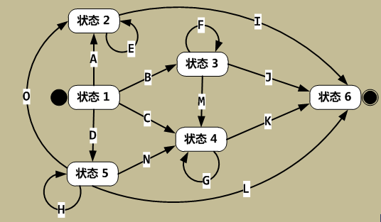
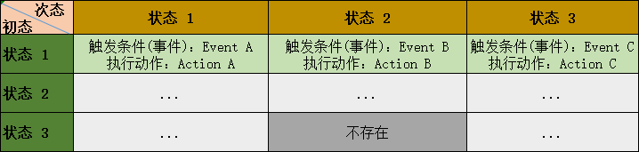
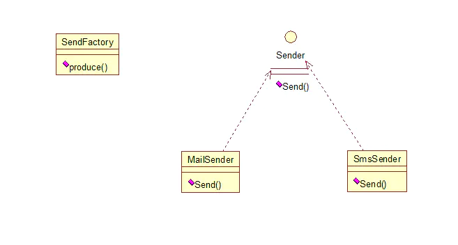
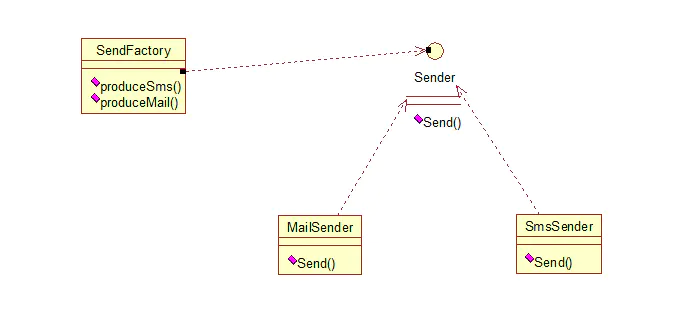
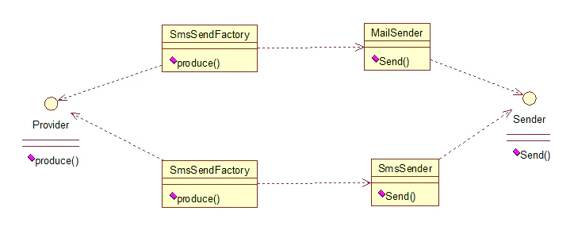

#初探设计模式
什么是设计模式:
设计模式是某类特定问题的代码设计解决方案，是一套代码设计的经验总结

设计模式的作用:
1. 提高代码复用率,降低开发成本和周期
2. 提高代码可维护性,可拓展性
3. 使代码更加优雅
4. 让代码更容易被理解


常见的设计原则:
1. 单一职责原则:一个类=只有一个引起它变化的原因，如果一个类承担的职责过多，即耦合性太高，一个职责的变化可能会影响到其他职责
2. 开放封闭原则:一个实体（类、函数、模块等）应该对外拓展开放，对内修改关闭，即每次发生变化时，要通过添加新的代码来增强现有类型的行为，而不是修改原有的代码。符合开放封闭原则的最好方式是提供一个固有的接口，然后让所有可能发生变化的类实现该接口，让固定的接口与相关对象进行交互。
3. 里氏替换原则:子类必须替换到他们的父类，在软件开发过程中，子类替换父类后，程序的行为是一样的，只有当子类替换掉父类后软件的功能不受影响时，父类才能真正的被复用，而子类也可以在父类的基础上添加新的行为。
4. 依赖倒置原则:细节应该依赖于抽象，而抽象不应该依赖于细节。所谓的“面向接口编程，而不是面向实现编程”，这样可以降低客户与具体实现的耦合。
5. 接口隔离原则:使用多个专门功能的接口，而不是使用一个总接口。不要让一个单一的接口承担过多的职责，而应把每个职责分离到多个专门的接口中，进行接口分离。
6. 合成复用原则:在一个新对象里使用已有的对象，使之成为新对象的一部分。新对象通过向这些对象委派达到复用已有功能的目的，简单的说就是要尽量使用合成/聚合，尽量不要使用继承。
7. 最小知识原则（迪米特法则）:一个模块或对象应尽量少的与其他实体之间发生相互作用，使得系统功能模块相对独立，这样，当一个模块修改时，影响的模块就会越少，拓展起来就会越容易。


##有限状态机(Finite-state machine,FSM)
有限状态机是我们游戏程序中非常常用的一种设计模式。不止游戏，在AI和编译器程序方面很出名。

###为什么引入有限状态机
一些项目中有很多实体(Entity)，每个实体都有很多状态(State)，各状态会经过不同事件(Event)触发后转换到另一个状态。这些事件包括但不限于：用户页面点击触发，生效时间或失效时间到达，其他依赖实体状态变更等。在状态变更后还会有一系列动作(Action)处理。一旦相互依赖实体或实体本身状态增多，状态转换变多，处理这些状态的业务代码也会分散在各处，代码处理很容易漏掉，维护成本很高。所以考虑引入有限状态机。
###什么是有限状态机
有限状态机,也称为FSM(Finite State Machine)，其在任意时刻都处于有限状态集合中的某一状态。当其获得一个输入字符时，将从当前状态转换到另一个状态，或者仍然保持在当前状态。任何一个FSM都可以用状态转换图来描述，图中的节点表示FSM中的一个状态，有向（方向表示从一个初态转换到次态）加权（权表示事件）边表示输入字符时状态的变化。如果图中不存在与当前状态与输入字符对应的有向边，则FSM将进入“消亡状态(Doom State)”，此后FSM将一直保持“消亡状态”。状态转换图中还有两个特殊状态：状态1称为“起始状态”，表示FSM的初始状态。状态6称为“结束状态”。

在启动一个FSM时，首先必须将FSM置于“起始状态”，然后触发一系列时间，最终，FSM会到达“结束状态”或者“消亡状态”。



说明：

在通常的FSM模型中，一般还存在一个“接受状态”，并且FSM可以从“接受状态”转换到另一个状态，只有在识别最后一个字符后，才会根据最终状态来决定是否接受所输入的字符串。此外，也可以将“其实状态”也作为接受状态，因此空的输入序列也是可以接受的。

1. 状态机要素:4个要素，即现态、条件、动作、次态。“现态”和“条件”是因，“动作”和“次态”是果。
- 现态：是指当前所处的状态。
- 条件：又称为“事件”。当一个条件被满足，将会触发一个动作，或者执行一次状态的迁移。
- 动作：条件满足后执行的动作。动作执行完毕后，可以迁移到新的状态，也可以仍旧保持原状态。动作不是必需的，当条件满足后，也可以不执行任何动作，直接迁移到新状态。
- 次态：条件满足后要迁往的新状态。“次态”是相对于“现态”而言的，“次态”一旦被激活，就转变成新的“现态”了。

我们可以用状态表了表示整个过程，如下图所示。


###FSM逻辑与数学模型
FSM的下一个状态和输出是由输入和当前状态决定的。

依据类型不同有多种定义。接受器有限状态机是五元组 ${\displaystyle (\Sigma ,S,s_{0},\delta ,F)}$ ，这里的：

1. ${\displaystyle \Sigma }$ 是输入字母表（符号的非空有限集合）。
2. ${\displaystyle S}$ 是状态的非空有限集合。
3. ${\displaystyle s_{0}}$ 是初始状态，它是{\displaystyle S}S的元素。在非确定有限状态自动机中，${\displaystyle s_{0}}$ 是初始状态的集合。
4. ${\displaystyle \delta }$ 是状态转移函数：${\displaystyle \delta :S\times \Sigma \rightarrow S}$。
5. ${\displaystyle F}$ 是最终状态的集合，${\displaystyle S}$ 的（可能为空）子集。

变换器有限状态自动机是六元组 ${\displaystyle (\Sigma ,\Gamma ,S,s_{0},\delta ,\omega )}$，这里的：
1. ${\displaystyle \Sigma }$ 是输入字母表（符号的非空有限集合）。
2. ${\displaystyle \Gamma }$ 是输出字母表（符号的非空有限集合）。
3. ${\displaystyle S}$ 是状态的非空有限集合。
4. ${\displaystyle s_{0}}$ 是初始状态，它是${\displaystyle S}$ 的元素。在非确定有限状态自动机中，${\displaystyle s_{0}}$ 是初始状态的集合。
5. ${\displaystyle \delta }$ 是状态转移函数：${\displaystyle \delta :S\times \Sigma \rightarrow S}$。
6. ${\displaystyle \omega }$ 是输出函数。
7. 如果输出函数是状态和输入字母表的函数（${\displaystyle \omega :S\times \Sigma \rightarrow \Gamma }$），则定义对应于Mealy模型，它可以建模为Mealy机。如果输出函数只依赖于状态 (${\displaystyle \omega :S\rightarrow \Gamma }$），则定义对应于Moore模型，它可建模为Moore机。根本没有输出函数的有限状态机叫做半自动机或转移系统。


##Java的23种设计模式

###工厂方法模式
工厂方法模式分为三种：
####普通工厂模式
就是建立了一个工厂类,对实现了同一接口的一些类进行实例的创建。


举例如下：（我们举一个发送邮件和短信的例子）
首先，创建二者的共同接口：
```
public interface Sender {
    public void Send();
}
```
其次，创建实现类：
```
public class MailSender implements Sender {
    @Override
    public void Send() {
        System.out.println("this is mailsender!");
    }
}
```

最后，建工厂类：
```
public class SendFactory {

    public Sender produce(String type) {
        if ("mail".equals(type)) {
            return new MailSender();
        } else if ("sms".equals(type)) {
            return new SmsSender();
        } else {
            System.out.println("请输入正确的类型!");
            return null;
        }
    }
}
```
####多个工厂方法模式
是对普通工厂方法模式的改进，在普通工厂方法模式中，如果传递的字符串出错，则不能正确创建对象，而多个工厂方法模式是提供多个工厂方法，分别创建对象。关系图：


将上面的代码做下修改，改动下SendFactory类就行，如下：
```
public class SendFactory {

    public Sender produceMail(){
        return new MailSender();
    }

    public Sender produceSms(){
        return new SmsSender();
    }
}
```
测试类如下：
```
public class FactoryTest {  

    public static void main(String[] args) {  
        SendFactory factory = new SendFactory();  
        Sender sender = factory.produceMail();  
        sender.Send();  
    }  
}  
```

####静态工厂方法模式
将上面的多个工厂方法模式里的方法置为静态的，不需要创建实例，直接调用即可。
```
public class SendFactory {

    public static Sender produceMail(){
        return new MailSender();
    }

    public static Sender produceSms(){
        return new SmsSender();
    }
}

public class FactoryTest {  

    public static void main(String[] args) {      
        Sender sender = SendFactory.produceMail();  
        sender.Send();  
    }  
}
```


总体来说，工厂模式适合：凡是出现了大量的产品需要创建，并且具有共同的接口时，可以通过工厂方法模式进行创建。在以上的三种模式中，第一种如果传入的字符串有误，不能正确创建对象，第三种相对于第二种，不需要实例化工厂类，所以，大多数情况下，我们会选用第三种——静态工厂方法模式。

###抽象工厂模式
工厂方法模式有一个问题就是，类的创建依赖工厂类，也就是说，如果想要拓展程序，必须对工厂类进行修改，这违背了闭包原则，所以，从设计角度考虑，有一定的问题，如何解决？就用到抽象工厂模式，创建多个工厂类，这样一旦需要增加新的功能，直接增加新的工厂类就可以了，不需要修改之前的代码。因为抽象工厂不太好理解，我们先看看图，然后就和代码，就比较容易理解。



```
public interface Sender {
    public void Send();
}
```

两个实现类:
```
public class MailSender implements Sender {  
    @Override  
    public void Send() {  
        System.out.println("this is mailsender!");  
    }  
}  

public class SmsSender implements Sender {  

    @Override  
    public void Send() {  
        System.out.println("this is sms sender!");  
    }  
}  
```
两个工厂类：
```
public class SendMailFactory implements Provider {

    @Override
    public Sender produce(){
        return new MailSender();
    }
}

public class SendSmsFactory implements Provider{

    @Override
    public Sender produce() {
        return new SmsSender();
    }
}
```
再提供一个接口:
```
public interface Provider {
    public Sender produce();
}
```

测试类:
```
public class Test {

    public static void main(String[] args) {
        Provider provider = new SendMailFactory();
        Sender sender = provider.produce();
        sender.Send();
    }
}
```
其实这个模式的好处就是，如果你现在想增加一个功能：发及时信息，则只需做一个实现类，实现Sender接口，同时做一个工厂类，实现Provider接口，就OK了，无需去改动现成的代码。这样做，拓展性较好！

###单例模式
单例对象（Singleton）是一种常用的设计模式。在Java应用中，单例对象能保证在一个JVM中，该对象只有一个实例存在。这样的模式有几个好处：
1、某些类创建比较频繁，对于一些大型的对象，这是一笔很大的系统开销。
2、省去了new操作符，降低了系统内存的使用频率，减轻GC压力。
3、有些类如交易所的核心交易引擎，控制着交易流程，如果该类可以创建多个的话，系统完全乱了。（比如一个军队出现了多个司令员同时指挥，肯定会乱成一团），所以只有使用单例模式，才能保证核心交易服务器独立控制整个流程。

```
public class Singleton {

    /* 持有私有静态实例，防止被引用，此处赋值为null，目的是实现延迟加载 */
    private static Singleton instance = null;

    /* 私有构造方法，防止被实例化 */
    private Singleton() {
    }

    /* 静态工程方法，创建实例 */
    public static Singleton getInstance() {
        if (instance == null) {
            instance = new Singleton();
        }
        return instance;
    }

    /* 如果该对象被用于序列化，可以保证对象在序列化前后保持一致 */
    public Object readResolve() {
        return instance;
    }
}
```
这个类可以满足基本要求，但是，像这样毫无线程安全保护的类，如果我们把它放入多线程的环境下，肯定就会出现问题了，如何解决？我们首先会想到对getInstance方法加synchronized关键字，如下：
```
public static synchronized Singleton getInstance() {
        if (instance == null) {
            instance = new Singleton();
        }
        return instance;
    }
```
但是，synchronized关键字锁住的是这个对象，这样的用法，在性能上会有所下降，因为每次调用getInstance()，都要对对象上锁，事实上，只有在第一次创建对象的时候需要加锁，之后就不需要了，所以，这个地方需要改进。我们改成下面这个：
```
public static Singleton getInstance() {
        if (instance == null) {
            synchronized (instance) {
                if (instance == null) {
                    instance = new Singleton();
                }
            }
        }
        return instance;
    }
```

###建造者模式(Builder)
工厂类模式提供的是创建单个类的模式，而建造者模式则是将各种产品集中起来进行管理，用来创建复合对象，所谓复合对象就是指某个类具有不同的属性，其实建造者模式就是前面抽象工厂模式和最后的Test结合起来得到的。我们看一下代码：
还和前面一样，一个Sender接口，两个实现类MailSender和SmsSender。最后，建造者类如下：
```
public class Builder {

    private List<Sender> list = new ArrayList<Sender>();

    public void produceMailSender(int count){
        for(int i=0; i<count; i++){
            list.add(new MailSender());
        }
    }

    public void produceSmsSender(int count){
        for(int i=0; i<count; i++){
            list.add(new SmsSender());
        }
    }
}
```
测试类:
```
public class Test {

    public static void main(String[] args) {
        Builder builder = new Builder();
        builder.produceMailSender(10);
    }
}
```
从这点看出，建造者模式将很多功能集成到一个类里，这个类可以创造出比较复杂的东西。所以与工程模式的区别就是：工厂模式关注的是创建单个产品，而建造者模式则关注创建符合对象，多个部分。因此，是选择工厂模式还是建造者模式，依实际情况而定。

###原型模型
原型模式虽然是创建型的模式，但是与工程模式没有关系，从名字即可看出，该模式的思想就是将一个对象作为原型，对其进行复制、克隆，产生一个和原对象类似的新对象。本小结会通过对象的复制，进行讲解。在Java中，复制对象是通过clone()实现的，先创建一个原型类：
```
public class Prototype implements Cloneable {

    public Object clone() throws CloneNotSupportedException {
        Prototype proto = (Prototype) super.clone();
        return proto;
    }
}
```
很简单，一个原型类，只需要实现Cloneable接口，覆写clone方法，此处clone方法可以改成任意的名称，因为Cloneable接口是个空接口，你可以任意定义实现类的方法名，如cloneA或者cloneB，因为此处的重点是super.clone()这句话，super.clone()调用的是Object的clone()方法，而在Object类中，clone()是native的，具体怎么实现，我会在另一篇文章中，关于解读Java中本地方法的调用，此处不再深究。在这儿，我将结合对象的浅复制和深复制来说一下，首先需要了解对象深、浅复制的概念：
浅复制：将一个对象复制后，基本数据类型的变量都会重新创建，而引用类型，指向的还是原对象所指向的。
深复制：将一个对象复制后，不论是基本数据类型还有引用类型，都是重新创建的。简单来说，就是深复制进行了完全彻底的复制，而浅复制不彻底。
此处，写一个深浅复制的例子：
```
public class Prototype implements Cloneable, Serializable {

    private static final long serialVersionUID = 1L;
    private String string;

    private SerializableObject obj;

    /* 浅复制 */
    public Object clone() throws CloneNotSupportedException {
        Prototype proto = (Prototype) super.clone();
        return proto;
    }

    /* 深复制 */
    public Object deepClone() throws IOException, ClassNotFoundException {

        /* 写入当前对象的二进制流 */
        ByteArrayOutputStream bos = new ByteArrayOutputStream();
        ObjectOutputStream oos = new ObjectOutputStream(bos);
        oos.writeObject(this);

        /* 读出二进制流产生的新对象 */
        ByteArrayInputStream bis = new ByteArrayInputStream(bos.toByteArray());
        ObjectInputStream ois = new ObjectInputStream(bis);
        return ois.readObject();
    }

    public String getString() {
        return string;
    }

    public void setString(String string) {
        this.string = string;
    }

    public SerializableObject getObj() {
        return obj;
    }

    public void setObj(SerializableObject obj) {
        this.obj = obj;
    }

}

class SerializableObject implements Serializable {
    private static final long serialVersionUID = 1L;
}
```

要实现深复制，需要采用流的形式读入当前对象的二进制输入，再写出二进制数据对应的对象。
