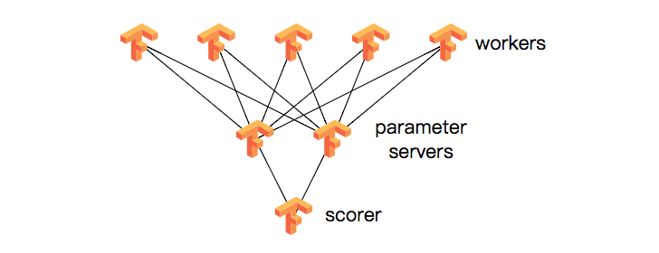

#大数据开发汇总
大数据是对海量数据进行存储、计算、统计、分析处理的一系列处理手段，处理的数据量通常是TB级，甚至是PB或EB级的数据，这是传统数据处理手段所无法完成的，其涉及的技术有分布式计算、高并发处理、高可用处理、集群、实时性计算等。

## Hadoop
###Hadoop是什么
Hadoop的核心就是HDFS和MapReduce。
#### HDFS
HDFS的设计特点是：
1. 大数据文件，非常适合上T级别的大文件或者一堆大数据文件的存储，如果文件只有几个G甚至更小就没啥意思了。
2. 文件分块存储，HDFS会将一个完整的大文件平均分块存储到不同计算器上，它的意义在于读取文件时可以同时从多个主机取不同区块的文件，多主机读取比单主机读取效率要高得多得都。
3. 流式数据访问，一次写入多次读写，这种模式跟传统文件不同，它不支持动态改变文件内容，而是要求让文件一次写入就不做变化，要变化也只能在文件末添加内容。
4. 廉价硬件，HDFS可以应用在普通PC机上，这种机制能够让给一些公司用几十台廉价的计算机就可以撑起一个大数据集群。
5. 硬件故障，HDFS认为所有计算机都可能会出问题，为了防止某个主机失效读取不到该主机的块文件，它将同一个文件块副本分配到其它某几个主机上，如果其中一台主机失效，可以迅速找另一块副本取文件。

HDFS的关键元素：
1）Block：将一个文件进行分块，通常是64M。
2）NameNode：保存整个文件系统的目录信息、文件信息及分块信息，这是由唯一 一台主机专门保存，当然这台主机如果出错，NameNode就失效了。在 Hadoop2.* 开始支持 activity-standy 模式----如果主 NameNode 失效，启动备用主机运行 NameNode。
3）DataNode：分布在廉价的计算机上，用于存储Block块文件。

- 名称节点(NameNode):名称节点负责文件和目录的创建、删除和重命名等，同时管理数据节点与文件块的映射关系。名称节点的两个和
- 数据节点(DataNode):数据节点负责数据的存储和读取。

客户端读数据会先访问名称节点，获取数据块对应数据节点的位置，进而读取数据，写入数据也会由名称节点分配存储位置，再向对应数据节点写入数据。

#####远程调用RPC
RPC，全称为Remote Procedure Call，即远程过程调用，它是一个计算机通信协议。它允许像调用本地服务一样调用远程服务。它可以有不同的实现方式。如RMI(远程方法调用)、Hessian、Http invoker等。另外，RPC是与语言无关的。

远程过程调用来的的新问题:
1. Call ID映射：我们怎么告诉远程机器我们要调用Multiply，而不是Add或者FooBar呢？在本地调用中，函数体是直接通过函数指针来指定的，我们调用Multiply，编译器就自动帮我们调用它相应的函数指针。但是在远程调用中，函数指针是不行的，因为两个进程的地址空间是完全不一样的。所以，在RPC中，所有的函数都必须有自己的一个ID。这个ID在所有进程中都是唯一确定的。客户端在做远程过程调用时，必须附上这个ID。然后我们还需要在客户端和服务端分别维护一个{函数 <--> Call ID}的对应表。两者的表不一定需要完全相同，但相同的函数对应的Call ID必须相同。当客户端需要进行远程调用时，它就查一下这个表，找出相应的Call ID，然后把它传给服务端，服务端也通过查表，来确定客户端需要调用的函数，然后执行相应函数的代码。
2. 序列化和反序列化：客户端怎么把参数值传给远程的函数呢？在本地调用中，我们只需要把参数压到栈里，然后让函数自己去栈里读就行。但是在远程过程调用时，客户端跟服务端是不同的进程，不能通过内存来传递参数。甚至有时候客户端和服务端使用的都不是同一种语言（比如服务端用C++，客户端用Java或者Python）。这时候就需要**客户端把参数先转成一个字节流，传给服务端后，再把字节流转成自己能读取的格式。这个过程叫序列化和反序列化。**同理，从服务端返回的值也需要序列化反序列化的过程。
3. 网络传输：远程调用往往用在网络上，客户端和服务端是通过网络连接的。所有的数据都需要通过网络传输，因此就需要有一个网络传输层。网络传输层需要把Call ID和序列化后的参数字节流传给服务端，然后再把序列化后的调用结果传回客户端。只要能完成这两者的，都可以作为传输层使用。因此，它所使用的协议其实是不限的，能完成传输就行。尽管大部分RPC框架都使用TCP协议，但其实UDP也可以，而gRPC干脆就用了HTTP2。Java的Netty也属于这层的东西。

所以，要实现一个RPC框架，其实只需要把以上三点实现了就基本完成了。Call ID映射可以直接使用函数字符串，也可以使用整数ID。映射表一般就是一个哈希表。序列化反序列化可以自己写，也可以使用Protobuf或者FlatBuffers之类的。网络传输库可以自己写socket，或者用asio，ZeroMQ，Netty之类。

总结一下4块核心内容:
1. RPC数据的传输:如上面的RPCConnector，RPCChannel。它们主要负责数据传输这一块， 具体客户端与服务器之间的连接是不是socket连接，是原始tcp连接还是使用http，这些RPC协议本身不做任何规定。那么我们的任务就是抽象出这样一个传输层。
2. RPC消息。如上面的RPCProtocol， 以及encode，decode方法。 因为RPC是远程调用，所以没办法直接函数调用，于是就必须用一套专门的协议，去表示调用以及调用结果。另外，因为实际应用基本都是跨机器连接，所以无法直接传递内存变量，也就是说还需要将消息编码成 诸如字符串一类的可以跨设备传输的内容。具体的RPC消息的封装协议很多，常见的是基于xml，json封装的。那么我们的任务就是抽象出这样一个协议层。
3. RPC服务注册。如上面Callee -->export。 服务端具体支持哪些调用，收到来自客户端的RPC请求后，怎样去调用真正的需要执行的方法，这些内容也是一个完整的RPC框架必须考虑的。一些稍微高级一点的框架，都是可以服务自动注册的，现在主流的RPC框架，还支持通过 IDL（Interface Definition Language）来定义远程接口，实现跨语言的RPC 。那么我们的任务就是抽象出一个RPC服务的注册机制。
4. RPC消息处理。如上面的RPCInvoker。这里其实与RPC本身关系不大，一般就是考虑支持异步/同步调用。 这一部分，大概我也会做一些说明，但不是这个系列的重点。

1. Hadoop与RPC

2. Tensorflow与RPC

#####名称节点
在HDFS中，名称节点（NameNode）负责管理分布式文件系统的命名空间（NameSpace），保存了两个核心的数据结构，即FsImage和EditLog。
1. FsImage用于维护文件系统树以及文件树中所有文件和文件夹的元数据
2. 操作日志文件EditLog中记录了所有针对文件的创建、删除、重命名等操作。

名称节点记录了每个文件中各个块所在的节点的位置信息，但是并不持久化存储这些信息，而是在系统每次启动时扫描所有数据节点重构得到这些信息。

名称节点在启动时，会将FsImage的内容加载到内存当中，然后执行EditLog文件中的各项操作，使得内存中的元数据保持最新。这个操作完成以后，就会创建一个新的FsImage文件和一个空的EditLog文件。名称节点启动成功并进入正常运行状态以后，HDFS中的更新操作都被写到EditLog，而不是直接写入FsImage，这是因为对于分布式文件系统而言，FsImage文件通常都很庞大，如果所有的更新操作都直接往FsImage文件中添加，那么系统就会变得非常缓慢。相对而言，EditLog通常都要远远小于FsImage，更新操作写入到EditLog是非常高效的。名称节点在启动的过程中处于“安全模式”，只能对外提供读操作，无法提供写操作。在启动结束后，系统就会退出安全模式，进入正常运行状态，对外提供写操作。

数据节点（DataNode）是分布式文件系统HDFS的工作节点，负责数据的存储和读取，会根据客户端或者名称节点的调度来进行数据的存储和检索，并且向名称节点定期发送自己所存储的块的列表。每个数据节点中的数据会被保存在各自节点的本地Linux文件系统中。

在名称节点运行期间，HDFS会不断发生更新操作，这些更新操作都是直接被写入到EditLog文件，因此EditLog文件也会逐渐变大。在名称节点运行期间，不断变大的EditLog文件通常对于系统性能不会产生显著影响，但是当名称节点重启时，需要将FsImage加载到内存中，然后逐条执行EditLog中的记录，使得FsImage保持最新。可想而知，如果EditLog很大，就会导致整个过程变得非常缓慢，是的名称节点在启动过程中长期处于“安全模式”，无法正常对外提供写操作，影响了用户的使用。

为了有效解决EditLog文件逐渐变大带来的问题，HDFS在设计中采用了第二名称节点（SecondaryNameNode）。
第二名称节点是HDFS架构的一个重要组成部分，具有两方面的功能：
1. 可以完成EditLog与FsImage的合并操作，减小EditLog文件大小，缩短名称节点重启时间；
2. 其次，可以作为名称节点的“检查点”，保存名称节点中的元数据信息。

具体操作:
1. EditLog与FsImage的合并操作。每隔一段时间，第二名称节点会和名称节点通信，请求其停止使用EditLog文件（这里假设这个时刻为t1），暂时将新到达的写操作添加到一个新的文件EditLog.new中。然后，第二名称节点把名称节点中的FsImage文件和EditLog文件拉回本地，再加载到内存中；对二者执行合并操作，即在内存中逐条执行EditLog中的操作，使得FsImage保持最新。合并结束后，第二名称节点会把合并后得到的最新的FsImage文件发送到名称节点。名称节点收到后，会用最新的FsImage文件去替换旧的FsImage文件，同时用EditLog.new去替换EditLog文件（这里假设这个时刻为t2），从而减小了EditLog文件的大小。

2. 作为名称节点的“检查点”。从上面的合并过程可以看出，第二名称节点会定期和名称节点通信，从名称节点获取FsImage文件和EditLog文件，执行合并操作得到新的FsImage文件。从这个角度来讲，第二名称节点相当于为名称节点设置了一个“检查点”，周期性地备份名称节点中的元数据信息，当名称节点发生故障时，就可以用第二名称节点中记录的元数据信息进行系统恢复。但是，在第二名称节点上合并操作得到的新的FsImage文件是合并操作发生时（即t1时刻）HDFS记录的元数据信息，并没有包含t1时刻和t2时刻期间发生的更新操作，如果名称节点在t1时刻和t2时刻期间发生故障，系统就会丢失部分元数据信息，在HDFS的设计中，也并不支持把系统直接切换到第二名称节点，因此从这个角度来讲，第二名称节点只是起到了名称节点的“检查点”作用，并不能起到“热备份”作用。即使有了第二名称节点的存在，当名称节点发生故障时，系统还是可能会丢失部分元数据信息的。

#####数据节点
HDFS的管理节点是NameNode，用于存储并管理元数据。那么具体的文件数据存储在哪里呢?DataNode就是负责存储数据的组件，一个数据块Block会在多个DataNode中进行冗余备份;而一个DataNode对于一个块最多只包含一个备份。所以可以简单地认为DataNode上存储了数据块ID和数据块内容，以及它们的映射关系。一个HDFS集群可能包含上千个DataNode节点，这些DataNode定时和NameNode进行通信，接受NameNode的指令，为了减轻NameNode的负担，NameNode上并不永久保存哪个DataNode上有哪些数据块的信息，而是通过DataNode启动时的上报来更新NameNode上的映射表。DataNode和NameNode建立连接后，就会不断地和NameNode保持联系，反馈信息中也包含了NameNode对DataNode的一些命令，如删除数据库或者把数据块复制到另一个DataNode。应该注意的是:NameNode不会发起到DataNode的请求，在这个通信过程中，它们严格遵从客户端/服务器架构。

当然DataNode也作为服务器接受来自客户端的i方问，处理数据块读/写请求。DataNode之间还会相互通信，执行数据块复制任务，同时，在客户端执行写操作的时候，DataNode之间需要相互配合，以保证写操作的一致性。

HDFS体系结构中有两类节点，一类是NameNode，另一类是DataNode。这两类节点分别承担Master和Worker的任务。NameNode就是Master管理集群中的执行调度，DataNode就是Worker具体任务的执行节点。NameNode管理文件系统的命名空间，维护整个文件系统的文件目录树及这些文件的索引目录(本质上还是名字)。这些信息以两种形式存储在本地文件系统中，一种是命名空间镜像(Namespaee image );一种是编辑日志(Edit log )。从NameNode中你可以获得每个文件的每个块所在的DataNode。有一点需要注意的是，这些信息不是永久保存的，NameNode会在每次启动系统时动态地重建这些信息。当运行任务时，客户端通过NameNode获取元数据信息，和DataNode进行交互以访问整个文件系统。系统会提供一个类似于POSIX的文件接口，这样用户在编程时无须考虑NameNode和DataNode的具体功能。

DataNode是文件系统Worker中的节点，用来执行具体的任务:存储文件块，被客户端和NameNode调用。同时，它会通过心跳(Heartbeat)定时向NameNode发送所存储的文件块信息。

####MapReduce

##Spark
