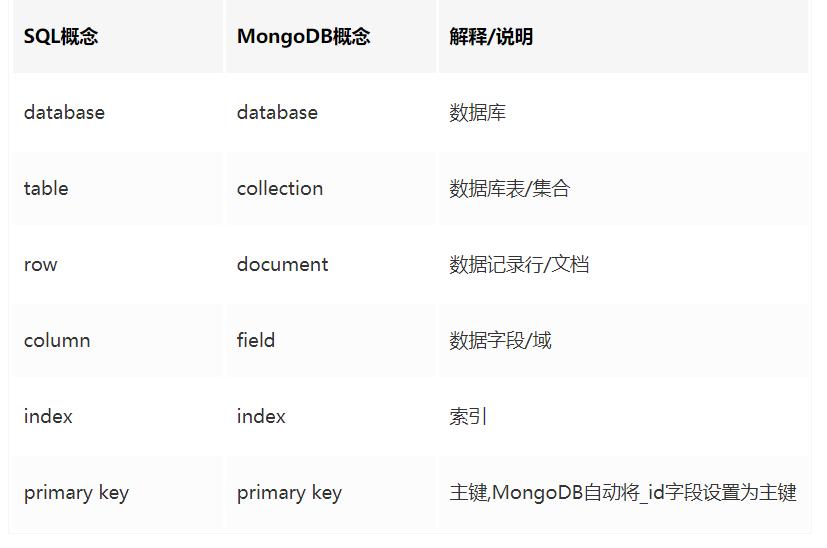

# 数据库汇总
##概念
1. 数据:描述事物的符号记录，可以使数字，也可以是文字、图形、图像、声音、语言等，数据有多种形式，它们都可以经过数字化后存入计算机。数据的含义称为数据的语义，数据与语义是不可分的。
2. 数据库：存储数据的仓库，是长期存放在计算机内、有组织、可共享的大量数据的集合。数据库中的数据按照一定数据模型组织、描述和存储，具有较小的冗余度，较高的独立性和易扩展性，并为各种用户共享，即数据库有永久存储、有知识和可共享三个基本特点。
3. 数据库管理系统（DBMS）：是位于用户与操作系统之间的一层数据管理软件。它的主用功能包括：
- 数据定义功能：提供数据定义语言（DDL），让用户方便地对数据库中数据对象进行定义。
- 数据组组织、存储和管理：要提高存储空间利用率和存储效率。
- 数据操纵功能：提供数据操纵语言（DML），实现对数据库基本操作，如增删改查等。
- 数据库的建立和维护功能：统一管理控制，以保证安全、完整、多用户并发使用。
- 其它功能：与网络中其它软件系统通信功能，异构数据库之间的互访和互操作功能。
4. 数据库系统：指在计算机系统中引入数据库后的系统，一般有数据库、数据库管理系统、应用系统、数据库管理员（DBA）构成，常简称数据库。

5. 数据管理技术是应数据管理任务需要而产生的。数据管理是指对数据进行分类、组织、编码、存储、检索和维护，是数据处理的中心问题。而数据处理时指对各种数据进行收集、存储、加工和传播的一系列活动的总和。数据管理经历了人工管理、文件系统、数据库系统3个阶段。

6. 数据库系统的特点：

- 数据结构化：实现整体数据的结构化，也是数据库系统与文件系统的本质区别。数据库中数据不再仅仅针对某一个应用，而是面向全组织，不仅内部是结构化的，而且整体是结构化的。在文件系统中，文件内部有某些结构，但文件间没有联系，而关系数据库中，关系表之间的联系可用参照完整性来表达。
- 数据共享性高，冗余度低，易扩充。
- 数据独立性高：包括数据的物理独立性和逻辑独立性。物理独立性指用户的应用程序跟存储在磁盘上的数据库中数据是相互独立的，数据库中数据存取是由DBMS管理的。数据独立性是由DBMS的二级映像功能来保证的。
- 数据由DMBS统一管理和控制。

7. 数据模型：是对现实世界数据特征的抽象，是对现实世界的模拟，是数据库系统的核心和基础。数据模型应满足三方面需求：1.真是模拟现实世界；2.容易为人理解；3.便于在计算机上实现。数据模型按应用目的分为两类：

8. 第一类是概念模型：按用户观点对数据和信息建模，主要用于数据库设计，也称信息模型。

9. 第二类是逻辑模型和物理模型：逻辑模型是按计算机观点对数据建模，主要包括层次模型、网络模型、关系模型、面向对象模型、对象关系模型；物理模型是对数据最底层的抽象，它描述数据在系统内部的表示方式和存取方法。

10. 数据模型通常由数据结构、数据操作和完整性约束三部分组成，是严格定义的一组概念的集合，精确的描述了系统的静态特写、动态特性和完整性约束条件。

11. 概念模型用于信息世界的建模，是现实世界到信息世界的第一层抽象，是数据库设计人员进行数据库设计的有力的工具，也是设计人员与用户之间进行交流的语言。信息世界涉及的概念主要有：
- 实体（Entity）：客观存在并可相互区别的事物成为实体。可以是人、事、物，也可以是抽象的概念和联系。
- 属性（Attribute）：实体所具有的某一特性。一个实体可以又若干个属性来刻画。
- 码（Key）：唯一标识实体的属性集。
- 域（Domain）：域是一组具有相同数据类型的值的集合。属性的取值范围来自某个域。
- 实体型（Entity Type）：具有相同属性的实体必然具有共同的特征和性质。用实体名和属性名集合来抽象和刻画同类实体，称为实体型。
- 实体集（Entity Set）:同一类型实体的集合。
- 联系（Relationship）：实体内部和实体之间的联系。实体之间的联系有一对一，一对多、多对多三种。

12. 概念模型的一种表示方法：实体-联系方法，E-R图：提供了表示实体型、属性和联系的方法：实体型：用矩形表示，矩形框内写实体名；属性：用椭圆表示，并用无向边将其与对应的实体型连接起来；联系：用菱形表示，框内写明联系名，并用 无向边与有关实体型连接起来，同时在无向边上标上联系的类型（1:1,1:n,m:n）。联系也可以有属性。

13. 数据库的三级模式
- 模式:模式又称概念模式或逻辑模式，对应于概念级。它是由数据库设计者综合所有用户的数据，按照统一的观点构造的全局逻辑结构，是对数据库中全部数据的逻辑结构和特征的总体描述，是所有用户的公共数据视图(全局视图)。它是由数据库管理系统提供的数据模式描述语言(Data Description Language，DDL)来描述、定义的，体现、反映了数据库系统的整体观。
- 外模式:外模式又称子模式或用户模式，对应于用户级。它是某个或某几个用户所看到的数据库的数据视图，是与某一应用有关的数据的逻辑表示。外模式是从模式导出的一个子集，包含模式中允许特定用户使用的那部分数据。用户可以通过外模式描述语言来描述、定义对应于用户的数据记录(外模式)，也可以利用数据操纵语言(Data Manipulation Language，DML)对这些数据记录进行。外模式反映了数据库的用户观。
- 内模式:内模式又称存储模式，对应于物理级，它是数据库中全体数据的内部表示或底层描述，是数据库最低一级的逻辑描述，它描述了数据在存储介质上的存储方式和物理结构，对应着实际存储在外存储介质上的数据库。内模式由内模式描述语言来描述、定义，它是数据库的存储观。

14. 在一个数据库系统中，只有唯一的数据库， 因而作为定义 、描述数据库存储结构的内模式和定义、描述数据库逻辑结构的模式，也是唯一的，但建立在数据库系统之上的应用则是非常广泛、多样的，所以对应的外模式不是唯一的，也不可能是唯一的。

15. 数据库的二级映象与数据库独立性
- 外模式/模式映象:模式描述的是数据的全局逻辑结构，外模式描述的是数据的局部逻辑结构。当模式改变时，由数据库管理员对各个外模式/模式的映象作相应改变，可以使外模式保持不变，从而应用程序不必修改，保证了数据与程序的逻辑独立性，简称数据的逻辑独立性
- 模式/内模式映象:数据库中只有一个模式，也只有一个内模式，所以模式/内模式映象是唯一的，它定义了数据库全局逻辑结构与存储结构之间的对应关系。当数据库的存储结构改变了，由数据库管理员对模式/内模式映象作相应改变，可以使模式保持不变，从而应用程序也不必改变。保证了数据与程序的物理独立性，简称数据的物理独立性。

16. 关系数据库的完整性：1)实体完整型、2)参照完整性、3)用户自定义完整性，其中实体完整性和参照完整性是关系模型必须满足的完整性约束条件，被称作关系的两个不变特性。
- 实体完整性规则：若A是关系R的主属性，则A不能取控制，即主属性不能为空。
- 参照完整性规则：如F是关系R的外码，参照关系S的主码K，则R中每个元祖在F上的值必须为S中某个元祖的主码值或空值，即外码要么是参照的主码值要么是空值。

19. 数据库类型的区分主要参照的指标是数据的存储模型，而常用的数据模型有:
- 层次模型
- 网状模型
- 关系模型
- 面向对象模型
- 半结构化模型

20. 我们习惯性将数据库类型分为两类:
- 关系型数据库:这是我们目前至今主流的数据库类型，其对应的数据存储模型就是关系型模型，数据以表格形式存储，字段关联数据。
  - 二维表结构是非常贴近逻辑世界的一个概念，它更容易理解，这是关系型数据库能够成为主流的其中一个重要原因。通过 SQL 进行表与表之间的联接查询非常的方便自然。
  - 缺点也是很显而易见的，海量数据下，对一张表的查询会显得很力不从心，就是因为数据的存储不具备特殊的数据结构，例如有些非关系型数据库的数据存储结构是类似树的结构，就使得查询上具有天然的优势。
- 非关系型数据库:非关系型数据库也被称为 NoSQL 数据库，NoSQL 并不是某个具体数据库，它泛指所有非关系型数据库。


###数据库与文件系统的区别
数据库从字面上理解就是存放数据的地方,它同一般直接在硬盘上存储的区别？


打个比方，更容易解释数据库跟文件系统的主要差别：
数据库是商场，文件系统是超市。
1. 数据库，你把你想要的告诉营业员，她自己已经记录了所有的商品对应哪个货架，然后就跑到对应的货架上，把货物拿给你。——你们之间的交互只有两样东西：你的一句话，她给你的货物。
2. 文件系统，你知道你想要什么东西，然后去逛超市，（假定这个超市除了收银员以外没有任何营业员）把超市的每样都逛了个遍，发现了你的东西在某个角落，然后把它拿出来了，最后到收银台去付钱。。。——你们之间的交互是：整个超市里所有货物的分类，布局，所有商品的样子。你一路遍历所花的时间。

对于本地来说，这没什么问题，但是如果是远程，那么有营业员的前提下你的通讯可以只是一个电话，和一个邮递包裹。若没有营业员，你得亲自去一趟去查看所有的布局，或者通过渠道获取对方整个超市的所有货物清单，然后亲自查找。通讯量太大了，至少一个清单是在一通电话里说不清楚的。

所以说了，商店还是那个商店，文件系统还是那个文件系统，数据库只是那个营业员而已。她记得每样东西在哪，然后与你协定了一种交互的命令，你用这个协议去让她提供服务。     ——这个营业员平时也不闲着，没事的时候就去整理一下货架，并且背诵一下各个货物的位置（建索引），这样她找东西往往会比你更快。

简单来说,数据库存储的是数据的集合，这种集合不是杂乱无章的,而是按照数据结构来组织、存储和管理的。


文件处理系统主要的缺点:
1. 数据冗余（Data Redundancy）和不一致性（Inconsistency）。一个数据项出现在多个文件中，因为不同的文件由不同的程序处理的，所以出现数据冗余和不同文件的数据不一致。
2. 访问数据很困难。程序不能实现复杂的信息检索功能。
3. 数据隔离（Data Isolation）问题。数据分散在不同的文件，可能不同的格式。
4. 完整性（Integrity）问题。很难实现数据的完整性约束条件。如账户余额不能少于零。
5. 原子性（Atomicity）问题。很难实现原子操作，很难恢复和保证数据一致性。
6. 并发访问异常。没有并发控制，导致并发访问数据异常。
7. 安全问题。不能实现安全访问约束。

文件处理系统存在以上大量的问题，它不能满足企业对大量数据高效快速处理的需求，人们迫切需要一个更高效、便捷、安全的数据管理系统。所以需要开发一个数据库管理系统来解决这些问题。

###数据的表现形式
数据库系统给用户提供了数据的抽象视图，它隐藏了数据是如何存储和如何维护的细节。

####数据抽象
数据库系统需要高效的检索数据，这往往需要设计一个复杂的数据结构去表示数据。为了简化用户与数据库系统的交互，通常将数据抽象成不同的层级，如下所示：

- 物理层（Physical Level）。物理层是最低的抽象层描述了数据的实际存储方式，以及详细地描述了复杂的底层数据结构。
- 逻辑层（Logical Level）。逻辑层描述了哪些数据存储在数据库中，数据之间存在什么关系。
- 视图层（View Level）。简化用户与系统的数据交互，仅提供一部分重要的信息给用户，隐藏一些次要的信息。

物理层，它通过编译器向数据库程序员隐藏了底层存储的细节。逻辑层，它通过编程语言向程序员隐藏了数据存储的细节。视图层，它通过应用程序向用户隐藏了数据类型的细节。

不同的用户在不同的抽象层与数据库进行交互，使得每一个用户都可以方便和高效的管理数据。

#### 实例和模式
实例（Instances）是某一个时刻存储在数据库中的信息的集合。

模式（Schema）是全部的数据库的设计。

#### 数据模型
数据模型（Data Models）是数据库结构和基础。它是一个用于描述数据、数据关系、数据语义和一致性约束的概念性工具的集合。数据模型提供了一种方式去描述数据库在物理层、逻辑层、视图层的设计。

常见的数据模型：
- 关系型模型（Relational Model）。使用一组表（Table）来表示数据和数据之间的关系。每个表有多个列（Columns）每个列有唯一的名称。表也称为关系（Relation）。
- 实体关系模型（Entity-Relationship Model）
- 基于对象的数据模型（Object-Based Data Model）
- 半结构化的数据模型（Semistructured Data Model）

以上数据模型中，关系型模型应用最为广泛，大部分数据库系统是采用关系型模型实现的。

### 数据库语言
数据库系统提供了数据定义语言去指定数据库的模式（Schema），以及数据操纵语言去表示数据库查询和更新操作。数据定义语言和数据操纵语言不是两种单独的语言，它们都是数据库语言的组成部分。被广泛使用的数据库语言，如 SQL（Structured Query Language）语言。

#### 数据操纵语言
数据操纵语言（Data-Manipulation Language, DML）能够访问和操作数据。基本的操作类型为：查询，插入，删除和修改。如SELECT、UPDATE、INSERT、DELETE

数据操纵语言可以分为两种类型：程序式的（Procedural），声明式的（Declarative）。声明式的更简单，不需要指定如何获取数据。

#### 数据定义语言
数据定义语言（Data-Definition Language, DDL）指定了数据库的模式，也指定了数据的属性。如CREATE、ALTER、DROP等。DDL主要用在定义或改变表(TABLE)的结构,数据类型，表之间的链接和约束等初始化工作上,他们大多在建立表时使用

数据存储在数据库中必须要满足某些一致性约束（Consistency Constraints）。如，账户余额不能少于0。数据定义语言（DDL）可以指定数据的完整性约束（Integrity Constraints），完整性约束是一致性约束的一部分，它防止不符合规范的数据进入数据库。常见的完整性约束如下：

- 域约束（Domain Constraints）。约束数据的取值范围和精度等。
- 参考约束（Referential Constraints）。关系 A 的一个属性参考关系 B 的属性，参考的属性必须出现在被参考的关系中。
- 断言（Assertions）。数据需要满足断言的约束条件。

数据定义语言的输出结果保存在数据库系统的数据字典（Data Dictionary）中，它包含了数据库的元数据（Metadata）即描述数据的数据。

####数据控制语言
数据控制语言(Data Control Language)是数据库控制语言。是用来设置或更改数据库用户或角色权限的语句，包括（grant,deny,revoke等）语句。在默认状态下，有sysadmin,dbcreator,db_owner或db_securityadmin等人员才有权力执行DCL


## 关系型数据库
关系型数据库（Relational Database）是基于关系模型（Relational Model）的和使用一系列的表（Table）来表示数据和数据之间的关系。

###表
一张表（Table）包含多个列，每个列有唯一的名称。一个表的结构示例，如下图所示。


数据库的表是由一些类型固定的记录（Record）构成的，一行数据称为一个记录。每个记录有固定数量的字段（Field）或属性（Attribute）。表的每一列与记录的每一个字段是相对应的。

###应用程序访问数据库
SQL 语言不是图灵完备的，一些计算不能通过 SQL 语言完成，但是操作数据库必须使用数据库语言如 SQL 语言。由于应用程序不能通过 SQL 语言来实现，一般使用如 C, C++ 或者 Java 来实现，应用程序访问数据库一般是通过嵌入 SQL 语句来与数据库进行交互的。

应用程序访问数据库的两种方式：
- 应用程序接口。通过它发送 DML 和 DDL SQL 语句给数据库，和取回执行结果。
- 嵌入 DML 调用。


## 数据库设计
数据库设计主要任务是数据库模式（Schema）的设计。

### 设计过程
- 需求分析。与用户和领域专家进行交流，设计如何让数据库的结构满足用户的数据需求。收集需求，用文字的形式描述数据结构，最后得出一个用户需求规格说明书。

- 概念设计（Conceptual Design）。选择一个数据模型，将用户需求转换为数据库概念模式。这个阶段主要是专注于描述数据和数据之间的关系。用专业的概念的数据模型去描述数据结构，主要使用 entity-relationship model 和 normalization 方式去设计。

- 逻辑设计（Logical Design）。将抽象的数据模型转换为数据库的实现。将概念模型转换为数据库系统使用的模型，如将 entity-relationship model 转换为 relational model。

- 物理设计（Physical Design）。设计物理存储的细节。包括文件组织的形式和内部的存储结构等。

### 实体关系模型
Entity-Relationship (E-R) 数据模型使用一组对象称为实体（Entity）和对象之间的关系（Relationship）来表示数据和它们之间的关系。每个实体由一组属性组成。E-R 模型可以表示数据约束。一个实体类型的所有实例称为实体集（Entity Set），两个实体类型的所有的实例之间的关系称为关系集（Relationship Set）。

E-R 模型中一个重要的约束是映射基数（Mapping Cardinality）它表示一个实体关联另一个实体的数量。

### 标准化
标准化（Normalization）可以让我的数据减少不必要的冗余。它使用范式（Normal Form）来设计数据库的模式（Schema）。常见的范式有：First normal form (1NF), Second normal form (2NF), Third normal form (3NF), Boyce-Codd normal form (BCNF).

## 数据的存储和查询
数据库系统分为多个模块，它们分别处理不同的任务。数据库系统的功能可以大致分为存储管理器（Storage Manager）和查询处理器（Query Processor）。存储管理器负责管理数据的物理存储空间，查询处理器负责简化和优化数据的访问。

### 存储管理器
存储管理器是数据库的一个组件，它提供了底层存储和应用程序之间的接口。它与操作系统的文件系统进行交互。它将 SQL 语句转换为底层的文件系统的命令。存储管理器的主要职责是：存储、取出和更新数据库中的数据。

存储管理器的组件包括：
- 授权和完整性管理器（Authorization and Integrity Manager）
- 事务管理器（Transaction Manager）
- 文件管理器（File Manager）
- 缓存管理器（Buffer Manager）

存储管理器实现的物理结构
- 数据文件（Data File）。存储数据库的数据的文件。
- 数据字典（Data Dictionary）。存储元数据即数据库的结构或模式。
- 索引（Index）。提供快速访问数据库数据的一种数据结构。

### 查询处理器
查询处理器（Query Processor）的组件包括：
- DDL 解释器（DDL Interpreter）
- DML 编译器（DML Compiler）
- 查询评估引擎（Query Evaluation Engine）


## 事务管理
真实场景中的数据操作往往需要具备一些基本的特性。如：
- 原子性（Atomicity）。一组数据操作组成一个逻辑的单元，这些操作必须全部完成或者全部失败。
- 一致性（Consistency）。数据的操作必须是正确的。如 A 转账给 B，A 和 B 的总金额必须是不变的。
- 持久性（Durability）。数据可以长久的保存。

事务（Transaction）是在数据库应用程序中执行单个逻辑功能的操作的集合。事务是一个原子性和一致性的单元。事务管理器由并发控制管理器（Concurrency-Control Manager）和恢复管理器（Recovery Manager）组成。其中，并发控制管理器负责的是：当多个事务同时修改数据库时，保证每个事务都是正确的。恢复管理器负责的是：当事务发生错误时恢复原始数据状态。

为了确保数据的一致性，程序员有责任去定义合适的事务。确保数据的原子性和持久性则是数据库系统本身的职责。
##数据库的架构
数据库系统由多个组件构成，它的系统结构如下图所示：


数据库的体系结构可以是中心化的 client-server 结构，也可以是平行的、分布式的结构。

数据库应用程序通常划分为两层或者三层结构。如下图所示：


##其他
###数据挖掘和信息检索
数据挖掘（Data Mining）是指半自动分析大型数据库，从中找到有用的模式的过程。数据挖掘不同于机器学习，机器学习是处理大量的磁盘中的数据文件，而数据挖掘指的是处理数据库中的数据。由于很多查询是十分复杂的，很难使用 SQL 进行查询，所以需要使用数据挖掘技术。数据挖掘可以从数据中分析出有价值的规律，它可以帮助企业执行更好的决策。

数据仓库（Data Warehouse）可以在一个站点中一统一的模式收集不同来源的数据。提供为用户提供了一个统一的数据接口。

信息检索（Information Retrieval）是指查询无结构的文本数据。

### 其它特性（非关系型）数据库

在某些数据库系统的应用领域，关系型数据模型是受限制的。我们需要其它的数据模型来处理这些应用领域。常见的非关系型模型，如
- 对象基于的数据模型（Object-Based Data Model）。它可以便捷的实现面向对象编程的数据存储。
- 半结构化的数据模型（Semistructured Data Model）。它的特点是相同类型的单个数据项可能具有不同的属性集。
- 键值数据模型（Key-value Data Model）。它是使用 map 或字典实现的。每一个 key 关联一个集合。键值数据模型没有查询语言，它使用简单的 get, put, 和 delete 命令去操作数据。它具有快速存取，可扩展性和可靠性等特点。

### 数据库的用户和管理员
与数据库系统进行交互的人群可以以分为：数据库用户和数据库管理员。

不同类型的数据库用户的不同交互方式为：
- 普通的用户。通过应用程序与数据库系统进行功能。
- 应用开发人员。通过编程语言与数据库系统交互，开发应用程序，提供用户接口。
- 专业人员。直接使用数据库查询语言操作数据库系统。

数据库管理员的作用：
- 定义模式。通过执行 DDL 来创建数据库模式（Schema）。
- 定义存储结构和访问方式。
- 修改模式和物理组织。
- 授权数据的访问。
- 日常维护。周期性的备份数据库。确保有充足的磁盘空间。监控数据库系统的运行状态等等。


## SQL详细介绍
SQL数据库语言，是结构化查询语言(Structured Query Language)的通称。SQL数据库语言是一种数据库查询和编程设计语言，用以存储数据及其查询、更新和管理关系数据库系统;另外也是数据库脚本文件的后缀名。

应用SQL的主流关系数据库有：Oracle、Sybase、MicrosoftSQLServer、Access、Ingres这些。尽管绝大部分的数据库系统软件使用SQL，可是它们基本都有独立的特有拓展功能用于其系统软件。然而，标准的SQL指令，例如’Select’、’Insert’、’Update’、’Delete’、’Create’和’Drop’经常被用于进行绝大部分数据库的实际操作。

SQL语言分类有五大类：数据定义语言（DDL）、数据操纵语言（DML）、数据查询语言（DQL)、数据控制语言（DCL）和事务处理语言（TPL）。

###数据库存储引擎
首先确定一点，存储引擎的概念是MySQL里面才有的，不是所有的关系型数据库都有存储引擎这个概念。

在讲清楚什么是存储引擎之前，我们先来个比喻，我们都知道录制一个视频文件，可以转换成不同的格式，例如mp4，avi，wmv等，而存在我们电脑的磁盘上也会存在于不同类型的文件系统中如windows里常见的ntfs、fat32，存在于linux里常见的ext3，ext4，xfs，但是，给我们或者用户看懂实际视频内容都是一样的。直观区别是，占用系统的空间大小与清晰程度可能不一样。
那么数据库表里的数据存储在数据库里及磁盘上和上述的视频格式及存储磁盘文件的系统格式特征类似，也有很多种存储方式。

但是对于用户和应用程序来说同样一张表的数据，无论用什么引擎来存储，用户能够看到的数据是一样的。不同储引擎存取，引擎功能，占用空间大小，读取性能等可能有区别。说白了，存储引擎就是在如何存储数据、提取数据、更新数据等技术方法的实现上，底层的实现方式不同，那么就会呈现出不同存储引擎有着一些自己独有的特点和功能，对应着不同的存取机制。

其实MySQL支持多种存储引擎，每种引擎有着一些自己独特的功能，用户在使用的时候，可以根据自己的业务场景来使用不同的存储引擎，其中MySQL最常用的存储引擎为：MyISAM和InnoDB。

###数据定义语言(DDL)
数据定义语言（Data Definition Language，DDL）是SQL语言中用于创建或删除数据库对象的语句。这类语句也可以定义数据表对象的主外键、索引等要素。主要语句如下：


1. CREATE DATABASE - 创建数据库
2. DROP DATABASE - 删除数据库
3. ALTER DATABASE - 修改数据库属性
4. CREATE TABLE - 创建数据库表
5. DROP TABLE - 删除数据库表
6. CREATE INDEX - 创建索引
7. DROP INDEX - 删除索引

DDL用于定义数据库的三级结构,包括外模式、概念模式、内模式及其相互之间的映像,定义数据的完整性、安全控制等约束。DDL不需要commit.


###数据操纵语言
数据操纵语言（Data Manipulation Language, DML）是SQL语言中用于添加、修改、删除数据的语句，需要进行事务提交（commit）。主要语句如下：
1. INSERT - 向数据库表中插入数据
2. UPDATE - 更新数据库表中的数据
3. DELETE - 从数据库表中删除数据
4. SELECT - 从至少一个数据库表中查询数据

DML语言由DBMS提供,用于让用户或程序员使用,实现对数据库种数据的操作。
DML分成交互型DML和嵌入型DML两类。

依据语言的级别，DML又可分成过程性DML和非过程性DML两种。

需要commit.
####DDL关键字
关键字	操作
CREATE	创建数据库和表等对象
DROP	删除数据库和表等对象
ALTER	修改数据库和表等对象的结构

####创建数据库
CREATE {DATABASE | SCHEMA} [IF NOT EXISTS] db_name
    [ ] ...
create_specification:
    [DEFAULT] CHARACTER SET [=] charset_name
  | [DEFAULT] COLLATE [=] collation_name


  参数	作用
  db_name	数据库名称
  CHARACTER	字符集
  COLLATE	排序规则

####删除数据库
DROP {DATABASE | SCHEMA} [IF EXISTS] db_name


####修改数据库
ALTER {DATABASE | SCHEMA} [db_name]
    alter_specification ...

alter_specification:
    [DEFAULT] CHARACTER SET [=] charset_name
  | [DEFAULT] COLLATE [=] collation_name


1. 修改表字段:
- ALTER TABLE tbl_name ALTER [COLUMN] col_name {SET DEFAULT literal | DROP DEFAULT}
2. 插入新字段
- ALTER TABLE tbl_name ADD [COLUMN] col_name column_definition [FIRST | AFTER col_name]
3. 修改字段名与定义:
- ALTER TABLE tbl_name CHANGE [COLUMN] old_col_name new_col_name column_definition [FIRST|AFTER col_name]
4. 修改字段名称
- ALTER TABLE tbl_name RENAME COLUMN old_col_name TO new_col_name
5. 删除字段
- ALTER TABLE tbl_name DROP [COLUMN] col_name
6. 更改表名
- ALTER TABLE tbl_name RENAME [TO|AS] new_tbl_name
7. 修改存储引擎
- ALTER TABLE tbl_name ENGINE [=] engine_name
8. 指定排序标准的字段
- ALTER TABLE tbl_name [DEFAULT] COLLATE [=] collation_name
9. ALTER TABLE tbl_name [DEFAULT] COLLATE [=] collation_name
- ALTER TABLE tbl_name [DEFAULT] CHARACTER SET [=] charset_name

####创建数据库表的三种方式
第一种方式
```
CREATE [TEMPORARY] TABLE [IF NOT EXISTS] tbl_name
    (create_definition,...)
    [table_options]
    [partition_options]
```
第二种方式:根据现有的表记录填充数据，并不会完全复制表结构
```
CREATE [TEMPORARY] TABLE [IF NOT EXISTS] tbl_name
    [(create_definition,...)]
    [table_options]
    [partition_options]
    [IGNORE | REPLACE]
    [AS] query_expression
```

第三种方式:根据现有表复制表结构

```
CREATE [TEMPORARY] TABLE [IF NOT EXISTS] tbl_name
    { LIKE old_tbl_name | (LIKE old_tbl_name) }
```
####查看数据库相关信息
1. 查看数据库列表
SHOW DATABASES;
2. 切换到数据库
use DATABASE;
3. 查看某张表的表结构
DESC tb_name;
4. 查看存储引擎
SHOW ENGINES;
5. 查看表的状态
SHOW TABLE STATUS LIKE 'TABLE_NAME'G
6. 查看表索引
SHOW INDEXS FROM TABLE_NAME
7. 查看支持的排序规则
SHOW COLLATION;


###数据控制语言
数据控制语言（Data Control Language, DCL）是SQL语言用于对数据对象访问权进行控制的语句。数据控制语言是结构化查询语言（SQL）的子集，通常用于提取和控制存储在数据库中的信息。 基本的SQL语言处理数据库中的数据操作，而数据控制语言处理授予特定的最终用户权限以在数据库中执行某些类型的命令。 数据控制语言使数据库管理员能够操纵和定制最终用户的特权，以增强安全性并维护对数据库中信息的控制层次。

主要语句如下：

1. GRANT - 授予用户对数据库对象的权限
2. DENY - 拒绝授予用户对数据库对象的权限
3. REVOKE - 撤销用户对数据库对象的权限


###事务处理语言
事务处理语言（Transaction Process Language, TPL）是SQL语言用于数据库内部事务处理的语句。主要语句如下：

1. BEGIN TRANSACTION - 开始事务
2. COMMIT - 提交事务
3. ROLLBACK - 回滚事务


什么是事务?
- 事务是指作为单个逻辑工作单元执行的一些列操作,要么完成地执行,要么完全地不执行.

事务的特点:
1. 原子性:事务中的操作要么都不做,要么就全做
2. 一致性:一个事务应该保护所有定义在数据上的不变的属性,在完成一个成功的事务时,数据应处于一致的状态.
3. 隔离性:一个事务的执行不能被其他事务干扰
4. 持久性:一个事务一旦提交,他对数据库中数据的改变就应该是永久的.

事务类型有以下几种:
1. 显式事务:需要我们手动的提交或回滚.
2. 隐式事务:数据库自动提交不需要我们做任何处理.同时也不具备回滚性.DDL,DCL 语言都是隐式事务操作.

## MySQL
MySQL 是一种关系型数据库，在Java企业级开发中非常常用，因为 MySQL 是开源免费的，并且方便扩展。阿里巴巴数据库系统也大量用到了 MySQL，因此它的稳定性是有保障的。MySQL是开放源代码的，因此任何人都可以在 GPL(General Public License) 的许可下下载并根据个性化的需要对其进行修改。MySQL的默认端口号是 3306 。

事务是逻辑上的一组操作，要么都执行，要么都不执行。事务最经典也经常被拿出来说例子就是转账了。假如小明要给小红转账1000元，这个转账会涉及到两个关键操作就是：将小明的余额减少1000元，将小红的余额增加1000元。万一在这两个操作之间突然出现错误比如银行系统崩溃，导致小明余额减少而小红的余额没有增加，这样就不对了。事务就是保证这两个关键操作要么都成功，要么都要失败。

事物的四大特性(ACID)介绍一下?


- 原子性：  事务是最小的执行单位，不允许分割。事务的原子性确保动作要么全部完成，要么完全不起作用；
- 一致性：  执行事务前后，数据保持一致，多个事务对同一个数据读取的结果是相同的；
- 隔离性：  并发访问数据库时，一个用户的事务不被其他事务所干扰，各并发事务之间数据库是独立的；
- 持久性：  一个事务被提交之后。它对数据库中数据的改变是持久的，即使数据库发生故障也不应该对其有任何影响。


并发事务带来哪些问题?
在典型的应用程序中，多个事务并发运行，经常会操作相同的数据来完成各自的任务（多个用户对统一数据进行操作）。并发虽然是必须的，但可能会导致以下的问题。

- 脏读（Dirty read）:  当一个事务正在访问数据并且对数据进行了修改，而这种修改还没有提交到数据库中，这时另外一个事务也访问了这个数据，然后使用了这个数据。因为这个数据是还没有提交的数据，那么另外一个事务读到的这个数据是“脏数据”，依据“脏数据”所做的操作可能是不正确的。
- 丢失修改（Lost to modify）:  指在一个事务读取一个数据时，另外一个事务也访问了该数据，那么在第一个事务中修改了这个数据后，第二个事务也修改了这个数据。这样第一个事务内的修改结果就被丢失，因此称为丢失修改。例如：事务1读取某表中的数据A=20，事务2也读取A=20，事务1修改A=A-1，事务2也修改A=A-1，最终结果A=19，事务1的修改被丢失。
- 不可重复读（Unrepeatableread）:  指在一个事务内多次读同一数据。在这个事务还没有结束时，另一个事务也访问该数据。那么，在第一个事务中的两次读数据之间，由于第二个事务的修改导致第一个事务两次读取的数据可能不太一样。这就发生了在一个事务内两次读到的数据是不一样的情况，因此称为不可重复读。
- 幻读（Phantom read）:  幻读与不可重复读类似。它发生在一个事务（T1）读取了几行数据，接着另一个并发事务（T2）插入了一些数据时。在随后的查询中，第一个事务（T1）就会发现多了一些原本不存在的记录，就好像发生了幻觉一样，所以称为幻读。

不可重复度和幻读区别：
- 不可重复读的重点是修改，幻读的重点在于新增或者删除。
- 例1（同样的条件, 你读取过的数据, 再次读取出来发现值不一样了 ）：事务1中的A先生读取自己的工资为 1000的操作还没完成，事务2中的B先生就修改了A的工资为2000，导 致A再读自己的工资时工资变为 2000；这就是不可重复读。
- 例2（同样的条件, 第1次和第2次读出来的记录数不一样 ）：假某工资单表中工资大于3000的有4人，事务1读取了所有工资大于3000的人，共查到4条记录，这时事务2 又插入了一条工资大于3000的记录，事务1再次读取时查到的记录就变为了5条，这样就导致了幻读。


SQL 标准定义了四个隔离级别：

- READ-UNCOMMITTED(读取未提交)：  最低的隔离级别，允许读取尚未提交的数据变更， 可能会导致脏读、幻读或不可重复读 。
- READ-COMMITTED(读取已提交)：  允许读取并发事务已经提交的数据， 可以阻止脏读，但是幻读或不可重复读仍有可能发生 。
- REPEATABLE-READ(可重复读)：  对同一字段的多次读取结果都是一致的，除非数据是被本身事务自己所修改， 可以阻止脏读和不可重复读，但幻读仍有可能发生 。
- SERIALIZABLE(可串行化)：  最高的隔离级别，完全服从ACID的隔离级别。所有的事务依次逐个执行，这样事务之间就完全不可能产生干扰，也就是说， 该级别可以防止脏读、不可重复读以及幻读 。

这里需要注意的是：与 SQL 标准不同的地方在于InnoDB 存储引擎在 **REPEATABLE-READ（可重读） 事务隔离级别下使用的是Next-Key Lock 锁算法，因此可以避免幻读的产生，这与其他数据库系统(如 SQL Server)是不同的。所以说InnoDB 存储引擎的默认支持的隔离级别是 REPEATABLE-READ（可重读） 已经可以完全保证事务的隔离性要求，即达到了 SQL标准的 SERIALIZABLE(可串行化)**隔离级别。

因为隔离级别越低，事务请求的锁越少，所以大部分数据库系统的隔离级别都是 READ-COMMITTED(读取提交内容): ，但是你要知道的是InnoDB 存储引擎默认使用 **REPEATABLE-READ（可重读）**并不会有任何性能损失。

InnoDB 存储引擎在  分布式事务  的情况下一般会用到**SERIALIZABLE(可串行化)**隔离级别。

### MySQL基架
MySQL基架大致包括如下几大模块组件：
（1）MySQL向外提供的交互接口（Connectors）
（2）管理服务组件和工具组件(Management Service & Utilities)
（3）连接池组件(Connection Pool)
（4）SQL接口组件(SQL Interface)
（5）查询分析器组件(Parser)
（6）优化器组件（Optimizer）
（7）缓存主件（Caches & Buffers）
（8）插件式存储引擎（Pluggable Storage Engines）
（9）物理文件（File System）


（一）MySQL向外提供的交互接口（Connectors）

Connectors组件，是MySQL向外提供的交互组件，如java,.net,php等语言可以通过该组件来操作SQL语句，实现与SQL的交互。

（二）管理服务组件和工具组件(Management Service & Utilities)

提供对MySQL的集成管理，如备份(Backup),恢复(Recovery),安全管理(Security)等

（三）连接池组件(Connection Pool)

负责监听对客户端向MySQL Server端的各种请求，接收请求，转发请求到目标模块。每个成功连接MySQL Server的客户请求都会被

创建或分配一个线程，该线程负责客户端与MySQL Server端的通信，接收客户端发送的命令，传递服务端的结果信息等。

（四）SQL接口组件(SQL Interface)

接收用户SQL命令，如DML,DDL和存储过程等，并将最终结果返回给用户。

（五）查询分析器组件(Parser)

首先分析SQL命令语法的合法性，并尝试将SQL命令分解成数据结构，若分解失败，则提示SQL语句不合理。

（六）优化器组件（Optimizer）

对SQL命令按照标准流程进行优化分析。

（七）缓存主件（Caches & Buffers）

缓存和缓冲组件

（八）MySQL存储引擎

   1.什么是MySQL存储引擎

MySQL属于关系型数据库，而关系型数据库的存储是以表的形式进行的，对于表的创建，数据的存储，检索，更新等都是由MySQL

存储引擎完成的，这也是MySQL存储引擎在MySQL中扮演的重要角色。

研究过SQL Server和Oracle的读者可能很清楚，这两种数据库的存储引擎只有一个，而MySQL的存储引擎种类比较多，如MyISAM存储

引擎，InnoDB存储引擎和Memory存储引擎.

MySQL之所以有多种存储引擎，是因为MySQL的开源性决定的。MySQL存储引擎，从种类上来说，大致可归结为官方存储引擎和第三

方存储引起。MySQL的开源性，允许第三方基于MySQL骨架，开发适合自己业务需求的存储引擎。

2.MySQL存储引擎作用

MySQL存储引擎在MySQL中扮演重要角色，其作比较重要作用，大致归结为如下两方面：

作用一：管理表创建，数据检索，索引创建等

作用二：满足自定义存储引擎开发。

3.MySQL引擎种类

不同种类的存储引擎，在存储表时的存储引擎表机制也有所不同，从MySQL存储引擎种类上来说，可以分为官方存储引擎和第三方存储引擎。

当前，也存在多种MySQL存储引擎，如MyISAM存储引擎，InnoDB存储引擎，NDB存储引擎，Archive存储引擎，Federated存储引擎，Memory

存储引擎，Merge存储引擎，Parter存储引擎，Community存储引擎，Custom存储引擎和其他存储引擎。

其中，比较常用的存储引擎包括InnoDB存储引擎，MyISAM存储引擎和Momery存储引擎。

4.几种典型MySQL存储引擎比较


（九）物理文件（File System）

实际存储MySQL 数据库文件和一些日志文件等的系统，如Linux，Unix,Windows等。


一个查询流程图:


###MySQL存储架构
MySQL的基本存储结构是页(记录都存在页里边)：


- 各个数据页可以组成一个双向链表
- 每个数据页中的记录又可以组成一个单向链表 每个数据页都会为存储在它里边儿的记录生成一个页目录，在通过主键查找某条记录的时候可以在页目录中使用二分法快速定位到对应的槽，然后再遍历该槽对应分组中的记录即可快速找到指定的记录
- 以其他列(非主键)作为搜索条件：只能从最小记录开始依次遍历单链表中的每条记录。

所以说，如果我们写select * from user where indexname = 'xxx'这样没有进行任何优化的sql语句，默认会这样做：
- 定位到记录所在的页：需要遍历双向链表，找到所在的页
- 从所在的页内中查找相应的记录：由于不是根据主键查询，只能遍历所在页的单链表了

很明显，在数据量很大的情况下这样查找会很慢！这样的时间复杂度为O（n）。

索引做了些什么可以让我们查询加快速度呢？其实就是将无序的数据变成有序(相对)：


要找到id为8的记录简要步骤：


很明显的是：没有用索引我们是需要遍历双向链表来定位对应的页，现在通过  “目录”  就可以很快地定位到对应的页上了！（二分查找，时间复杂度近似为O(logn)）

其实底层结构就是B+树，B+树作为树的一种实现，能够让我们很快地查找出对应的记录。


###MySQL数据库设计
1. 规则1：一般情况可以选择MyISAM存储引擎，如果需要事务支持必须使用InnoDB存储引擎。
注意：MyISAM存储引擎 B-tree索引有一个很大的限制：参与一个索引的所有字段的长度之和不能超过1000字节。另外MyISAM数据和索引是分开，而InnoDB的数据存储是按聚簇(cluster)索引有序排列的，主键是默认的聚簇(cluster)索引，因此MyISAM虽然在一般情况下，查询性能比InnoDB高，但InnoDB的以主键为条件的查询性能是非常高的。
2. 规则2：命名规则。
- 数据库和表名应尽可能和所服务的业务模块名一致
- 服务与同一个子模块的一类表应尽量以子模块名(或部分单词)为前缀或后缀
- 表名应尽量包含与所存放数据对应的单词
- 字段名称也应尽量保持和实际数据相对应
- 联合索引名称应尽量包含所有索引键字段名或缩写，且各字段名在索引名中的顺序应与索引键在索引中的索引顺序一致，并尽量包含一个类似idx的前缀或后缀，以表明期对象类型是索引。
- 约束等其他对象也应该尽可能包含所属表或其他对象的名称，以表明各自的关系
3. 规则3：数据库字段类型定义
- 经常需要计算和排序等消耗CPU的字段,应该尽量选择更为迅速的字段，如用TIMESTAMP(4个字节，最小值1970-01-01 00:00:00)代替Datetime（8个字节，最小值1001-01-01 00:00:00）,通过整型替代浮点型和字符型
- 变长字段使用varchar，不要使用char
- 对于二进制多媒体数据，流水队列数据(如日志)，超大文本数据不要放在数据库字段中

4. 规则4：业务逻辑执行过程必须读到的表中必须要有初始的值。避免业务读出为负或无穷大的值导致程序失败
5. 规则5：并不需要一定遵守范式理论，适度的冗余，让Query尽量减少Join
6. 规则6：访问频率较低的大字段拆分出数据表。有些大字段占用空间多，访问频率较其他字段明显要少很多，这种情况进行拆分，频繁的查询中就不需要读取大字段，造成IO资源的浪费。
7. 规则7：大表可以考虑水平拆分。大表影响查询效率，根据业务特性有很多拆分方式，像根据时间递增的数据，可以根据时间来分。以id划分的数据，可根据id%数据库个数的方式来拆分。

8. 规则8：业务需要的相关索引是根据实际的设计所构造sql语句的where条件来确定的，业务不需要的不要建索引，不允许在联合索引（或主键）中存在多于的字段。特别是该字段根本不会在条件语句中出现。

9. 规则9：唯一确定一条记录的一个字段或多个字段要建立主键或者唯一索引，不能唯一确定一条记录，为了提高查询效率建普通索引

10. 规则10：业务使用的表，有些记录数很少，甚至只有一条记录，为了约束的需要，也要建立索引或者设置主键。

11. 规则11：对于取值不能重复，经常作为查询条件的字段，应该建唯一索引(主键默认唯一索引)，并且将查询条件中该字段的条件置于第一个位置。没有必要再建立与该字段有关的联合索引。

12. 规则12：对于经常查询的字段，其值不唯一，也应该考虑建立普通索引，查询语句中该字段条件置于第一个位置，对联合索引处理的方法同样。

13. 规则13：业务通过不唯一索引访问数据时，需要考虑通过该索引值返回的记录稠密度，原则上可能的稠密度最大不能高于0.2，如果稠密度太大，则不合适建立索引了。
- 当通过这个索引查找得到的数据量占到表内所有数据的20%以上时，则需要考虑建立该索引的代价，同时由于索引扫描产生的都是随机I/O，生其效率比全表顺序扫描的顺序I/O低很多。数据库系统优化query的时候有可能不会用到这个索引。

14. 规则14：需要联合索引(或联合主键)的数据库要注意索引的顺序。SQL语句中的匹配条件也要跟索引的顺序保持一致。
- 注意：索引的顺势不正确也可能导致严重的后果。

15. 规则15：表中的多个字段查询作为查询条件，不含有其他索引，并且字段联合值不重复，可以在这多个字段上建唯一的联合索引，假设索引字段为 (a1,a2,...an),则查询条件(a1 op val1,a2 op val2,...am op valm)m<=n,可以用到索引，查询条件中字段的位置与索引中的字段位置是一致的。

16. 规则16：联合索引的建立原则(以下均假设在数据库表的字段a,b,c上建立联合索引(a,b,c))

- 联合索引中的字段应尽量满足过滤数据从多到少的顺序，也就是说差异最大的字段应该房子第一个字段
- 建立索引尽量与SQL语句的条件顺序一致，使SQL语句尽量以整个索引为条件，尽量避免以索引的一部分(特别是首个条件与索引的首个字段不一致时)作为查询的条件
Where a=1,where a>=12 and a<15,where a=1 and b<5 ,where a=1 and b=7 and c>=40为条件可以用到此联合索引；而这些语句where b=10,where c=221,where b>=12 and c=2则无法用到这个联合索引。
- 当需要查询的数据库字段全部在索引中体现时，数据库可以直接查询索引得到查询信息无须对整个表进行扫描(这就是所谓的key-only)，能大大的提高查询效率。
当a，ab，abc与其他表字段关联查询时可以用到索引
当a，ab，abc顺序而不是b，c，bc，ac为顺序执行Order by或者group不要时可以用到索引
- 以下情况时，进行表扫描然后排序可能比使用联合索引更加有效
a.表已经按照索引组织好了
b.被查询的数据站所有数据的很多比例。

17. 规则17：重要业务访问数据表时。但不能通过索引访问数据时，应该确保顺序访问的记录数目是有限的，原则上不得多于10.

18. 规则18：合理构造Query语句
- Insert语句中，根据测试，批量一次插入1000条时效率最高，多于1000条时，要拆分，多次进行同样的插入，应该合并批量进行。注意query语句的长度要小于mysqld的参数 max_allowed_packet
- 查询条件中各种逻辑操作符性能顺序是and,or,in,因此在查询条件中应该尽量避免使用在大集合中使用in
- 永远用小结果集驱动大记录集，因为在mysql中，只有Nested Join一种Join方式，就是说mysql的join是通过嵌套循环来实现的。通过小结果集驱动大记录集这个原则来减少嵌套循环的循环次数，以减少IO总量及CPU运算次数
- 尽量优化Nested Join内层循环。
- 只取需要的columns，尽量不要使用select *
- 仅仅使用最有效的过滤字段，where 字句中的过滤条件少为好
- 尽量避免复杂的Join和子查询
  Mysql在并发这块做得并不是太好，当并发量太高的时候，整体性能会急剧下降，这主要与Mysql内部资源的争用锁定控制有关，MyIsam用表锁，InnoDB好一些用行锁。
19. 规则19：应用系统的优化
- 合理使用cache，对于变化较少的部分活跃数据通过应用层的cache缓存到内存中，对性能的提升是成数量级的。
- 对重复执行相同的query进行合并，减少IO次数。
- 事务相关性最小原则

### 数据库字段类型介绍
数据库中支持很多字段类型，目前比较常用的几个分别为：

- 数字类型：int（整数）、decimal（可指定小数长度）
- 字符串类型：char（不可变字符）、varchar（可变字符）、text（长文本）
- 日期：datetime
- 布尔：bit

注：为了减少数据库的开销问题，可以将具有两个状态的（或多个状态）数据使用 bit类型来将其存储为0和1。

整数型：


浮点型:


字符串:


其他:


### 数据库字段约束
在创建数据库的表中对应的字段时还可以对某些字段进行相应的约束，保证其数据的准确性。

主要的字段约束包括：
- 主键：primary key
- 非空：not null
- 唯一：unique
- 默认：default
- 外键：foreign key

### 数据库相关操作命令

1. 创造数据库：可以在创建数据库的时候为其指定字符集。
```
create database 数据库名 charset=utf8;
```
2. 切换数据库：
```
use 数据库名;

```
3. 显示所有的数据库:
```
show databases;

```
4. 删除数据库
```
drop database 数据库名;

```
### 数据库表相关操作命令
1. 创建表:
```
create table 表名(
    id int auto_increment primary key not null,
    字段1 类型 约束条件 默认值,
    字段2 类型 约束条件 默认值,
    ...
    foreign key(外键字段) references 表名1(关联表字段（一般为id字段）)
);
```
注意:在创建varchar类型的字段时得指定大小

2. 查看创建得表结构
```
desc 表名;
```

3. 查看表的创建语句：
```
show create table 表名;
```

4. 修改表结构:修改表结构主要包括增加列，修改列以及删除列。修改列的时候并不能够修改列的名字，只是修改列的类型。

```
-- 增加列
alter table 表名 add (字段 类型 约束条件 默认值);
-- 修改列
alter table 表名 change (字段 类型 约束条件 默认值);
-- 删除列
alter table 表名 delete 字段;
```
5. 删除表
```
drop table 表名;
```
###数据库表中的数据操作
数据库中的数据操作就是主要的 增删改查，其中数据的查询是重点。

1. 添加数据:向数据库表中加入数据可以一次一条的进行添加还可以一次添加很多条，还可以执行脚本从文件中进行添加。数据库插入数据可以分为：全列插入、缺省插入以及一次插入多条数据（mysql特有）
```
-- 全列插入(其中的一些具有默认值的字段可以使用占位符来代替)
insert into 表名 values(对应表中字段的值);

-- 缺省插入，可以指定插入的字段
insert into 表名（字段1，字段2，...） values(字段1对应的值，字段2对应的值，...);

-- 一次插入多条数据（mysql特有）
insert into students(字段1，字段2，...) values(字段1对应的值，字段2对应的值，...),(字段1对应的值，字段2对应的值，...),...;
```

2. 修改数据:
```
update 表名 set 字段1=值1,字段2=值2,... where 查询条件;

```
可以修改一个字段的数据也可以修改多个字段的数据，根据条件还可以修改满足条件的所有数据，不设置条件的话则修改所有数据。

3. 删除数据:删除数据可以使用delete命令来进行
```
delete 表名 where 条件;

```
这样会删除符合条件的记录。

但这是对于一般的不重要的数据信息可以将其直接删除，但是对于重要的信息，比如注册的用户信息则使用 逻辑删除来进行。（数据是最珍贵的）

逻辑删除：其实就是在表中额外添加一个字段名为 isDelete（可以自定义），将其设置为 bit类型的。默认值为0表示未被删除，在需要删除当前记录的时候只需要将当前记录的该字段值设置为1即可。这样，在后面进行数据库数据查询时只需要添加查找isDelete字段值为0的记录即可。

```

-- 物理删除
delete from 表名 where 条件;

-- 逻辑删除（其实就是修改isDelete字段的值）
update 表名 set isDelete=1 where 条件;

-- 对于逻辑删除的数据可以在查询时只查询该字段为0的记录
select * from 表名 where isDelete=0;
```

4. 查询数据

```
select * from 表名；

-- 查询固定字段的数据
select 字段1，字段2 from 表名；

-- 消除重复数据
select distinct 字段1，字段2 from 表名；
```

####高级查询
1. 条件查询：使用 where关键字来设置查询条件，满足条件的记录返回。
```
select * from 表名 where 条件；

```
条件运算符中可以写：

1. 比较运算符（=;>;<;>=;<=;<>|!=）
2. 逻辑运算符（and;or;not）
上面的这些条件查询命令是有一个优先级的，优先级从高到低分别为：

小括号，not，比较运算符，逻辑运算符（and大于or）

1.范围查询
范围查询可以查询在某一个范围内的字段值：

· in 表示在某一个范围内
· between a and b 表示在从a到b一个连续的范围内（只使用与数字类型）
2.模糊查询
条件查询还可以使用 模糊查询，使用 like 关键字表示进行模糊查询

select * from 表名 where 字段 like 模糊内容；
模糊内容中的通配符包括：

· ‘%’ 表示任意多个字符
· ‘_’ 表示任意一个字符
3.空判断
注意： null 与 ’‘ 是不同的。前者是空，什么都没有，不占内存；后者是空字符串。

· 判空命令：is null
· 判非空命令 ：is not null

2. 聚合查询
为了更好的得到数据库中数据的统计结果，mysql提供了一些 聚合函数：
- count（）：表示计算总行数。
- max（列名）：表示求此列的最大值
- min（列名）：表示求此列的最小值
- sum（列名）：表示求此列的总和
- avg（列名）：表示求此列的平均值

语法：
```
selece 聚合函数 from 表名 where 条件;

```
3. 分组查询：可以将查询出来的数据按照字段分组，这样此字段相同的数据都会被分到同一组中。分组后只能查询到相同的数据列，对于有差异的数据列无法出现在结果集中。

可以对分组后的数据进行统计，做 聚合运算。一般分组操作和聚合操作搭配使用。

语法:
```
select 字段1，字段2 from 表名 group by 字段1，字段2；

```
注意：在按照指定字段分组之后，select所查询到的字段只能是分组后的字段以及相应的聚合函数。

分组之后还可以进行数据筛选，使用 having关键字。
```
-- having之后的条件与select相同
select 字段1，字段2，聚合函数()... from 表名 group by 字段1，字段2，字段3... having 条件
```

注意：对比where 与 having
- where：是对from之后的原始数据集进行筛选
- having：是对group by的数据进行筛

4. 查询结果排序:为了方便查看数据的顺序，可以对其进行排序操作。关键字：order by
```
select * from 表名 order by 字段1 asc|desc,字段2 asc|desc,...;

```
注意：
-  当字段1的值相同时，则按照字段2的值进行排序，以此类推。
- 使用条件查询时默认按id字段进行升序排序
- 默认是从小到大进行排序
- asc：升序排序
- desc：降序排序


5. 分页查询:当查询到的数据比较多时，无法将所有的数据都显示出来，这时便可以使用 分页来将数据一页一页的显示出来。

分页关键字:limit

```
-- start表示起始位置，从0开始索引。count表示一次获取多少条数据。
select * from 表名 limit start,count;

-- 假如：一页显示m条数据，当前是第n页（从1开始），如何获取第n页的数据：
select * from 表名 limit （n-1）*m, m；
```

###数据库数据备份和恢复
有时会需要对数据库的数据进行备份和恢复操作，这些操作可以使用 mysql 命令来直接完成。

1. 备份操作:
```
#1. 使用超级管理员
$ sudo -s

#2.进入mysql库目录中去
$ cd /var/lib/mysql

#3.运行 mysqldump 命令(按提示输入密码)
$ mysqldump -uroot -p 数据库名 > 保存路径/名字.sql;
```

2. 恢复操作:
首先得连接到mysql中去，创建一个数据库（备份数据库文件中并没有创建数据库命令）。

创建好数据库之后便退出数据库，执行以下命令：
```
$ mysql -uroot -p 数据库名 < 保存路径/名字.sql;

```
## MongoDB
###MongoDB和MySQL的区别


MySQL与MongoDB都是开源的常用数据库，但是MySQL是传统的关系型数据库，MongoDB则是非关系型数据库，也叫文档型数据库，是一种NoSQL的数据库。

它们各有各的优点，关键是看用在什么地方。所以我们所熟知的那些SQL语句就不适用于MongoDB了，因为SQL语句是关系型数据库的标准语言。

1. 关系型数据库——MySQL
- 在不同的引擎上有不同的存储方式。
- 查询语句是使用传统的sql语句，拥有较为成熟的体系，成熟度很高。
- 开源数据库的份额在不断增加，mysql的份额页在持续增长。
- 缺点就是在海量数据处理的时候效率会显著变慢。

2. 非关系型数据库——MongoDB:非关系型数据库(nosql ),属于文档型数据库。先解释一下文档的数据库，即可以存放xml、json、bson类型系那个的数据。这些数据具备自述性，呈现分层的树状数据结构。数据结构由键值(key=>value)对组成。
- 存储方式：虚拟内存+持久化。
- 查询语句：是独特的MongoDB的查询方式。
- 适合场景：事件的记录，内容管理或者博客平台等等。
- 架构特点：可以通过副本集，以及分片来实现高可用。
- 数据处理：数据是存储在硬盘上的，只不过需要经常读取的数据会被加载到内存中，将数据存储在物理内存中，从而达到高速读写。
- 成熟度与广泛度：新兴数据库，成熟度较低，Nosql数据库中最为接近关系型数据库，比较完善的DB之一，适用人群不断在增长。

MongoDB优势与劣势
1. 优势：
- 在适量级的内存的MongoDB的性能是非常迅速的，它将热数据存储在物理内存中，使得热数据的读写变得十分快。
- MongoDB的高可用和集群架构拥有十分高的扩展性。
- 在副本集中，当主库遇到问题，无法继续提供服务的时候，副本集将选举一个新的主库继续提供服务。
- MongoDB的Bson和JSon格式的数据十分适合文档格式的存储与查询。
2. 劣势：
- 不支持事务操作。MongoDB本身没有自带事务机制，若需要在MongoDB中实现事务机制，需通过一个额外的表，从逻辑上自行实现事务。
-  应用经验少，由于NoSQL兴起时间短，应用经验相比关系型数据库较少。
- MongoDB占用空间过大。
- 不支持复杂的跨文档(表)级联查询

###MongoDB相关概念
MongoDB是非关系型数据库当中最像关系型数据库的，所以我们通过它与关系型数据库的对比，来了解下它的概念。



### 数据库操作
#### 启动MongoDB
1. 打开命令窗口，切换到mongodb安装目录下的bin目录中
2. 启动服务:输入命令"mongod --dbpath E:\software\MongoDB\data"
3. 通过shell连接本地数据库服务器，在命令行中输入"mongo"
4. 使用用户和密码连接到MongoDB服务器，使用'username:password@hostname/dbname' 格式打开。


####创建、查看数据库(DDL命令)
1. 创建数据库的命令格式：
```
use database_name
```
如果数据库不存在，则创建，如果存在，则使用该数据库。

2. 当前数据库名称
```
db
```
3. 查看数据库:
```
show dbs
```
4. 删除数据库
```
drop database_name
或
db.dropDatabase()
```
5. 创建表：MongoDb 中并没有直接创建表的命令，表的数据结构在你往表插入数据时确定。因此在 MongoDb 中，你创建完数据库之后就可以直接往表中插入数据，表名在插入数据时指定。

####对表操作
1. MongoDb插入数据:db.collection名.insert(document)
```
db.user.insert({
     "name": "chenyurong",
     "age": 25,
     "addr": "ShenZhen"
})
```
2. 打印collection中的document并格式化输出
```
db.user.find().pretty()
```
3. 批量插入数据
```
db.user.insert([
... {
...     "name": "ChenYuRong",
...     "age": 25,
...     "addr": "ShenZhen"
... },
... {
...     "name": "LiQiLiang",
...     "age": 27,
...     "addr": "GuangZhou"
... },
... {
...     "name": "XiaoPai",
...     "age": 30,
...     "addr": "BeiJing"
... },
... {
...     "name": "YuChangHui",
...     "age": 32,
...     "addr": "FuJian"
... },
... {
...     "name": "XiaoHei",
...     "age": 28,
...     "addr": "ShenZhen"
... },
... {
...     "name": "AnQi",
...     "age": 20,
...     "addr": "JieYang"
... }]
... )
```
3. MongoDB查询数据，其格式为db.collection名.find(query, projection)，其中query可选：使用查询操作符指定查询条件。该参数是一个JSON对象，key 一般为查询的列名，value 为查询匹配的值。projection可选：使用投影操作符指定返回的键。如果省略该参数，那么查询时返回文档中所有键值。该参数是一个JSON对象，key 为需要显示的列名，value 为 1（显示） 或 0（不显示）。
```
db.user.find({"addr":"ShenZhen","age":25},{"_id":0}).pretty()
//返回满足条件行的除了_id以外的所有值。
```

4. 范围操作符：指的是大于、大于等于、等于、不等于、小于、小于等于操作符

```
db.user.find({"age": {$gte:25}},{"_id":0}).pretty()
```

5. AND操作符：MongoDB 的 find() 方法可以传入多个键（key），每个键（key）以逗号隔开。每个键（key）之间是与的逻辑关系。
```
db.user.find({"addr": "ShenZhen","age": {$gte:25}},{"_id":0}).pretty()
```
6. OR操作符:
```
db.user.find({$or:[{"addr":"ShenZhen"},{"age":{$gte:30}}]}).pretty()
```
7. AND和OR混用：
```
db.user.find({$or:[{"name":"ChenYuRong"}, {"age": {$lte:25}, "addr": "JieYang"}]}).pretty()
```
8. 排序:在 MongoDB 中使用使用 sort() 方法对数据进行排序，sort() 方法可以通过参数指定排序的字段，并使用 1 和 -1 来指定排序的方式，其中 1 为升序排列，而-1是用于降序排列。基本语法：db.collection名.find().sort({KEY:1})
```
db.user.find({"age":{$lt:30}}).sort({age:1}).pretty()
```
9. 聚合:其基本的语法格式:db.collection名.aggregate(AGGREGATE_OPERATION)
```
db.user.aggregate([{$group:{_id:{userAddr:'$addr'},totalCount:{$sum:1}}}])
```


7. MongoDB更新数据：update() 方法用于更新已存在的文档。
- 语法格式：db.collection名.update(
   <query>,
   <update>,
   {
     upsert: <boolean>,
     multi: <boolean>,
     writeConcern: <document>
   }
)
- query：对哪些数据进行更新操作。
- update：对这些数据做什么操作。
- upsert（可选）：如果不存在update的记录，是否将其作为记录插入。true为插入，默认是false，不插入。
- multi（可选）：是否更新多条记录。MongoDb 默认是false，只更新找到的第一条记录。如果这个参数为true,就把按条件查出来多条记录全部更新。
- writeConcern（可选）：表示抛出异常的级别。
```
db.user.update({'name':'chenyurong'},{$set:{'age':25}})
```
8. MongoDB删除数据
```
db.user.remove({"name":"LiQiLiang"})
```
如果想删除所有数据：
```
db.col.remove({})
```
9. MongoDB索引:
- 索引通常能够极大的提高查询的效率，如果没有索引，MongoDB在读取数据时必须扫描集合中的每个文件并选取那些符合查询条件的记录。

- 这种扫描全集合的查询效率是非常低的，特别在处理大量的数据时，查询可以要花费几十秒甚至几分钟，这对网站的性能是非常致命的。

- 索引是特殊的数据结构，索引存储在一个易于遍历读取的数据集合中，索引是对数据库表中一列或多列的值进行排序的一种结构

用ensureIndex()方法来创建索引:
```
db.user.ensureIndex({"title":1})
```
按照title升序来创建索引。

ensureIndex() 接收可选参数，可选参数列表如下：


10. MongoDB复制(副本集)
- MongoDB复制是将数据同步在多个服务器的过程。
- 复制提供了数据的冗余备份，并在多个服务器上存储数据副本，提高了数据的可用性， 并可以保证数据的安全性。
- 复制还允许您从硬件故障和服务中断中恢复数据。


11. MongoDB分片:
- 在Mongodb里面存在另一种集群，就是分片技术,可以满足MongoDB数据量大量增长的需求。
- 当MongoDB存储海量的数据时，一台机器可能不足以存储数据也足以提供可接受的读写吞吐量。这时，我们就可以通过在多台机器上分割数据，使得数据库系统能存储和处理更多的数据。


12. MongoDB备份与恢复
```
>mongodump -h dbhost -d dbname -o dbdirectory
```
- -h：MongDB所在服务器地址，例如：127.0.0.1，当然也可以指定端口号：127.0.0.1:27017
- -d：需要备份的数据库实例，例如：test
- -o：备份的数据存放位置，例如：c:\data\dump，当然该目录需要提前建立，在备份完成后，系统自动在dump目录下建立一个test目录，这个目录里面存放该数据库实例的备份数据。

```
>mongorestore -h dbhost -d dbname --directoryperdb dbdirectory
```
- -h：MongoDB所在服务器地址
- -d：需要恢复的数据库实例，例如：test，当然这个名称也可以和备份时候的不一样，比如test2
- --directoryperdb：备份数据所在位置，例如：c:\data\dump\test，这里为什么要多加一个test，而不是备份时候的dump，读者自己查看提示吧！
- --drop：恢复的时候，先删除当前数据，然后恢复备份的数据。就是说，恢复后，备份后添加修改的数据都会被删除，慎用哦！

### MongoDB高级教程
1. 嵌入式文档:如下studyInfo就是嵌入式文档
```
{
  "_id":ObjectID("5d60fd1cdf656ebb2f51c5b5"),
  "age":18.0,
  "address":"Hunan",
  "studyInfo":{
    "score":59.0,
    "project":"LOL"
  }
}
#插入
db.getCollection('test_data_1').insertOne(
{
    "age":18,
    "adress":"Hunan",
    "studyInfo":{
        "score":59,
        "project":"LOL"
        }
    }
)

#查询
db.getCollection('test_data_1').find(
    {
    	"studyInfo.score":59
    },

    // 不返回studyInfo.score
    {
    	"studyInfo.score":0
    }
)
```
2. 数组字段:
在下面中，like字段保存的就是一个数组，所以我们使用**[]**将"apple","orange","fruit"括起来。
```
db.getCollection('test_data_1').insertOne(
{
    "name":"Array",
    "like":["apple","orange","fruit"]
}
)
#查询
db.getCollection('test_data_1').find(
  {
    "like":{
      "$size":{"$ne":2}
    }
  }
  )
```


3. 修改字段:关键字$project用于修改输入文档的结构。可以用来重命名、增加或删除域也可以用来创建计算结果及嵌套文档。
- 下面返回的字段中不包含_id和like字段
```
db.getCollection('test_data_1').aggregate([
    {"$project":{"_id":0,"like":0}}
])
```
注意：
- _id 字段默认包含在输出文档中。
- 如果指定包含文档中不存在的字段， $project 将忽略该字段包含，并且不会将该字段添加到文档中。
- 默认情况下， _id 字段包含在输出文档中。要从输出文档中排除 _id 字段，必须在 $project 中明确指定对 _id 字段的抑制。
- 如果指定排除某个或多个字段，则在输出文档中返回所有其他字段。
- 如果指定排除 _id 以外的字段，则不能使用任何其他 $project 规范表单：即，如果排除字段，则不能指定包含字段，重置现有字段的值或添加新字段。

4. 添加新的字段:在project中直接添加
```
db.getCollection('test_data_1').aggregate([

    {"$project":{
        "name":1,
        "_id":0,
   		// 添加的新的字段
        "add":"GG"
        }
     }
])
```
不过值得注意的是：
- 如果指定排除 _id 以外的字段，则不能使用任何其他 $project 规范表单：即，如果排除字段，则不能指定包含字段，重置现有字段的值或添加新字段。


5. 筛选数据:筛选数据的功能乍一看和find的功能差不多，然后仔细一看，还真的和find的功能一模一样。筛选数据的关键字是“ $match”

```
db.getCollection('test_data_1').aggregate([{"$match":{和find完全一样的过滤表达式}}])
```
下面是返回like字段数组的第一个元素为“apple”的记录（和上面数组字段里面查询返回的结果一模一样）。
```
db.getCollection('test_data_1').aggregate([{"$match":{"like.0":"apple"}}])
```

6. 分组操作:分组操作所对应的关键字是“$group”，它的作用是根据给出的字段key，它所有的key的值相同的记录放在一起进行运算。
7. 去重:在上一篇博客中使用了去重函数“distinct”，使用该函数后，返回的是一个数组。不过，现在我们可以使用“$group”去重。操作如下所示：
```
db.getCollection('test_data_1').aggregate(
    [
        {
            "$group":{"_id":"$被g去重的字段名"}
        }
    ]
)
```
其中，“_id”是必不可少的，不能用其他的去替代。而这个返回的也不是一个数组，而是很多条记录。

8. 拆分数组:拆分数组使用的关键字是“$unwind”，它的作用是把一条包含数组的记录拆分为很对条记录，其中，每一条记录拥有数组中的一个元素。

下面是数组like和infos进行拆分，其中拆分的结果数量是like数组的长度乘以infos数组的长度。
```
db.getCollection('test_data_1').aggregate(
    [
        {"$unwind":"$like"},
        {"$unwind":"$infos"},
    ]
)
```

9. 联集合查询:Mongodb中的联集合查询类似SQL中的联表查询，在联集合查询中，有两个概念，主集合和被查集合。简单点来说，就是主集合提供字段key，然后被查集合通过字段key查出需要的字段。
```
db.getCollection('主集合名').aggregate([
    "$lookup":{
            "from":"被查集合名",
            "localField":"主集合提供的字段key",
            "foreginField":"被查集合接受的字段",
            "as":"为查出来的字段命名",
    }
]
)
```

###高级查询
https://justcode.ikeepstudying.com/2016/01/mongodb-%E6%95%99%E7%A8%8B%E4%B8%89-%E9%AB%98%E7%BA%A7%E6%9F%A5%E8%AF%A2/

### MongoDB图形化工具
##Redis
Redis是由C语言编写的开源、基于内存、支持多种数据结构、高性能的Key-Value数据库。

###MySQL与Redis的区别与联系
MySQL是关系型数据库,主要用于存放持久化数据,将数据存储在硬盘中,读取速度较慢.

Redis是NOSQL,即非关系型数据库,也是缓存数据库,即将数据存储在缓存中,缓存的读取速度快,能够大大的提高运行效率,但是保存时间有限.

MySQL作为持久化存储的关系型数据库,相对薄弱的地方在于每次请求访问数据库时，都存在着I/O操作，如果反复频繁的访问数据库.第一:会在反复链接数据库上花费大量时间，从而导致运行效率过慢;第二:反复的访问数据库也会导致数据库的负载过高，那么此时缓存的概念就衍生了出来.

相比于MySQL,缓存就是数据交换的缓冲区(cache)当浏览器执行请求时,首先会对在缓存中进行查找,如果存在就获取;否则就访问数据库.缓存的好处就是读取速度快.Redis数据库就是一款缓存数据库,用于存储使用频繁的数据,这样减少访问数据库的次数,提高运行效率.

1. 类型上:MySQL是关系型数据库,Redis是缓存数据库.
2. 作用上:MySQL用于持久化的存储数据到硬盘,功能强大,但是速度较慢;Redis用于存储使用较为频繁的数据到缓存中,读取速度快.
3. 需求上:MySQL和Redis因为需求的不同,一般都是配合使用.
4. 场景选型上:Redis和MySQL要根据具体业务场景去选型.
5. 存放位置上:MySQL数据存放在磁盘;Redis数据存放在内存
6. 适合存放数据类型:Redis适合放一些频繁使用,比较热的数据,因为是放在内存中,读写速度都非常快,一般会应用在下面一些场景:排行榜、计数器、消息队列推送、好友关注、粉丝.

数据可不可以直接全部用Redis存储?
1. 首先要知道MySQL存储在磁盘里,Redis存储在内存里,Redis既可以用来做持久存储,也可以做缓存,而目前大多数公司的存储都是MySQL + Redis,MySQL作为主存储,Redis作为辅助存储被用作缓存,加快访问读取的速度,提高性能.
2. Redis存储在内存中,如果存储在内存中,存储容量肯定要比磁盘少很多,那么要存储大量数据,只能花更多的钱去购买内存,造成在一些不需要高性能的地方是相对比较浪费的,所以目前基本都是MySQL(主) + Redis(辅),在需要性能的地方使用Redis,在不需要高性能的地方使用MySQL,好钢用在刀刃上.
3. MySQL支持sql查询,可以实现一些关联的查询以及统计.
4. Redis对内存要求比较高,在有限的条件下不能把所有数据都放在Redis.
5. MySQL偏向于存数据,Redis偏向于快速取数据,但Redis查询复杂的表关系时不如MySQL,所以可以把热门的数据放Redis,MySQL存基本数据.

###Redis特性
1. 速度块：首先Redis是将数据储存在内存中的，通常情况下每秒读写次数达到千万级别。其次Redis使用ANSI C编写，因为C语言接近操作系统，所以Redis的执行效率很高。最后Redis的处理网络请求部分采用的是单线程，如果想充分利用CPU资源的话，可以多开几个Redis实例来达到目的，为什么单线程还是速度快的原因呢？我们知道Redis的读写都是基于内存的，读写速度都是非常快的，不会出现需要等待很长时间，所以瓶颈并不会出现在请求读写上，所以没必要使用多线程来利用CPU，如果使用多线程的话（线程数>CPU数情况下），多线程的创建、销毁、线程切换、线程竞争等开销所需要的时间会比执行读写所损耗的时间还多，那就南辕北辙了，当然这是在数据量小的时候才会这样，如果数据量到达一定量级了，那肯定是多线程比单线程快（线程数<=CPU数情况下）。


2. 持久化:Redis可以通过RDB和AOF两种方式将数据持久化到磁盘上，其中这两种方式的区别如下：
- RDB：是在指定的时间间隔内将内存中的数据通过异步生成数据快照并且保存到磁盘中。
- AOF：相对于RDB方式，AOF方式的持久化更细粒度，把每次数据变化（写、删除操作）都记录AOF文件中，其中AOF又可以配置为always即实时将记录写到AOF文件中，everysec每隔一秒将记录写到AOF文件中，no由系统决定何时将记录写到AOF文件中。

3. 多种数据结构:Redis支持五种基本的数据结构，分别是String（字符串），Hash（哈希），List（列表），Set（集合），Zset（即Sorted Set有序集合）,这些数据结构类型和我们使用的开发语言的数据结构类型其实是相对应的。


4. 多语言客户端：Redis支持多种语言，诸如Ruby,Python, Twisted Python, PHP, Erlang, Tcl, Perl, Lua, Java, Scala, Clojure等。

5. 主从复制:在Redis中，用户可以通过执行SLAVEOF命令或者SLAVEOF选项，让从服务器去复制主服务器，为高可用和分布式提供了基础。


6. 高可用和集群:
- 高可用:有了主从复制之后的实现之后，如果想对服务器进行监控，那么在Redis2.6以后提供了一个Sentinel（哨兵机制）。顾名思义，哨兵的含义就是监控Redis系统的运行状态，可以启动多个哨兵，去监控Redis数据库的运行状态。其功能有以下两点：a.监控所有节点数据库是否正常运行;b.主数据库出现故障时，可以通过自动投票机制，在从数据库选举出新的主数据库，实现将从数据库转为主数据库的自动切换。
- 集群:Redis在3.0版本正式引入了Redis-Cluster集群这个特征。Redis-Cluster采用无中心架构，每个节点保存完整的数据和整个集群的状态，每个节点都和其他所有节点连接。


### Redis的5种数据结构
Redis 有 5 种基础数据结构，它们分别是：string(字符串)、list(列表)、hash(字典)、set(集合) 和 zset(有序集合)。这 5 种是 Redis 相关知识中最基础、最重要的部分，下面我们结合源码以及一些实践来给大家分别讲解一下。

####字符串string
Redis 中的字符串是一种 动态字符串.string表示的是一个可变的字节数组，我们初始化字符串的内容、可以拿到字符串的长度，可以获取string的子串，可以覆盖string的子串内容，可以追加子串。

Redis的字符串是动态字符串，是可以修改的字符串，内部结构实现上类似于Java的ArrayList，采用预分配冗余空间的方式来减少内存的频繁分配，如图中所示，内部为当前字符串实际分配的空间capacity一般要高于实际字符串长度len。当字符串长度小于1M时，扩容都是加倍现有的空间，如果超过1M，扩容时一次只会多扩1M的空间。需要注意的是字符串最大长度为512M。


1. 初始化字符串：需要提供「变量名称」和「变量的内容」
```
> set ireader beijing.zhangyue.keji.gufen.youxian.gongsi
ok
```
2. 获取字符串的内容:需要提供「变量名称」
```
> get ireader
"beijing.zhangyue.keji.gufen.youxian.gongsi"
```
3. 获取字符串的长度:需要提供「变量名称」
```
> strlen ireader
(integer) 42
```

4. 获取子串:需要提供「变量名称」以及开始和结束位置[start, end]
```
> getrange ireader 28 34
"youxian"
```

5. 覆盖子串:需要提供「变量名称」以及开始位置和目标子串
```
> setrange ireader 28 wooxian
(integer) 42  # 返回长度
> get ireader
"beijing.zhangyue.keji.gufen.wooxian.gongsi"
```

6. 追加子串:需要提供「变量名称」以及目标子串
```
> append ireader .hao
(integer) 46 # 返回长度
> get ireader
"beijing.zhangyue.keji.gufen.wooxian.gongsi.hao"
```
遗憾的是字符串没有提供字串插入方法和子串删除方法。

计数器 如果字符串的内容是一个整数，那么还可以将字符串当成计数器来使用。

```
> set ireader 42
OK
> get ireader
"42"
> incrby ireader 100
(integer) 142
> get ireader
"142"
> decrby ireader 100
(integer) 42
> get ireader
"42"
> incr ireader  # 等价于incrby ireader 1
(integer) 43
> decr ireader  # 等价于decrby ireader 1
(integer) 42
```


计数器是有范围的，它不能超过Long.Max，不能低于Long.MIN
```
> set ireader 9223372036854775807
OK
> incr ireader
(error) ERR increment or decrement would overflow
> set ireader -9223372036854775808
OK
> decr ireader
(error) ERR increment or decrement would overflow
```
过期和删除 字符串可以使用del指令进行主动删除，可以使用expire指令设置过期时间，到点会自动删除，这属于被动删除。可以使用ttl指令获取字符串的寿命。

```
> expire ireader 60
(integer) 1  # 1表示设置成功，0表示变量ireader不存在
> ttl ireader
(integer) 50  # 还有50秒的寿命，返回-2表示变量不存在，-1表示没有设置过期时间
> del ireader
(integer) 1  # 删除成功返回1
> get ireader
(nil)  # 变量ireader没有了
```

####列表list


Redis将列表数据结构命名为list而不是array，是因为列表的存储结构用的是链表而不是数组，而且链表还是双向链表。因为它是链表，所以随机定位性能较弱，首尾插入删除性能较优。如果list的列表长度很长，使用时我们一定要关注链表相关操作的时间复杂度。

负下标 链表元素的位置使用自然数0,1,2,....n-1表示，还可以使用负数-1,-2,...-n来表示，-1表示「倒数第一」，-2表示「倒数第二」，那么-n就表示第一个元素，对应的下标为0。

队列／堆栈 链表可以从表头和表尾追加和移除元素，结合使用rpush/rpop/lpush/lpop四条指令，可以将链表作为队列或堆栈使用，左向右向进行都可以

```
# 右进左出
> rpush ireader go
(integer) 1
> rpush ireader java python
(integer) 3
> lpop ireader
"go"
> lpop ireader
"java"
> lpop ireader
"python"
# 左进右出
> lpush ireader go java python
(integer) 3
> rpop ireader
"go"
...
# 右进右出
> rpush ireader go java python
(integer) 3
> rpop ireader
"python"
...
# 左进左出
> lpush ireader go java python
(integer) 3
> lpop ireader
"python"
...
```

在日常应用中，列表常用来作为异步队列来使用。

长度 使用llen指令获取链表长度

```
> rpush ireader go java python
(integer) 3
> llen ireader
(integer) 3
```

随机读 可以使用lindex指令访问指定位置的元素，使用lrange指令来获取链表子元素列表，提供start和end下标参数

```
> rpush ireader go java python
(integer) 3
> lindex ireader 1
"java"
> lrange ireader 0 2
1) "go"
2) "java"
3) "python"
> lrange ireader 0 -1  # -1表示倒数第一
1) "go"
2) "java"
3) "python"
```
使用lrange获取全部元素时，需要提供end_index，如果没有负下标，就需要首先通过llen指令获取长度，才可以得出end_index的值，有了负下标，使用-1代替end_index就可以达到相同的效果。

修改元素 使用lset指令在指定位置修改元素。
```
> rpush ireader go java python
(integer) 3
> lset ireader 1 javascript
OK
> lrange ireader 0 -1
1) "go"
2) "javascript"
3) "python"
```

插入元素 使用linsert指令在列表的中间位置插入元素，有经验的程序员都知道在插入元素时，我们经常搞不清楚是在指定位置的前面插入还是后面插入，所以antirez在linsert指令里增加了方向参数before/after来显示指示前置和后置插入。不过让人意想不到的是linsert指令并不是通过指定位置来插入，而是通过指定具体的值。这是因为在分布式环境下，列表的元素总是频繁变动的，意味着上一时刻计算的元素下标在下一时刻可能就不是你所期望的下标了。

```
> rpush ireader go java python
(integer) 3
> linsert ireader before java ruby
(integer) 4
> lrange ireader 0 -1
1) "go"
2) "ruby"
3) "java"
4) "python"
```

到目前位置，我还没有在实际应用中发现插入指定的应用场景。

删除元素 列表的删除操作也不是通过指定下标来确定元素的，你需要指定删除的最大个数以及元素的值
```
> rpush ireader go java python
(integer) 3
> lrem ireader 1 java
(integer) 1
> lrange ireader 0 -1
1) "go"
2) "python"
```

定长列表 在实际应用场景中，我们有时候会遇到「定长列表」的需求。比如要以走马灯的形式实时显示中奖用户名列表，因为中奖用户实在太多，能显示的数量一般不超过100条，那么这里就会使用到定长列表。维持定长列表的指令是ltrim，需要提供两个参数start和end，表示需要保留列表的下标范围，范围之外的所有元素都将被移除。
```
> rpush ireader go java python javascript ruby erlang rust cpp
(integer) 8
> ltrim ireader -3 -1
OK
> lrange ireader 0 -1
1) "erlang"
2) "rust"
3) "cpp"
```
如果指定参数的end对应的真实下标小于start，其效果等价于del指令，因为这样的参数表示需要需要保留列表元素的下标范围为空。

快速列表:如果再深入一点，你会发现Redis底层存储的还不是一个简单的linkedlist，而是称之为快速链表quicklist的一个结构。首先在列表元素较少的情况下会使用一块连续的内存存储，这个结构是ziplist，也即是压缩列表。它将所有的元素紧挨着一起存储，分配的是一块连续的内存。当数据量比较多的时候才会改成quicklist。因为普通的链表需要的附加指针空间太大，会比较浪费空间。比如这个列表里存的只是int类型的数据，结构上还需要两个额外的指针prev和next。所以Redis将链表和ziplist结合起来组成了quicklist。也就是将多个ziplist使用双向指针串起来使用。这样既满足了快速的插入删除性能，又不会出现太大的空间冗余。


####hash


哈希等价于Java语言的HashMap或者是Python语言的dict，在实现结构上它使用二维结构，第一维是数组，第二维是链表，hash的内容key和value存放在链表中，数组里存放的是链表的头指针。通过key查找元素时，先计算key的hashcode，然后用hashcode对数组的长度进行取模定位到链表的表头，再对链表进行遍历获取到相应的value值，链表的作用就是用来将产生了「hash碰撞」的元素串起来。Java语言开发者会感到非常熟悉，因为这样的结构和HashMap是没有区别的。哈希的第一维数组的长度也是2^n。


1. 增加元素 可以使用hset一次增加一个键值对，也可以使用hmset一次增加多个键值对
```
> hset ireader go fast
(integer) 1
> hmset ireader java fast python slow
OK
```
2. 获取元素 可以通过hget定位具体key对应的value，可以通过hmget获取多个key对应的value，可以使用hgetall获取所有的键值对，可以使用hkeys和hvals分别获取所有的key列表和value列表。这些操作和Java语言的Map接口是类似的。
```
> hmset ireader go fast java fast python slow
OK
> hget ireader go
"fast"
> hmget ireader go python
1) "fast"
2) "slow"
> hgetall ireader
1) "go"
2) "fast"
3) "java"
4) "fast"
5) "python"
6) "slow"
> hkeys ireader
1) "go"
2) "java"
3) "python"
> hvals ireader
1) "fast"
2) "fast"
3) "slow"
```
3. 删除元素 可以使用hdel删除指定key，hdel支持同时删除多个key
```
> hmset ireader go fast java fast python slow
OK
> hdel ireader go
(integer) 1
> hdel ireader java python
(integer) 2
```
4. 判断元素是否存在 通常我们使用hget获得key对应的value是否为空就直到对应的元素是否存在了，不过如果value的字符串长度特别大，通过这种方式来判断元素存在与否就略显浪费，这时可以使用hexists指令。
```
> hmset ireader go fast java fast python slow
OK
> hexists ireader go
(integer) 1
```

5. 计数器 hash结构还可以当成计数器来使用，对于内部的每一个key都可以作为独立的计数器。如果value值不是整数，调用hincrby指令会出错。
```
> hincrby ireader go 1
(integer) 1
> hincrby ireader python 4
(integer) 4
> hincrby ireader java 4
(integer) 4
> hgetall ireader
1) "go"
2) "1"
3) "python"
4) "4"
5) "java"
6) "4"
> hset ireader rust good
(integer) 1
> hincrby ireader rust 1
(error) ERR hash value is not an integer
```
6. 扩容 当hash内部的元素比较拥挤时(hash碰撞比较频繁)，就需要进行扩容。扩容需要申请新的两倍大小的数组，然后将所有的键值对重新分配到新的数组下标对应的链表中(rehash)。如果hash结构很大，比如有上百万个键值对，那么一次完整rehash的过程就会耗时很长。这对于单线程的Redis里来说有点压力山大。所以Redis采用了渐进式rehash的方案。它会同时保留两个新旧hash结构，在后续的定时任务以及hash结构的读写指令中将旧结构的元素逐渐迁移到新的结构中。这样就可以避免因扩容导致的线程卡顿现象。

7. 缩容 Redis的hash结构不但有扩容还有缩容，从这一点出发，它要比Java的HashMap要厉害一些，Java的HashMap只有扩容。缩容的原理和扩容是一致的，只不过新的数组大小要比旧数组小一倍。

####set
Java程序员都知道HashSet的内部实现使用的是HashMap，只不过所有的value都指向同一个对象。Redis的set结构也是一样，它的内部也使用hash结构，所有的value都指向同一个内部值。

1. 增加元素 可以一次增加多个元素
```
> sadd ireader go java python
(integer) 3
```
2. 读取元素 使用smembers列出所有元素，使用scard获取集合长度，使用srandmember获取随机count个元素，如果不提供count参数，默认为1
```
> sadd ireader go java python
(integer) 3
> smembers ireader
1) "java"
2) "python"
3) "go"
> scard ireader
(integer) 3
> srandmember ireader
"java"
```
3. 删除元素 使用srem删除一到多个元素，使用spop删除随机一个元素
```
> sadd ireader go java python rust erlang
(integer) 5
> srem ireader go java
(integer) 2
> spop ireader
"erlang"
```

4. 判断元素是否存在 使用sismember指令，只能接收单个元素
```
> sadd ireader go java python rust erlang
(integer) 5
> sismember ireader rust
(integer) 1
> sismember ireader javascript
(integer) 0
```

####sortedset


SortedSet(zset)是Redis提供的一个非常特别的数据结构，一方面它等价于Java的数据结构Map<String, Double>，可以给每一个元素value赋予一个权重score，另一方面它又类似于TreeSet，内部的元素会按照权重score进行排序，可以得到每个元素的名次，还可以通过score的范围来获取元素的列表。

zset底层实现使用了两个数据结构，第一个是hash，第二个是跳跃列表，hash的作用就是关联元素value和权重score，保障元素value的唯一性，可以通过元素value找到相应的score值。跳跃列表的目的在于给元素value排序，根据score的范围获取元素列表。

1. 增加元素 通过zadd指令可以增加一到多个value/score对，score放在前面
```
> zadd ireader 4.0 python
(integer) 1
> zadd ireader 4.0 java 1.0 go
(integer) 2
```
2. 长度 通过指令zcard可以得到zset的元素个数
```
> zcard ireader
(integer) 3
```
3. 删除元素 通过指令zrem可以删除zset中的元素，可以一次删除多个
```
> zrem ireader go python
(integer) 2
```
4. 计数器 同hash结构一样，zset也可以作为计数器使用。
```
> zadd ireader 4.0 python 4.0 java 1.0 go
(integer) 3
> zincrby ireader 1.0 python
"5"
```
5. 获取排名和分数 通过zscore指令获取指定元素的权重，通过zrank指令获取指定元素的正向排名，通过zrevrank指令获取指定元素的反向排名[倒数第一名]。正向是由小到大，负向是由大到小。
```
> zscore ireader python
"5"
> zrank ireader go  # 分数低的排名考前，rank值小
(integer) 0
> zrank ireader java
(integer) 1
> zrank ireader python
(integer) 2
> zrevrank ireader python
(integer) 0
```
6. 根据排名范围获取元素列表 通过zrange指令指定排名范围参数获取对应的元素列表，携带withscores参数可以一并获取元素的权重。通过zrevrange指令按负向排名获取元素列表[倒数]。正向是由小到大，负向是由大到小。
```
> zrange ireader 0 -1  # 获取所有元素
1) "go"
2) "java"
3) "python"
> zrange ireader 0 -1 withscores
1) "go"
2) "1"
3) "java"
4) "4"
5) "python"
6) "5"
> zrevrange ireader 0 -1 withscores
1) "python"
2) "5"
3) "java"
4) "4"
5) "go"
6) "1"
```

7. 根据score范围获取列表 通过zrangebyscore指令指定score范围获取对应的元素列表。通过zrevrangebyscore指令获取倒排元素列表。正向是由小到大，负向是由大到小。参数-inf表示负无穷，+inf表示正无穷。
```
> zrangebyscore ireader 0 5
1) "go"
2) "java"
3) "python"
> zrangebyscore ireader -inf +inf withscores
1) "go"
2) "1"
3) "java"
4) "4"
5) "python"
6) "5"
> zrevrangebyscore ireader +inf -inf withscores  # 注意正负反过来了
1) "python"
2) "5"
3) "java"
4) "4"
5) "go"
6) "1"
```
8. 根据范围移除元素列表 可以通过排名范围，也可以通过score范围来一次性移除多个元素
```
> zremrangebyrank ireader 0 1
(integer) 2  # 删掉了2个元素
> zadd ireader 4.0 java 1.0 go
(integer) 2
> zremrangebyscore ireader -inf 4
(integer) 2
> zrange ireader 0 -1
1) "python"
```
9. 跳跃列表 zset内部的排序功能是通过「跳跃列表」数据结构来实现的，它的结构非常特殊，也比较复杂。这一块的内容深度读者要有心理准备。因为zset要支持随机的插入和删除，所以它不好使用数组来表示。我们先看一个普通的链表结构。


我们需要这个链表按照score值进行排序。这意味着当有新元素需要插入时，需要定位到特定位置的插入点，这样才可以继续保证链表是有序的。通常我们会通过二分查找来找到插入点，但是二分查找的对象必须是数组，只有数组才可以支持快速位置定位，链表做不到，那该怎么办？

想想一个创业公司，刚开始只有几个人，团队成员之间人人平等，都是联合创始人。随着公司的成长，人数渐渐变多，团队沟通成本随之增加。这时候就会引入组长制，对团队进行划分。每个团队会有一个组长。开会的时候分团队进行，多个组长之间还会有自己的会议安排。公司规模进一步扩展，需要再增加一个层级——部门，每个部门会从组长列表中推选出一个代表来作为部长。部长们之间还会有自己的高层会议安排。

跳跃列表就是类似于这种层级制，最下面一层所有的元素都会串起来。然后每隔几个元素挑选出一个代表来，再将这几个代表使用另外一级指针串起来。然后在这些代表里再挑出二级代表，再串起来。最终就形成了金字塔结构。

想想你老家在世界地图中的位置：亚洲-->中国->安徽省->安庆市->枞阳县->汤沟镇->田间村->xxxx号，也是这样一个类似的结构。


「跳跃列表」之所以「跳跃」，是因为内部的元素可能「身兼数职」，比如上图中间的这个元素，同时处于L0、L1和L2层，可以快速在不同层次之间进行「跳跃」。

定位插入点时，先在顶层进行定位，然后下潜到下一级定位，一直下潜到最底层找到合适的位置，将新元素插进去。你也许会问那新插入的元素如何才有机会「身兼数职」呢？

跳跃列表采取一个随机策略来决定新元素可以兼职到第几层，首先L0层肯定是100%了，L1层只有50%的概率，L2层只有25%的概率，L3层只有12.5%的概率，一直随机到最顶层L31层。绝大多数元素都过不了几层，只有极少数元素可以深入到顶层。列表中的元素越多，能够深入的层次就越深，能进入到顶层的概率就会越大。

###Redis使用
####后台启动服务器
```
nohup redis-server &
```
注意:redis-server默认启动端口是6379，没有密码

如果不使用默认配置文件，启动时可以加上配置文件
```
nohup redis-server  ~/soft/redis-2.8.17/redis.conf &
```

####启动客户端、验证
```
127.0.0.1:6379> ping
PONG

127.0.0.1:6379> set var "hello world"
OK
127.0.0.1:6379> get var
"hello world"
```
####退出
关闭redis-server
```
redis-cli shutdown
```

例子
```
$ps -ef | grep redis
root     23422 19813  0 10:59 pts/5    00:00:08 redis-server *:6379

$sudo redis-cli  shutdown
[23422] 05 Mar 12:11:29.301 # User requested shutdown...
[23422] 05 Mar 12:11:29.301 * Saving the final RDB snapshot before exiting.
[23422] 05 Mar 12:11:29.314 * DB saved on disk
[23422] 05 Mar 12:11:29.314 # Redis is now ready to exit, bye bye...
[1]+  Done                    sudo redis-server  (wd: ~/soft/redis-2.10.3)
(wd now: ~/soft/redis-2.8.17)

$ps -ef | grep redis
wzh94434 30563 19813  0 12:11 pts/5    00:00:00 grep redis
```
注意:如果设置上 密码 后，单纯的redis-cli是关不掉的，必须加上ip、port、passwd
```
sudo redis-cli -h host -p port -a passwd shutdown
```

退出客户端
```
localhost:6379> QUIT
```
####设立密码
打开redis.conf找到requirepass，去掉默认，修改
```
requirepass yourpassword
```

验证密码的正确性
```
localhost:6379> auth jihite
OK
```
####远程连接
需要已经安装redis，可以使用redis-cli命令
```
redis-cli -h host -p port -a password
```
####查看redis-server统计信息

####Redis Key
Redis是key-value的数据库，Redis的键用于管理Redis的键，基本语法是
```
COMMAND KEY_NAME
```

例子:
```
localhost:6379> SET var redis
OK
localhost:6379> GET var
"redis"
localhost:6379> DEL var
(integer) 1
localhost:6379> GET var
(nil)
```

注意：注 ：redis命令不区分大小写，所以get var和GET var是等价的


####Redis HyperLogLog
Redis HyperLogLog是用来做基数统计的算法。优点是，在输入元素的数量或者体积非常非常大时，计算基数所需的空间总是固定的、并且是很小的。

在 Redis 里面，每个 HyperLogLog 键只需要花费 12 KB 内存，就可以计算接近 2^64 个不同元素的基 数。这和计算基数时，元素越多耗费内存就越多的集合形成鲜明对比。

注 ：因为HyperLogLog只会根据输入元素来计算基数，而不会存储输入元素本身，因此不会返回输入的各个元素。

基数是什么？ 对于["abc", "abc", "2", "3"]，基数是["abc", "2", "3"]，个数是3.

例子:
```
localhost:6379> pfadd jsh redis
(integer) 1
localhost:6379> pfadd jsh redis
(integer) 0
localhost:6379> pfadd jsh mongodb
(integer) 1
localhost:6379> pfadd jsh rabbitmq
(integer) 1
localhost:6379> pfcount jsh
(integer) 3
localhost:6379> pfadd jsh2 redis
(integer) 1
localhost:6379> pfadd jsh2 a
(integer) 1
localhost:6379> pfcount jsh2
(integer) 2

localhost:6379> pfmerge jsh jsh2
OK
localhost:6379> pfcount jsh
(integer) 4
localhost:6379> pfcount jsh2
(integer) 2
```

说明：
- pfadd key ele [ele2 ...]：添加指定元素到HyperLogLog中，
- pfcount key: 返回给定HyperLogLog的基数估算值
- pfmerge destkey srckey [srckey2....]：讲多个HyperLogLog合并到一个第一个HyperLogLog中

####Redis发布订阅
Redis 发布订阅(pub/sub)是一种消息通信模式：发送者(pub)发送消息，订阅者(sub)接收消息。

Redis 客户端可以订阅任意数量的频道。

原理：下图展示了三个客户端client1, client2, client5订阅了频道channel1


当有新消息通过PUBLISH发送给channel1时，这时候channel1就会把消息同时发布给订阅者


例子：创建订阅频道redisChat
```
localhost:6379> subscribe redisChat
Reading messages... (press Ctrl-C to quit)
1) "subscribe"
2) "redisChat"
3) (integer) 1
```
打开几个客户端，订阅channel redisChat
```
localhost:6379> psubscribe redisChat
Reading messages... (press Ctrl-C to quit)
1) "psubscribe"
2) "redisChat"
3) (integer) 1
```
然后给channel redisChat发送消息“Hello World”
```
localhost:6379> publish redisChat "Hello World"
(integer) 1
```
客户端会收到消息
```
Reading messages... (press Ctrl-C to quit)
1) "pmessage"
2) "redisChat"
3) "redisChat"
4) "Hello World"
```

####Redis事务
事务是一个单独的操作集合，事务中的命令有顺序，是一个原子操作（事务中的命令要么全部执行，要么全部不执行），执行一个事务中的命令时不会被其他命令打断。

一个事务从开始到结束经过以下三个阶段：
- 开始事务
- 命令入队
- 执行事务

例子
```
localhost:6379> MULTI
OK
localhost:6379> set name jihite
QUEUED
localhost:6379> get name
QUEUED
localhost:6379> sadd language "c++" "python" "java"
QUEUED
localhost:6379> smembers language
QUEUED
localhost:6379> exec
1) OK
2) "jihite"
3) (integer) 3
4) 1) "java"
   2) "python"
   3) "c++"
```
说明：事务以MULTI开始，以EXEC结束

####Redis脚本
Redis 脚本使用 Lua 解释器来执行脚本。执行脚本的常用命令为 EVAL 。基本语法
```
EVAL script numkeys key [key ...] arg [arg ...]
```
例子
```
localhost:6379> EVAL "return {KEYS[1],KEYS[2],ARGV[1],ARGV[2]}" 2 key1 key2 first second
1) "key1"
2) "key2"
3) "first"
4) "second"
```

####数据备份与恢复
数据备份
```
localhost:6379> save
OK
```

改命令会在redis的安装目录中创建文件dump.rdb，并把数据保存在该文件中。
查看redis的安装目录
```
localhost:6379> config get dir
1) "dir"
2) "/home/jihite/soft/redis-2.8.17"
```

数据恢复
只需将备份文件dump.rdb拷贝到redis的安装目录即可.

####数据库操作
Redis中，一共有16个数据库，分别是0~15，一般情况下，进入数据库默认编号是0，如果我们要进入指定数据库，可以用select语句

切换到编号为3的数据库
```
localhost:6379> select 3
OK
localhost:6379[3]>
```
存放键值: set key value
查看数据库中所有的键值
获取键值
```
localhost:6379[1]> set a 1
OK
localhost:6379[1]> set  b 2
OK
localhost:6379[1]> keys *
1) "b"
2) "a"
localhost:6379[1]> get a
1
```
返回当前数据库中所有key的数目: dbsize

删除当前数据库中的所有key: flushdb

清空所有数据库中的所有key: flushall

把当前数据库中的key转移到指定数据库：move a aim_db，例：
```
localhost:6379[1]> set z sss
OK
localhost:6379[1]> move z 0
(integer) 1
localhost:6379[1]> select 0
OK
localhost:6379> get z
"sss"
```

删除键:del key1[key2...]
```
localhost:6379[1]> del java javastack
(integer) 1
```

查询键类型:type key
```
localhost:6379[1]> type javastack
string
```

查询key的生命周期(秒): ttl key, -1表示永远不过期
```
localhost:6379[1]> ttl javastack
(integer) -1
```

查询key的生命周期(毫秒): pttl key, -1表示永远不过期
```
localhost:6379[1]> pttl javastack
(integer) -1
```

设置过期时间:
- 秒级语法: expire key seconds
- 毫秒级语法: pexpire key milliseconds
```
localhost:6379[1]>expire javastack 60
(integer) 1
localhost:6379[1]>ttl javastack
(integer) 55
```

设置永不过期：persist key
```
localhost:6379[1]> persist javastack
(integer) 1
```

更改键名称:rename key newkey
```
localhost:6379[1]> rename javastack javastack123
OK
```

#####字符串操作命令
字符串是Redis中最基本的数据类型，单个数据能存储的最大空间是512M。


存放键值:set key value
```
localhost:6379[1]> set javastack 666
OK
```

获取键值:get key
```
localhost:6379[1]> get javastack
"666"
```

值递增/递减：incr key
```
localhost:6379[1]> incr javastack
(integer) 667
```

批量存放键值:mset key1 value1[key2 value2...]
```
localhost:6379[1]> mset java1 1 java2 2 java3 3
OK
```

批量获取键值:mget key1[key2...]
```
localhost:6379[1]> mget java1 java2
1) "1"
2) "2"
```
Redis接收的是UTF-8的编码，如果是中文一个汉字将占3位返回。


获取值长度:strlen key
```
localhost:6379[1]> strlen javastack
(integer) 3
```

追加内容:append key value
```
localhost:6379[1]> append javastack hi
(integer) 5
```
向键值尾部添加，如上命令执行后由666变成666hi

获取部分字符:getrange key start end
```
localhost:6379[1]> getrange javastack 0 4
"javas"
```

#####集合操作命令
集合类型和列表类型相似，只不过是集合是无序且不可重复的。

存储值:sadd key member [member ...]
```
localhost:6379[1]> sadd langs java php c++ go ruby python kotlin java
(integer) 7
```

获取所有元素:smembers key
```
localhost:6379[1]> smembers langs
1) "php"
2) "kotlin"
3) "c++"
4) "go"
5) "ruby"
6) "python"
7) "java"
```

随机获取：srandmember langs count
```
localhost:6379[1]> srandmember langs 3
1) "c++"
2) "java"
3) "php"
```

判断集合是否存在元素:sismember key member
```
localhost:6379[1]> sismember langs go
(integer) 1
```

获取集合元素个数:scard key
```
localhost:6379[1]>scard langs
(integer) 7
```

删除集合元素:srem key member [member ...]
```
localhost:6379[1]> srem langs ruby kotlin
(integer) 2
```


弹出元素:spop key [count]
```
localhost:6379[1]> spop langs 2
1) "go"
2) "java"
```


#####有序集合
和列表的区别：
1. 列表使用链表实现，两头快，中间慢。有序集合是散列表和跳跃表实现的，即使读取中间的元素也比较快。
2. 列表不能调整元素位置，有序集合能。
3. 有序集合比列表更占内存。

存储值:zadd key [NX|XX] [CH] [INCR] score member [score member ...]
```
localhost:6379[1]> zadd footCounts 16011 tid 20082 huny 2893 nosy
(integer) 3
```

获取元素分数:zscore key member
```
localhost:6379[1]> zscore footCounts tid
"16011"
```


获取排名范围排名语法：zrange key start stop [WITHSCORES]
```
// 获取所有，没有分数
localhost:6379[1]> zrange footCounts 0 -1
1) "nosy"
2) "tid"
3) "huny"

// 获取所有及分数
localhost:6379[1]> zrange footCounts 0 -1 Withscores
1) "nosy"
2) "2893"
3) "tid"
4) "16011"
5) "huny"
6) "20082"
```

获取指定分数范围排名语法：zrangebyscore key min max [WITHSCORES] [LIMIT offset count]
```
localhost:6379[1]> zrangebyscore footCounts 3000 30000 withscores limit 0 1
1) "tid"
2) "16011"
```

增加指定元素分数:zincrby key increment member
```
localhost:6379[1]> zincrby footCounts 2000 tid
"18011"
```

获取集合元素个数:zcard key
```
localhost:6379[1]> zcount footCounts 2000 20000
(integer) 2
```

获取指定范围分数个数:zcount key min max
```
localhost:6379[1]> zcount footCounts 2000 20000
(integer) 2
```

删除指定元素:zrem key member[member...]
```
localhost:6379[1]> zrem footCounts huny
(integer) 1
```

获取元素排名:zrank key member
```
localhost:6379[1]> zrank footCounts tid
(integer) 1
```

#####列表操作命令
https://www.cnblogs.com/javastack/p/9854489.html
