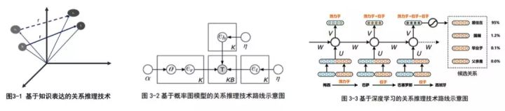

# 知识图谱
## 知识图谱概述
1. “知识图谱旨在描述真实世界中存在的各种实体或概念。其中，每个实体或概念用一个全局唯一确定的ID来标识，这个ID被称为它们的标识符。‘属性-值’对（Attribute-Value Pair,AVP）用来刻画实体的内在特性，而关系用来在连接两个实体，刻画它们之间的关联。”
2. “知识图谱是结构化的语义知识库，用于以符号形式描述物理世界中的概念及其相互关系，其基本组成单元是“实体-关系-实体”三元组以及实体及其属性-值对，实体间通过关系相互联结，构成网状的知识结构。”
3. “本质上，知识图谱旨在描述真实世界中存在的各种实体或概念及其关系，其构成一张巨大的语义网络图，节点表示实体或概念，边则由属性或关系构成。现有的知识图谱已被用来泛指各种大规模的知识库。”

###知识图谱的通用表示
从本质上来看，可以将知识图谱理解为一张由不同知识点相互连接形成的语义网络。

知识图谱中的节点可以分为以下两种:
1. 实体:指具有可区别性且独立存在的某种事物。
2. 语义类/概念:语义类指具有某种共同属性的实体的集合，如国家、民族、性别等。概念则反映一组实体的种类或对象类型，如人物、气候、地理等。

知识图谱中的边分为以下两种:
1. 属性(值)：指某个实体可能具有的特征、特性、特点以及参数，是从某个实体指向它的属性值得"边"，不同的属性对应不同的边，而属性值是实体在某一个特定属性下的值。
2. 关系:是连接不同实体的"边"，可以是因果关系，相近关系、推论关系、组成关系等。在知识图谱中，将关系形式化为一个函数。这个函数把若干个节点映射到布尔值，其取值反映实体间是否具有某种关系。

基于以上定义，可以更好地理解三元组。三元组是知识图谱的一种直观、简洁的通用表示方式，可以方便计算机对实体关系进行处理。

用三元组G=(E,R,S)表示知识图谱，其中 $E=\{e_1,e_2,....,e_E\}$ 是知识图谱中的实体集合，包含|E|种不同的实体; $R=\{r_1,r_2,...,r_E\}$ 是知识图谱中的关系集合，共包含|R种不同的关系；

三元组的基本形式主要包括(实体1,关系,实体2)以及(概念属性,属性值)等。(实体1,关系,实体2)、(实体,属性,属性值)都是经典的三元组。

### 知识图谱的架构

1. 信息抽取:从各种类型的数据源种提取出实体、属性值以及实体间的相互关系，在此基础上形成本体化的知识表达。
2. 知识融合:在获得新知识之后，需要对其进行整合，以消除矛盾和歧义，比如某些实体可能有多种表达，某个特定称谓也许对应多个不同的实体等
3. 知识加工:经过融合的新知识需要经过质量评估之后(部分需要人工参与甄别)，才能将合格的部分加入知识库中，以确保知识库的质量。

知识图谱的构建有自顶向下和自底向上两种形式。
1. 自顶向下是先为知识图谱定义好本体与数据模式，借助百科类网站等结构化的数据源，从高质量的数据中提取本体和模式信息加入知识库；
2. 自底向上是通过一定的技术手段，从公开的数据中提出资源模式，选择其中置信度较高的模式，经人工审核后加入知识库，之后再构建顶层的本体模式。

####信息抽取
信息抽取是知识图谱构建的第一步，其中的关键问题是如何从异构数据源中自动抽取信息得到候选知识单元。信息抽取是一种自动化地从半结构化和无结构数据中抽取实体、关系以及实体属性等结构化信息的技术。涉及的关键技术包括：命名实体识别、关系抽取和属性抽取。

1. 命名实体识别（实体抽取）：命名实体识别（named entity recognition，NER）也称实体抽取，是指从文本数据集中自动识别出命名实体。实体抽取的质量（准确率和召回率）对后续的知识获取效率和质量影响极大，因此是信息抽取中最为基础和关键的部分。2012年Ling等人归纳出112种实体类别，并基于条件随机场CRF进行实体边界识别，最后采用自适应感知机算法实现了对实体的自动分类，取得了不错的效果。但是随着互联网中内容的动态变化，采用人工预定义实体分类体系的方式已经很难适应时代的需求，因此提出了面向开放域的实体识别和分类研究。在面向开放域的实体识别和分类研究中，不需要（也不可能）为每个领域或者每个实体类别建立单独的语料库作为训练集。因此，该领域面临的主要挑战是如何从给定的少量实体实例中自动发现具有区分力的模型。一种思路是根据已知的实体实例进行特征建模，利用该模型处理海量数据集得到新的命名实体列表，然后针对新实体建模，迭代地生成实体标注语料库。另一种思路是利用搜索引擎的服务器日志，事先并不给出实体分类等信息，而是基于实体的语义特征从搜索日志中识别出命名实体，然后采用聚类算法对识别出的实体对象进行聚类。

2. 关系抽取：文本语料经过实体抽取，得到的是一系列离散的命名实体，为了得到语义信息，还需要从相关的语料中提取出实体之间的关联关系，通过关联关系将实体（概念）联系起来，才能够形成网状的知识结构，研究关系抽取技术的目的，就是解决如何从文本语料中抽取实体间的关系这一基本问题。早期的关系抽取研究方法主要是通过人工构造语法和语义规则。随后，出现了大量基于特征向量或者核函数的有监督学习方法，关系抽取的准确性也不断提高。但以上研究成果的共同特点是需要预先定义实体关系类型，如雇佣关系、整体部分关系以及位置关系等。与之相对的，Banko等人提出了面向开放域的信息抽取方法框架（open information extraction，OIE），并发布了基于自监督（self-supervised）学习方式的开放信息抽取原型系统（TextRunner），该系统采用少量人工标记数据作为训练集，据此得到一个实体关系分类模型，再依据该模型对开放数据进行分类，依据分类结果训练朴素贝叶斯模型来识别『实体-关系-实体』三元组，经过大规模真实数据测试，取得了显著优于同时期其他方法的结果。TextRunner系统中错误的部分主要是一些无意义或者不和逻辑的实体关系三元组，据此引入语法限制条件和字典约束，采用先识别关系指示词，然后再对实体进行识别的策略，有效提高了关系识别准确率。

研究历程简单总结：
- 人工构造语法和语义规则--模式匹配
- 统计机器学习方法
- 基于特征向量或核函数的有监督方法
- 研究重点转向半监督和无监督
- 开放领域的信息抽取
- 将面向开放域的信息抽取方法和面向封闭领域的传统方法结合
3. 属性抽取：属性抽取的目标是从不同信息源中采集特定实体的属性信息。例如针对某个公众人物，可以从网络公开信息中得到其昵称、生日、国籍、教育背景等信息。属性抽取技术能够从多种数据来源中汇集这些信息，实现对实体属性的完整勾画。由于可以将实体的属性视为实体与属性值之间的一种名词性关系，因此也可以将属性抽取问题视为关系抽取问题。百科类网站提供的半结构化数据是当前实体属性抽取研究的主要数据来源。但是还有大量的实体属性数据隐藏在非结构化的公开数据中。一种解决方案是基于百科类网站的半结构化数据，通过自动抽取生成训练语料，用于训练实体属性标注模型，然后将其应用于对非结构化数据的实体属性抽取；另一种方案是采用数据挖掘的方法直接从文本中挖掘实体属性与属性值之间的关系模式，据此实现对属性名和属性值在文本中的定位。这种方法的基本假设是属性名和属性值之间在位置上有关联关系，事实上在真实语言环境中，许多实体属性值附近都存在一些用于限制和界定该属性值含义的关键词（属性名），在自然语言处理技术中将这类属性称为有名属性，因此可以利用这些关键字来定位有名属性的属性值。

####知识融合
通过信息抽取，实现了从非结构化和半结构化数据中获取实体、关系以及实体属性信息的目标，然而，这些结果中可能包含大量的冗余和错误信息，数据之间的关系也是扁平化的，缺乏层次性和逻辑性，因此有必要对其进行清理和整合。知识融合包含2部分内容：实体链接和知识合并。

实体链接（entity linking）是指对于从文本中抽取得到的实体对象，将其链接到知识库中对应的正确实体对象的操作。

实体链接的基本思想是首先根据给定的实体指称项，从知识库中选出一组候选实体对象，然后通过相似度计算将指称项链接到正确的实体对象。

实体链接的一般流程是：
1. 从文本中通过实体抽取得到实体指称项
2. 进行实体消歧和共指消解，判断知识库中的同名实体与之是否代表不同的含义，以及知识库中是否存在其他命名实体与之表示相同的含义
3. 在确认知识库中对应正确实体对象之后，将该实体指称链接到知识库中对应实体

**实体消歧** 是专门用于解决同名实体产生歧义问题的技术，通过实体消歧，就可以根据当前的语境，准确建立实体链接，实体消歧主要采用聚类法。其实也可以看做基于上下文的分类问题，类似于词性消歧和词义消歧。

**共指消解** 技术主要用于解决多个指称对应同一实体对象的问题。在一次会话中，多个指称可能指向的是同一实体对象。利用共指消解技术，可以将这些指称项关联（合并）到正确的实体对象，由于该问题在信息检索和自然语言处理等领域具有特殊的重要性，吸引了大量的研究努力。共指消解还有一些其他的名字，比如对象对齐、实体匹配和实体同义。

共指消解问题的早期研究成果主要来自自然语言处理领域，近年来统计机器学习领域的学者越来越多的参与到这项工作中。

基于自然语言处理的共指消解是以句法分析为基础的，代表方法是Hobbs算法和向心理论（centering theory）。Hobbs算法是最早的代词消解算法之一，主要思路是基于句法分析树进行搜索，因此适用于实体与代词出现在同一句子中的场景，有一定的局限性。

向心理论的基本思想是：将表达模式（utterance）视为语篇（discourse）的基本组成单元，通过识别表达式中的实体，可以获得当前和后续语篇中的关注中心（实体），根据语义的局部连贯性和显著性，就可以在语篇中跟踪受关注的实体。

随着统计机器学习方法被引入该领域，共指消解技术进入了快速发展阶段，McCarthy等人首次将C4.5决策树算法也被应用于解决共指消解问题。

除了将共指消解问题视为分类问题之外，还可以将其作为聚类问题来求解。聚类法的基本思想是以实体指称项为中心，通过实体聚类实现指称项与实体对象的匹配。其关键问题是如何定义实体间的相似性测度。Turney基于点互信息来求解实体所在文档的相似度，能够有效的实现共指消解。

基于统计机器学习的共指消解方法通常受限于2个问题：训练数据的（特征）稀疏性和难以在不同的概念上下文中建立实体关联。为解决该问题，Pantel等人基于Harris提出的分布相似性模型，提出了一个新的实体相似性测度模型，称为术语相似度（term similarity），借助该模型可以从全局语料中得到所有术语间的统计意义上的相似性，据此可以完成实体合并，达到共指消解的目的

####知识合并

在构建知识图谱时，可以从第三方知识库产品或已有结构化数据获取知识输入。

常见的知识合并需求有两个，一个是合并外部知识库，另一个是合并关系数据库。

将外部知识库融合到本地知识库需要处理两个层面的问题：
1. 数据层的融合，包括实体的指称、属性、关系以及所属类别等，主要的问题是如何避免实例以及关系的冲突问题，造成不必要的冗余
2. 通过模式层的融合，将新得到的本体融入已有的本体库中

然后是合并关系数据库，在知识图谱构建过程中，一个重要的高质量知识来源是企业或者机构自己的关系数据库。为了将这些结构化的历史数据融入到知识图谱中，可以采用资源描述框架（RDF）作为数据模型。业界和学术界将这一数据转换过程形象地称为RDB2RDF，其实质就是将关系数据库的数据换成RDF的三元组数据。

####知识加工
通过信息抽取，可以从原始语料中提取出实体、关系与属性等知识要素，再经过知识融合，可以消除实体指称项与实体对象之间的歧义，得到一系列基本的事实表达。然而事实本身并不等于知识，要想最终获得结构化，网络化的知识体系，还需要经历知识加工的过程。知识加工主要包括3方面内容：**本体构建、知识推理和质量评估**。

##### 本体构建
本体（ontology）是对概念进行建模的规范，是描述客观世界的抽象模型，以形式化的方式对概念及其之间的联系给出明确定义。本体最大的特点在于它是共享的，本体反映的知识是一种明确定义的共识。如：“人”、“事”、“物”

本体是同一领域内的不同主体之间进行交流的语义基础。本体是树状结构，相邻层次的节点（概念）之间有严格的『IsA』关系。在知识图谱中，本体位于模式层，用于描述概念层次体系，是知识库中知识的概念模板。

本体可以采用人工编辑的方式手动构建（借助本体编辑软件），因为人工方式工作量巨大，且很难找到具备专业知识领域的人才，故，也可以以数据驱动的自动化方式构建本体，其包含3个阶段：

1. 实体并列关系相似度计算，适用于考察任意给定的两个实体在多大程度上属于同一概念分类的指标测度，相似度越高，表明这2个实体越有可能属于同一语义类别。所谓并列关系，是相对于纵向的概念隶属关系而言的；当前主流的实体并列关系相似度计算方法有两种：模式匹配法和分布相似度。其中，模式匹配法采用预先定义实体对模式的方法，通过模式匹配取得给定关键字组合在同一语料单位中共同出现的频率，据此计算实体对之间的相似度。分布相似度方法的前提假设是：在相似的上下文管径中频繁出现的实体之间具有语义上的相似性。
2. 实体上下位关系抽取，是用于确定概念之间的隶属（IsA）关系，这种关系也称为上下位关系。实体上下位关系抽取是该领域的研究重点，主要的研究方法是基于语法模式（如Hearst模式）抽取IsA实体对。也有方法利用概率模型判定IsA关系和区分上下位词，通常会借助百科类网站提供的概念分类知识来帮助训练模型，以提高算法精度。
3. 本体的生成，主要任务是对各层次得到的概念进行聚类，并对其进行语义类的标定，为该类的中的实体指定1个或多个公共上位词。

举例，实体：百度、腾讯、阿里、无人车；当仅仅得到这四个实体时，四者并无任何区别，但进过计算四者之间的形似度后，发现：百度、阿里、腾讯，三者相似度较高，而他们与无人车差别较大；第二步，相似度计算后，发现实体之间的相似度不同，但无上下位差异，所以需要上下位关系抽取后，生成本体，发现：百度、阿里、腾讯对应本体：公司，无人车对应本体：交通工具；他们不属于一类。

##### 知识推理
知识图谱之间大多数关系都是残缺的，缺失值非常严重，知识推理是指从知识库中已有的实体关系数据出发，进行计算机推理，建立实体间的新关联，从而拓展和丰富知识网络。知识推理是知识图谱构建的重要手段和关键环节，通过知识推理，能够从现有知识中发现新的知识。假设，A的孩子Z，B有孩子Z，那么A,B的关系很有可能是配偶关系

知识推理的对象也并不局限于实体间的关系，也可以是实体的属性值，本体的概念层次关系等。

知识的推理方法可以分为2大类：基于逻辑的推理和基于图的推理。

基于逻辑的推理主要包括一阶逻辑谓词、描述逻辑以及基于规则的推理。

一阶谓词逻辑建立在命题的基础上，在一阶谓词逻辑中，命题被分解为个体（individuals）和谓词（predication）2部分。个体是指可独立存在的客体，可以是一个具体的事物，也可以是一个抽象的概念。谓词是用来刻画个体性质及事物关系的词。比如（A，friend，B）就是表达个体A和B关系的谓词。

对于复杂的实体关系，可以采用描述逻辑进行推理。描述逻辑（description logic）是一种基于对象的知识表示的形式化工具，是一阶谓词逻辑的子集，它是本体语言推理的重要设计基础。

基于规则的推理可以利用专门的规则语言，如SWRL（semantic Web rule language）。

基于图的推理方法主要基于神经网络模型或Path Ranking算法。Path Ranking算法的基本思想是将知识图谱视为图（以实体为节点，以关系或属性为边），从源节点开始，在图上执行随机游走，如果能够通过一个路径到达目标节点，则推测源和目的节点可能存在关系。

#### 质量评估
质量评估也是知识库构建技术的重要组成部分。其意义在于：可以对知识的可信度进行量化，通过舍弃置信度较低的知识，可以保障知识库的质量。

#### 知识更新
从逻辑上看，知识库的更新包括概念层的更新、数据层的更新

1. 概念层的更新是指新增数据后获得了新的概念，需要自动将新的概念添加到知识库的概念层中
2. 数据层的更新主要是新增或更新实体、关系、属性值，对数据层进行更新需要考虑数据源的可靠性、数据的一致性（是否存在矛盾或冗杂等问题）等可靠数据源，并选择在各数据源中出现频率高的事实和属性加入知识库。

知识图谱的内容更新有两种方式：

1. 全面更新：指以更新后的全部数据为输入，从零开始构建知识图谱。这种方法比较简单，但资源消耗大，而且需要耗费大量人力资源进行系统维护；
2. 增量更新：以当前新增数据为输入，向现有知识图谱中添加新增知识。这种方式资源消耗小，但目前仍需要大量人工干预（定义规则等），因此实施起来十分困难。
