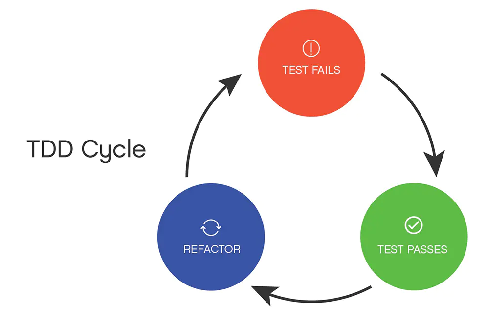

# 讨论TDD
## 什么是TDD

开发团队写测试，通常有3种模式
- 先写测试再开发
- 开发完成后再写测试
- 不写测试

本文的重点是第一种模式，先写测试再开发，也就是标题里的TDD。

TDD全称Test Driven Development,测试驱动开发，是敏捷开发中的一项核心实践和技术。

一般我们提到TDD专指UTDD(Unit Test Driven Development,单元测试驱动开发)。

TDD之父Kent Beck说：“建议开发者25%-50%的时间在测试上。”

TDD的基本流程：
- 分析需求，把需求拆分为具体的任务。
- 从任务列表中取出一个任务，并对其编写测试用例。
- 由于没有实际的功能代码，测试代码不大可能会通过（红）。
- 编写对应的功能代码，尽快让测试代码通过（绿）。
- 对代码进行重构，并保证测试通过（重构）。
- 重复以上步骤。

上述过程可以用下图表示：

TDD的好处(极限编程之父Kent Beck方的观点)：
- 编出来的程序是自带测试的，可靠性好，缺陷少
- 能大大减少debug的需要，尤其减少单步调试，从这里能节约时间

TDD的坏处(David Heinemeier Hansson方的观点)：
- 成本很高，会造成低效率
- 补测试例的情况居多，因为测试例的推导比正常程序还困难。
- 测试需要维护，当有了越来越多的测试时，也就意味着越来越难以改动业务代码。因为改动会造成很多的测试失败而需要修正，所以测试会让业务代码变得死板，难以改动
- 由于其沉重的mocks和stubs 的使用，这种编写测试的代码比代码本身要复杂的多。Bradley的经验法则对我来说：为每一个IF， And，Or，Case，For，While条件语句编写一个单独的测试，当所有分支/条件语句被覆盖时，该代码将会被完全覆盖。

为什么需要TDD?（[深度解读- TDD](https://www.jianshu.com/p/62f16cd4fef3)）
- 强制解耦
- 测试第一，即用户第一
- 减少迭代的代价

传统编码方式 VS TDD编码方式
1. 传统编码方式
- 需求分析，想不清楚细节，管他呢，先开始写
- 发现需求细节不明确，去跟业务人员确认
- 确认好几次终于写完所有逻辑
- 运行起来测试一下，靠，果然不工作，调试
- 调试好久终于工作了
- 转测试，QA 测出 bug，debug， 打补丁
- 终于，代码可以工作了
- 一看代码烂的像坨屎，不敢动，动了还得手工测试，还得让 QA 测试，还得加班...

2. TDD编码方式
- 先分解任务，分离关注点（后面有演示）
- 列 Example，用实例化需求，澄清需求细节
- 写测试，只关注需求，程序的输入输出，不关心中间过程
- 写实现，不考虑别的需求，用最简单的方式满足当前这个小需求即可
- 重构，用手法消除代码里的坏味道
- 写完，手动测试一下，基本没什么问题，有问题补个用例，修复
- 转测试，小问题，补用例，修复
- 代码整洁且用例齐全，信心满满地提交
