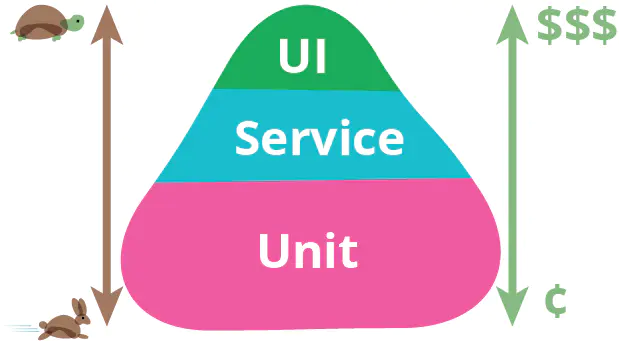
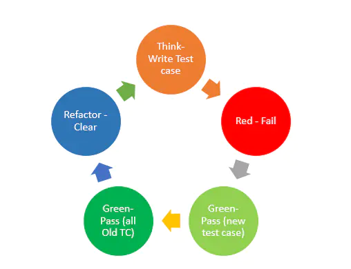

# 讨论TDD
##测试金字塔

上图的“测试金字塔”模型按照运行速度和投入成本两个维度对不同阶段的测试工作进行非常直观的可视化，可以看到单元测试是位于“测试金字塔”的最底部，很明显“单元测试”相对于其它不同阶段的测试工作，拥有速度快（运行效率），成本低（维护成本）的优势，同时也是作为上层测试工作的支撑，体现了“单元测试”的重要程度。

## 什么是TDD

开发团队写测试，通常有3种模式
- 先写测试再开发
- 开发完成后再写测试
- 不写测试

本文的重点是第一种模式，先写测试再开发，也就是标题里的TDD。

TDD全称Test Driven Development,测试驱动开发，是敏捷开发中的一项核心实践和技术。

一般我们提到TDD专指UTDD(Unit Test Driven Development,单元测试驱动开发)。

TDD之父Kent Beck说：“建议开发者25%-50%的时间在测试上。”

TDD的基本流程：
- 分析需求，把需求拆分为具体的任务。
- 从任务列表中取出一个任务，并对其编写测试用例。
- 由于没有实际的功能代码，测试代码不大可能会通过（红）。
- 编写对应的功能代码，尽快让测试代码通过（绿）。
- 对代码进行重构，并保证测试通过（重构）。
- 重复以上步骤。

上述过程可以用下图表示：

更具体的图示：

- 想一下我要做什么，想想如何测试它，然后写一个小测试。思考所需的类、接口、输入和输出。
- 编写足够的代码使测试失败（明确失败总比模模糊糊的感觉要好）。
- 编写刚刚好使测试通过的代码（保证之前编写的测试也需要通过）。
- 运行并观察所有测试。如果没有通过，则现在解决它，错误只会落在新加入的代码中。
- 如果有任何重复的逻辑或无法解释的代码，重构可以消除重复并提高表达能力（减少耦合，增加内聚力）。
- 再次运行测试验证重构是否引入新的错误。如果没有通过，很可能是在重构时犯了一些错误，需要立即修复并重新运行，直到所有测试通过。
- 重复上述步骤，直到找不到更多驱动编写新代码的测试。

TDD的好处(极限编程之父Kent Beck方的观点)：
- 编出来的程序是自带测试的，可靠性好，缺陷少
- 能大大减少debug的需要，尤其减少单步调试，从这里能节约时间

TDD的坏处(David Heinemeier Hansson方的观点)：
- 成本很高，会造成低效率
- 补测试例的情况居多，因为测试例的推导比正常程序还困难。
- 测试需要维护，当有了越来越多的测试时，也就意味着越来越难以改动业务代码。因为改动会造成很多的测试失败而需要修正，所以测试会让业务代码变得死板，难以改动
- 由于其沉重的mocks和stubs 的使用，这种编写测试的代码比代码本身要复杂的多。Bradley的经验法则对我来说：为每一个IF， And，Or，Case，For，While条件语句编写一个单独的测试，当所有分支/条件语句被覆盖时，该代码将会被完全覆盖。

为什么需要TDD?（[深度解读- TDD](https://www.jianshu.com/p/62f16cd4fef3)）
- 强制解耦
- 测试第一，即用户第一
- 减少迭代的代价

传统编码方式 VS TDD编码方式
1. 传统编码方式
- 需求分析，想不清楚细节，管他呢，先开始写
- 发现需求细节不明确，去跟业务人员确认
- 确认好几次终于写完所有逻辑
- 运行起来测试一下，靠，果然不工作，调试
- 调试好久终于工作了
- 转测试，QA 测出 bug，debug， 打补丁
- 终于，代码可以工作了
- 一看代码烂的像坨屎，不敢动，动了还得手工测试，还得让 QA 测试，还得加班...

2. TDD编码方式
- 先分解任务，分离关注点（后面有演示）
- 列 Example，用实例化需求，澄清需求细节
- 写测试，只关注需求，程序的输入输出，不关心中间过程
- 写实现，不考虑别的需求，用最简单的方式满足当前这个小需求即可
- 重构，用手法消除代码里的坏味道
- 写完，手动测试一下，基本没什么问题，有问题补个用例，修复
- 转测试，小问题，补用例，修复
- 代码整洁且用例齐全，信心满满地提交

## TDD实战方法举例
https://blog.51cto.com/2681882/2120480

##什么是单元测试
单元测试可以理解为“开发阶段的自动化测试”。
1. 测试是开发人员搞的
2. 测试是自动化的

开发阶段自动化测试：
- 确定测试的目标，到底想验证什么
- 基于这个目标，找到和维护需要的工具，比如Runner，Mock，覆盖率统计工具等，Embedded数据库等
- 留足给测试的时间，并通过code review的手段来保证写有效的测试
- 给一些典型的场景如何做测试写一写文档，积累经验（比如如何测试要模拟时间的案例？）
- 统计测试同学给开发同学报bug的数据，盯紧代码质量不高的同学，多做沟通
- 根据出现bug的数量和scope来推动部分关键代码的测试质量的改善
- 在能达成测试目标的前提下，看看能够整合一些工具，降低维护测试依赖的成本

最常见的测试目标是是验证“自己写的一小段代码是不是符合设计逻辑的“。这个”一小段代码“就是我们经常说的“单元”。

##单元测试工具
